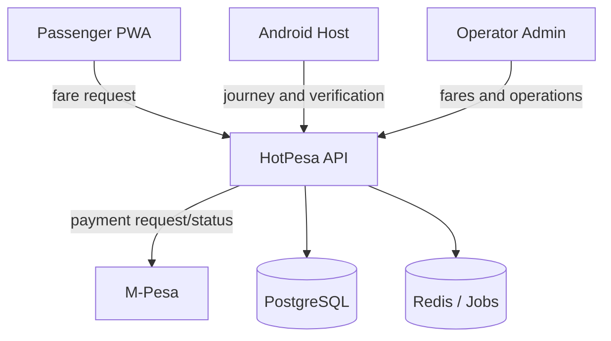

# System context

The local hotspot supports discovery and local session exchange; it is not a trusted
payment settlement channel. The API owns authoritative fare, journey, payment, and audit
state. M-Pesa callback processing must be authenticated where supported, idempotent,
durable, and reconciled.
