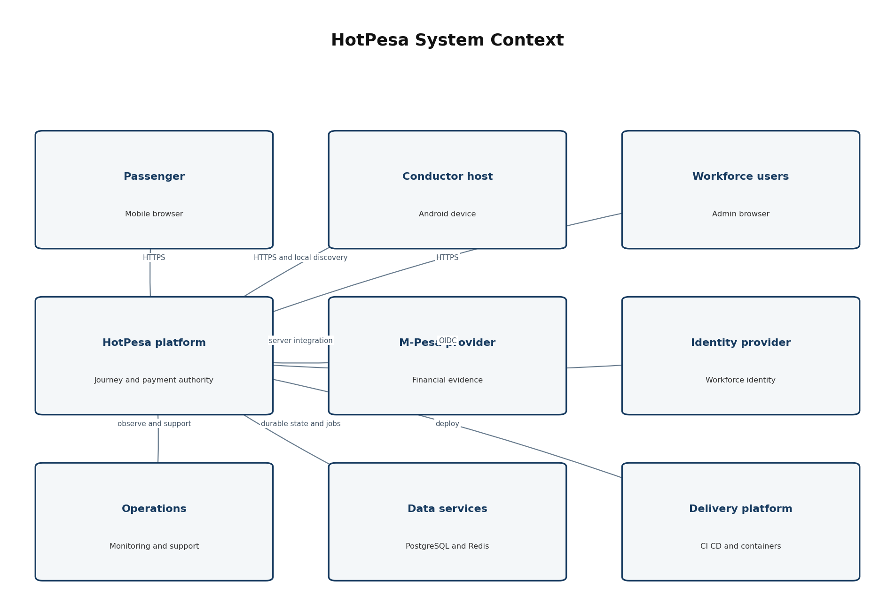
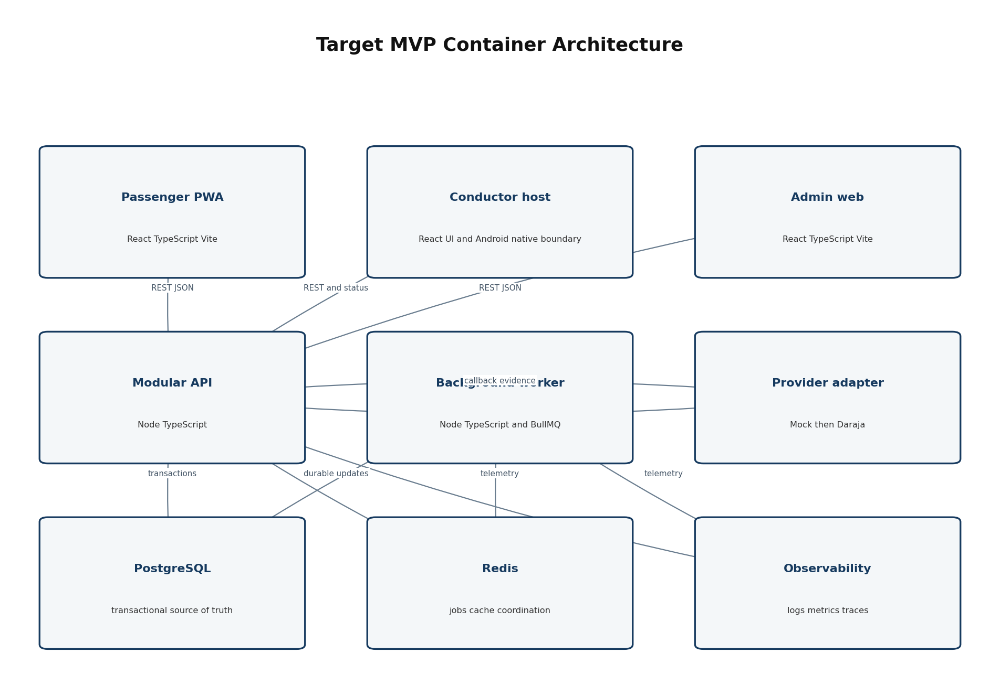
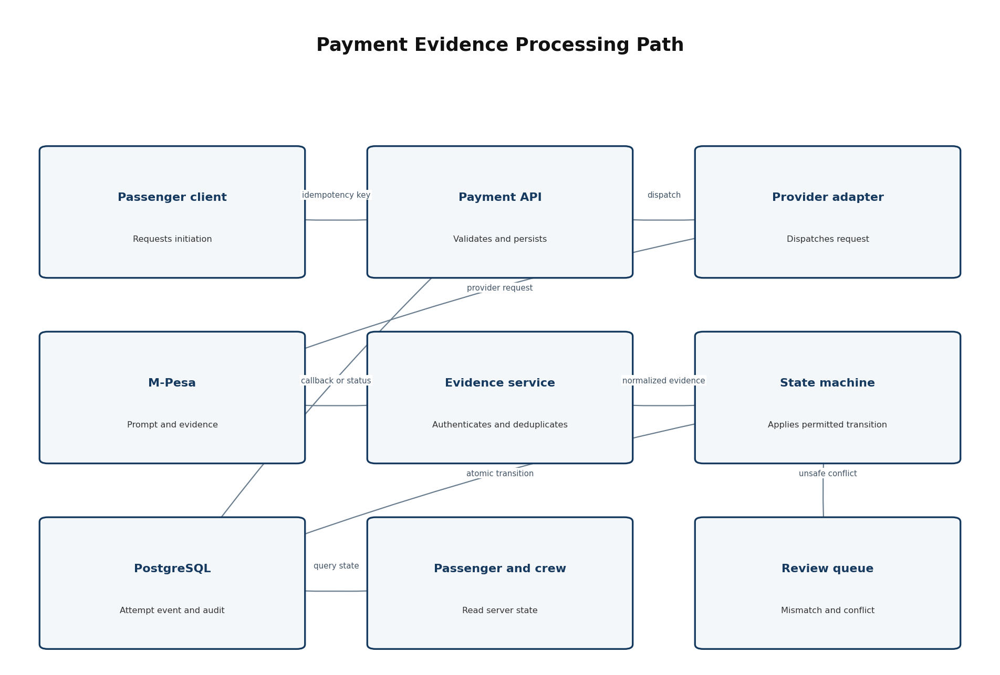
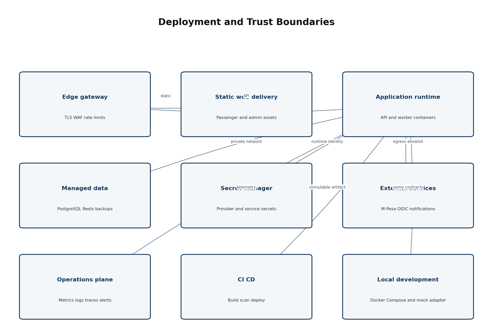

> Controlled source: [05_Technical Requirements and System Architecture (TRD)_HotPesa Pay.docx](../controlled-documents/05_Technical%20Requirements%20and%20System%20Architecture%20(TRD)_HotPesa%20Pay.docx)

> The DOCX source is authoritative. This Markdown copy preserves its controlled status and does not confer approval.

DOCUMENT 05

Technical Requirements and System Architecture

HotPesa Pay

 

Engineering authority for components, trust boundaries, integration, deployment, quality controls and technical decisions

  

| Control | Value |
| --- | --- |
| Project | HotPesa Pay |
| Document | Technical Requirements and System Architecture |
| Version | 1.0 |
| Status | Draft for architecture review and approval |
| Lifecycle stage | Technical baseline following BRD, PRD, FRS and USUC |
| Primary market | Kenya |
| Classification | Confidential - project planning |

 

### Governing question

How shall HotPesa be engineered so that payment truth, field usability, tenant isolation, operational recovery and controlled delivery remain reliable from local proof to Kenyan pilot?

 

# Document Control

| Field | Controlled value |
| --- | --- |
| Document owner | Engineering Authority, supported by Product, Security, Data, DevOps and Quality Assurance. |
| Business and product authority | Approved HotPesa BRD, PRD, FRS and USUC, including recorded approval conditions. |
| Reviewers | Founder; Product Owner; Engineering; Security/Privacy; QA; DevOps/SRE; Finance/Operations; pilot operator/SACCO; Legal/Compliance. |
| Approval authority | Architecture Review Board or designated Engineering Authority, with sponsor approval for material cost/risk decisions. |
| Reference use | Mpanga TRD and professional documentation handbook informed structure; HotPesa decisions are project-specific. |
| Downstream authority | Approved TRD governs data/API, flow, UI/UX, security/NFR, implementation, infrastructure, tests and ADRs. |
| Change control | A material stack, boundary, data, integration, deployment or trust decision requires impact analysis and an ADR. |
| Next review | Before live-provider implementation, pilot deployment and each production architecture gate. |

## Document Status and Interpretation

This TRD separates the proven Phase 0 repository and mock-payment foundation from the target MVP architecture. Approved Baseline defines the intended engineering direction. Proposed, Validation Required and Decision Required items remain subject to the listed gate. The document does not authorize production credentials, live money movement, regulatory conclusions or public release.

## Version History

| Version | Date | Status | Summary |
| --- | --- | --- | --- |
| 1.0 |
| 19 September 2026 |
| Draft for architecture approval |
| Initial comprehensive HotPesa technical baseline aligned to Documents 01-04 and Phase 0 evidence. |

## Table of Contents

| Section | Purpose |
| --- | --- |
| 1 Executive Technical Overview | Recommended engineering direction |
| 2 Technical Drivers and Objectives | Requirements shaping the design |
| 3 Architecture Principles | Rules for technical choices |
| 4 Baseline and Target Architecture | What exists and what is targeted |
| 5 System Context and Trust Boundaries | Actors systems boundaries and data trust |
| 6 Frontend and Mobile Architecture | Passenger admin and Android host design |
| 7 Backend and Module Architecture | Modular service responsibilities |
| 8 Data Persistence and Transaction Architecture | Durability transactions and data authority |
| 9 Payment Provider Integration Architecture | Mock to Daraja provider boundary |
| 10 Identity Authentication and Authorization | Workforce identity and contextual access |
| 11 Background Processing Caching and Synchronization | Workers Redis queues cache and weak network |
| 12 Deployment and Infrastructure Architecture | Local CI pilot and production topology |
| 13 Technology Stack and Version Policy | Approved and proposed technologies |
| 14 Repository and Application Structure | Monorepo ownership and package layout |
| 15 API and Integration Conventions | Versioning errors idempotency and webhooks |
| 16 State Management and Consistency | State ownership and concurrency rules |
| 17 Logging Observability and Audit | Operational evidence and financial audit |
| 18 Configuration Secrets and Environment Management | Safe configuration and deployment promotion |
| 19 CI CD and Supply Chain Controls | Automated controls and immutable artifacts |
| 20 Testing and Quality Architecture | Test pyramid and acceptance evidence |
| 21 Reliability Resilience and Disaster Recovery | Failure handling backups and recovery |
| 22 Performance Capacity and Scalability | Load model scaling and budgets |
| 23 Security and Privacy Architecture Summary | Trust controls and data minimization |
| 24 Coding Standards and Engineering Conventions | TypeScript database and review standards |
| 25 Technical Requirements Register | Atomic technical obligations |
| 26 Architecture Decision Summary | Decisions to preserve in ADRs |
| 27 Technical Risks Constraints and Dependencies | Known risks limitations and suppliers |
| 28 Requirements Traceability | Links to FRS and use cases |
| 29 Delivery and Architecture Gates | Entry exit and release conditions |
| 30 Open Decisions and Validation Spikes | Unresolved decisions and prototypes |
| 31 Approval and Sign Off | Stakeholder architecture acceptance |
| 32 Final TRD Readiness Checklist | Completion gate |

# 1 Executive Technical Overview

HotPesa shall use an evolutionary modular-monolith architecture for the controlled MVP. A TypeScript pnpm monorepo contains the passenger PWA, administration web application, API, background worker and shared contracts/configuration packages. PostgreSQL is the transactional source of truth; Redis supports bounded queues, cache and coordination but never defines financial truth. A provider adapter isolates the implemented Mock M-Pesa proof from a future Daraja sandbox/live adapter. The Android conductor host reuses the web design system and API contracts while placing hotspot, local discovery and device functions behind an explicit native boundary.

The architecture is optimized for correctness and operational clarity before distribution. Payment state changes pass through one central transition service. Provider evidence is authenticated, normalized, deduplicated and persisted before it affects the attempt. Passenger and conductor clients are read-only observers of payment truth. The system remains non-custodial: M-Pesa/provider infrastructure moves and settles funds under the approved merchant arrangement.

| Architecture decision | Recommended direction | Status |
| --- | --- | --- |
| Application shape | Modular monolith API plus separate worker; split only after measured scaling or ownership need. | Approved Baseline |
| Repository | pnpm TypeScript monorepo with shared contracts/configuration and enforced project discovery. | Proven Phase 0 |
| Web clients | React, TypeScript and Vite; mobile-first passenger PWA and responsive admin web. | Proven Phase 0 |
| Conductor host | React/TypeScript UI packaged for Android with a narrow native hotspot/local-service boundary. | Proposed; field spike required |
| Data | PostgreSQL durable system of record; Redis for jobs/cache/coordination. | Implemented direction; Docker runtime validation pending locally |
| Payments | Provider-port interface with Mock M-Pesa and controlled Daraja adapter; server evidence only. | Mock proven; Daraja decision required |
| Deployment | OCI containers on a managed platform; managed PostgreSQL/Redis; edge TLS/WAF; provider-neutral first. | Proposed |
| Identity | Managed OIDC for workforce; HotPesa owns application authorization; signed short-lived passenger journey sessions. | Proposed |
| Delivery | GitHub Actions quality/security gates, immutable artifacts and environment promotion. | Foundation implemented |

# 2 Technical Drivers and Objectives

## 2.1 Architecture Drivers

| Driver | Required architectural response | Source |
| --- | --- | --- |
| Payment truth | Central state machine; accepted provider evidence only; idempotent initiation/event handling. | FR-PAY-*; UC-PAY-001 |
| Variable connectivity | Separate local discovery from internet/provider connectivity; honest degraded states and retry-safe recovery. | FR-OFF-*; UC-OFF-001 |
| Passenger simplicity | Accountless scoped session; low bundle size; mobile-first accessible UI. | FR-PAX-* |
| Field operation | Android host recovery, large controls, cached nonfinancial context and server-authoritative status. | FR-JRN-* |
| Tenant isolation | Tenant key in every business boundary; contextual authorization and database/repository enforcement. | FR-ADM-009 |
| Financial durability | Transactional PostgreSQL records for attempts, provider events, transitions and audit before success response. | FR-PAY-006; FR-OFF-008 |
| Operational support | Correlation IDs, structured redacted logs, metrics, traces, health and reconciliation views. | FR-COM-003; FR-REC-012 |
| Controlled evolution | Versioned contracts, ADRs, CI gates and deployable modular boundaries. | USUC and implementation governance |

## 2.2 Technical Objectives

| ID | Objective | Evidence |
| --- | --- | --- |
| TO-001 | Make duplicate requests, callbacks and retries create at most one business effect. | Idempotency, concurrency and replay tests. |
| TO-002 | Keep confirmed reachable only through accepted provider evidence. | Transition unit/property tests and negative browser/API tests. |
| TO-003 | Recover journeys and payment timelines after API/host restart. | PostgreSQL durability and restart tests. |
| TO-004 | Protect tenant and passenger data across API, UI, logs, exports and operations. | Authorization, isolation, redaction and secret scans. |
| TO-005 | Support local development and CI with reproducible services and exact dependency graph. | Frozen pnpm install, Docker Compose and CI results. |
| TO-006 | Enable provider replacement without changing domain state semantics. | Contract tests across Mock and Daraja adapters. |
| TO-007 | Measure behavior before scaling architecture complexity. | Capacity tests, telemetry and ADR evidence. |
| TO-008 | Keep deployment rollbackable without corrupting business state. | Backward-compatible migrations and release rollback drills. |

# 3 Architecture Principles

| ID | Principle | Engineering consequence |
| --- | --- | --- |
| AP-001 | Correctness before distribution | Prefer one transactional domain boundary until load or team ownership proves separation. |
| AP-002 | Provider evidence is authoritative | Clients request and observe; they cannot submit success or alter provider evidence. |
| AP-003 | Durable truth over cache | PostgreSQL owns business state; Redis loss may delay work but cannot redefine payment outcome. |
| AP-004 | Idempotency at every effect boundary | Financial, journey and asynchronous operations use stable keys and duplicate-safe handlers. |
| AP-005 | Ports around external systems | M-Pesa, identity, notifications and object storage are adapters behind domain interfaces. |
| AP-006 | Tenant and purpose context everywhere | Authorization evaluates identity, tenant, role, resource, assignment and action. |
| AP-007 | Offline is an explicit state | Cached information is labelled; no offline settlement or last-write-wins financial sync. |
| AP-008 | Secure and observable by default | Least privilege, redaction, correlation, metrics and audit are built into shared platform code. |
| AP-009 | Backward-compatible evolution | Expand-and-contract migrations and versioned contracts protect rolling deployment/rollback. |
| AP-010 | Automated evidence | CI discovers tests and fails on empty coverage, vulnerable dependencies, secrets or invalid infrastructure. |

# 4 Baseline and Target Architecture

## 4.1 Proven Phase 0 Baseline

| Area | Evidence available | Limitation |
| --- | --- | --- |
| Monorepo | pnpm workspace with six projects, strict discovery, lint, typecheck, tests and builds. | Not evidence of production hosting or scale. |
| Passenger/admin/API | Browser-testable vertical slice with live local servers. | Synthetic journey and development-only administration. |
| Payment behavior | Mock adapter covers confirmation, failure, missing/duplicate callbacks and conflict review. | No Daraja sandbox/live credentials or real money. |
| Persistence | PostgreSQL mode implemented for attempts, event receipts and redacted audit. | Local runtime was previously untested where Docker/psql unavailable. |
| CI/CD | Discovery, dependency audit, Compose validation, secret scanning and browser tests configured. | Hosted workflow evidence depends on pushed repository and Actions run. |
| Interfaces | Responsive accessible passenger/admin flows and Playwright journeys. | No production identity or conductor Android/native proof. |

## 4.2 Target MVP Evolution

Add controlled journey, fare, tenant, workforce and reporting modules without splitting the API prematurely.

Add a separately deployable worker for provider status reconciliation, expiry, notifications and bounded background work.

Package the conductor experience for Android and validate local hotspot/discovery behavior on target devices.

Implement Daraja sandbox through the existing provider port and retain Mock M-Pesa for deterministic automated testing.

Adopt managed workforce identity and contextual application authorization.

Deploy containerized services with managed PostgreSQL, Redis, secrets, observability, backups and environment promotion.

# 5 System Context and Trust Boundaries

Figure 1  HotPesa system context and external trust relationships

## 5.1 Trust Boundaries

| Boundary | Trusted input | Untrusted or limited input | Required control |
| --- | --- | --- | --- |
| Passenger browser to edge | Server-issued scoped session and validated response. | All client fields, URL tokens, device/network claims. | TLS, validation, rate limits, no client price/state authority. |
| Workforce client to API | Validated identity token plus server-resolved authorization context. | Role claims used without application checks; guessed IDs. | OIDC validation, tenant/resource policy, audit. |
| Provider to callback | Provider-authenticated event under approved contract. | Internet traffic, replay, malformed/mismatched payload. | Authenticity, parsing limits, dedupe, correlation, quarantine. |
| API/worker to data | Runtime identity and parameterized repository operation. | Dynamic SQL, cross-tenant keys, cache as truth. | Least privilege, transaction boundary, repository scoping. |
| CI/CD to runtime | Signed/identified artifact from protected workflow. | Developer workstation state or mutable untracked build. | Protected branch, checks, immutable image, deployment identity. |
| Operations to production | Approved role, purpose and time-bound action. | Shared accounts, direct DB mutation, clear-text secrets. | MFA, least privilege, break-glass, audit, no ordinary DB writes. |

## 5.2 Data Classification

| Class | Examples | Default handling |
| --- | --- | --- |
| Public | Static help and approved public operator information. | Integrity protected; no sensitive inference. |
| Internal | System configuration names, non-sensitive telemetry, architecture metadata. | Authenticated access and change control. |
| Confidential | Masked passenger reference, journey/payment records, workforce data, reports. | Encryption, tenant/purpose access, minimization and retention. |
| Restricted | Provider secrets, identity credentials, full MSISDN where justified, raw sensitive evidence. | Vault/strong access, never in client/log, limited reveal and audit. |

# 6 Frontend and Mobile Architecture

## 6.1 Passenger PWA

| Concern | Technical requirement |
| --- | --- |
| Framework | React + TypeScript + Vite with route-level code splitting and no server-held secrets. |
| Session | Short-lived signed/opaque journey-scoped session; no passenger account required for MVP. |
| Data access | Typed API client generated or validated from shared contracts; server values override URL/client values. |
| State | Server state through a query/cache library; local component state for form/UI only; payment state always refreshed from API. |
| Offline | Service worker may cache static shell and approved journey/fare snapshot; must display stale/offline status and must not queue financial confirmation. |
| Accessibility | Semantic HTML, keyboard operation, visible focus, text/icon state, live regions, reduced motion and 44 px primary controls. |
| Security | CSP, safe URL handling, no sensitive storage in localStorage, no third-party scripts without approval. |
| Telemetry | Consent/policy-controlled technical metrics with no full phone or raw provider payload. |

## 6.2 Administration Web

React + TypeScript + Vite, protected routes and server-enforced authorization.

Feature modules for tenant/fleet, journeys, fares, reconciliation, reports, support and audit.

Pagination and bounded filters for operational data; exports are server-generated and audited.

No direct database or provider access from the browser; secrets are write-only or vault references.

## 6.3 Android Conductor Host

The recommended MVP direction is a shared React/TypeScript user-interface package inside an Android-capable shell, with device-specific functions exposed through a narrow native bridge. Capacitor is the initial candidate because it reuses the web stack, but the hotspot/local web service requirement must be proven on target Android versions. If Android restrictions require a foreground service or embedded HTTP/DNS behavior beyond a safe plugin, that function should be implemented in Kotlin behind the same bridge contract. This is an ADR-controlled validation, not an assumption.

| Native capability | Boundary rule | Validation evidence |
| --- | --- | --- |
| Hotspot/setup guidance | Prefer user-controlled system settings; never bypass Android platform security. | Device matrix demonstration. |
| Local discovery/QR | QR and short address resolve to the active journey; local network access does not imply internet. | Passenger-device field test. |
| Foreground operation | Use only where required for active journey/local service; clear user notification and lifecycle handling. | Battery/restart/OS-kill tests. |
| Local cache/queue | Encrypted/minimized approved data; no offline confirmed payment; unique event IDs. | Offline/conflict tests. |
| Device identity | Application installation/device registration is not payment evidence and must be revocable. | Provisioning/revocation test. |

# 7 Backend and Module Architecture

Figure 2  Target MVP logical containers and primary dependencies

## 7.1 Modular Monolith Boundaries

| Module | Responsibility | Prohibited coupling |
| --- | --- | --- |
| Identity and access | Workforce subject mapping, tenant membership, role/context policies and passenger session issuance. | No credential storage unless explicitly approved. |
| Tenant and fleet | Tenant, operator, vehicle, route, direction, stage and assignment lifecycle. | Cannot alter historical journey/payment facts. |
| Fare | Draft, approval, effective version selection and immutable quote linkage. | No retroactive mutation of attempts. |
| Journey | Start, active context, discovery token, status board projection, closure and incident references. | Cannot confirm payment. |
| Payment | Attempt creation, idempotency, provider dispatch coordination and central state transitions. | Only normalized accepted evidence can confirm. |
| Provider evidence | Authenticity validation, normalization, event receipt, dedupe, correlation and quarantine. | Provider-specific fields stay behind adapter. |
| Reconciliation | Status query, bounded retry, expiry and review case workflow. | Uses central transition service; no parallel rules. |
| Reporting | Read models, bounded queries, truthful aggregation and controlled export. | No mutation of transactional records. |
| Audit and operations | Append-only material events, health, support timeline and operational controls. | Redaction and no ordinary direct DB mutation. |

## 7.2 Dependency Rules

Domain modules depend on shared primitives and declared ports, not on web framework request objects.

Provider, identity, email/SMS and storage SDKs are used only inside infrastructure adapters.

Modules communicate synchronously through explicit application services or asynchronously through durable outbox/job references.

Reporting may read approved projections but cannot become the source of transactional payment state.

Cross-module database access uses owned repository interfaces; no ad hoc table joins in unrelated modules.

## 7.3 API and Worker Separation

The API serves bounded synchronous commands and queries. The worker executes retryable or time-based work: reconciliation status queries, expiry evaluation, notification dispatch, export generation and outbox delivery. Both use the same domain packages and transition rules. Jobs contain stable entity references, not sensitive full payloads, and every handler is idempotent.

# 8 Data Persistence and Transaction Architecture

## 8.1 Systems of Record

| Data category | Authority | Consistency requirement |
| --- | --- | --- |
| Tenant, fleet, fare and journey | PostgreSQL application schema. | Transactional changes with version/history where material. |
| Payment attempt and transition | PostgreSQL payment tables and central state service. | Strong consistency for one attempt transition. |
| Provider event receipt | PostgreSQL evidence table, unique provider-event key. | Persist/dedupe before business effect. |
| Audit event | Append-only PostgreSQL audit record/outbox path. | Material mutation and audit committed atomically where required. |
| Job scheduling/lease | Redis/BullMQ with durable entity reference. | At-least-once delivery; idempotent handler; recoverable from database. |
| Cache | Redis or client cache. | Disposable; bounded TTL; never financial authority. |
| Observability | External telemetry platform. | Operational evidence only; not business record. |

## 8.2 Transaction Boundaries

Create attempt and idempotency record in one transaction before or atomically with dispatch intent.

Persist provider event receipt, deduplication result, permitted transition and audit/outbox effect atomically where feasible.

Lock or compare-and-swap the attempt version during transitions to prevent concurrent overwrite.

Use database uniqueness for idempotency and provider-event identity, not only application memory.

Perform external network calls outside long database transactions; record intent/result and resume safely.

## 8.3 Schema and Migration Policy

| Requirement | Policy |
| --- | --- |
| Identifiers | UUID/ULID or equivalent server-generated opaque IDs; external IDs stored separately and indexed. |
| Money | Integer minor units plus ISO currency; never binary floating point. |
| Time | UTC instants in storage; Africa/Nairobi only at display/business-calendar boundary. |
| Tenant key | Present and enforced on tenant-owned tables and repository operations. |
| State | Controlled enum/check plus transition service; history table/event record for material changes. |
| Migrations | Version-controlled, reviewed, automated; expand then migrate then contract; no destructive same-release change. |
| Indexes | Derived from bounded query and uniqueness needs; verified with representative plans. |
| Backups | Encrypted automated backups with restore testing and retention defined in NFR/operations policy. |

# 9 Payment Provider Integration Architecture

Figure 3  Server authoritative payment and evidence processing path

## 9.1 Provider Port

| Operation | Normalized contract | Control |
| --- | --- | --- |
| initiate | Attempt reference, merchant configuration reference, MSISDN, amount/currency, callback correlation. | Server-only, idempotent, timeout-safe. |
| parseCallback | Provider event identity, correlation, result, amount/currency, provider timestamps and safe metadata. | Authenticity and schema validation precede use. |
| queryStatus | Attempt/provider references returning normalized evidence. | Authorized/bounded retry and full audit. |
| health/config check | Non-secret readiness and provider availability information. | No credential/value disclosure. |
| redact | Approved normalized/raw evidence handling. | Full phone, token, secret and prohibited raw values removed from logs/views. |

## 9.2 Adapter Strategy

| Adapter | Purpose | Environment rule |
| --- | --- | --- |
| Mock M-Pesa | Deterministic success, failure, delayed, duplicate, missing and conflict scenarios. | Default for unit/integration/e2e; never presented as live provider. |
| Daraja sandbox | Validate real contract, credentials, callback reachability and status semantics. | Separate sandbox merchant/config; synthetic test phones/data only. |
| Daraja production | Process approved live requests and evidence. | Created only after legal/commercial/security/release approval; credentials outside repository. |

## 9.3 State and Evidence Rules

The seven states are created, initiating, pending, confirmed, failed, expired and review-required.

Only the central state service writes state; adapters return evidence and never set database state directly.

Confirmed requires accepted matching success evidence. Local HTTP success, STK prompt creation, UI message, SMS or screenshot is insufficient.

Duplicate equivalent evidence creates one state effect and a separate duplicate audit event.

Late or conflicting trusted evidence follows an approved deterministic rule or review-required; it is never discarded.

# 10 Identity Authentication and Authorization

## 10.1 Workforce Identity

A managed OpenID Connect identity provider is recommended for workforce credential, MFA and session primitives. HotPesa shall maintain the mapping from external subject to tenant membership, operational roles, assignments and application permissions. The specific provider remains an open decision and must support Kenyan pilot operations, administrator MFA, account suspension and audit export.

## 10.2 Passenger Access

The MVP passenger is accountless. Access uses a short-lived opaque or signed journey token and an application session scoped to the active journey and permitted actions. The token contains no price authority and no provider secret. Payment attempt recovery uses a safe scoped reference rather than a broad passenger account.

## 10.3 Authorization Model

| Control dimension | Examples | Enforcement point |
| --- | --- | --- |
| Identity | External subject, active workforce account or anonymous journey session. | Authentication middleware/session service. |
| Tenant | Operator/SACCO membership and platform boundary. | API policy plus repository tenant scope. |
| Role | Conductor, operations, finance, support, tenant admin, platform admin, auditor. | Application policy service. |
| Resource | Assigned vehicle/journey, owned fleet, fare version, reconciliation case. | Command/query handler and repository. |
| Context | Assignment active, journey state, separation of duties, support purpose, emergency access expiry. | Domain authorization policy. |
| Field/action | Masked phone, export column, approve fare, configure provider. | Serializer, service and UI as defense in depth. |

## 10.4 Privileged Access

MFA for tenant/platform administrators and high-risk finance/configuration actions.

Dual control for production provider/merchant changes and other approved high-impact actions.

No shared administrator accounts; no ordinary direct production database mutation.

Break-glass access is time-bound, reasoned, strongly authenticated, alerted and independently reviewed.

# 11 Background Processing Caching and Synchronization

## 11.1 Job Architecture

| Job | Trigger | Idempotency key | Failure outcome |
| --- | --- | --- | --- |
| Provider status reconciliation | Pending age, manual request or schedule. | Attempt plus query generation/policy window. | Backoff, review/dead-letter and alert. |
| Attempt expiry | Scheduled scan or delayed job. | Attempt plus target expiry instant. | Re-evaluate current state; never overwrite confirmed. |
| Outbox delivery | Committed business/audit event. | Outbox event ID. | Retry; alert/dead-letter while record remains durable. |
| Notification | Approved state/operational event. | Event plus channel/template recipient key. | Retry bounded; payment state unaffected. |
| Report export | Authorized bounded request. | Export request ID. | Failed export state and safe retry; no partial misleading file. |
| Cleanup/retention | Approved policy schedule. | Policy version plus data partition/window. | Stop and alert on hold/conflict; never blind-delete evidence. |

## 11.2 Redis Use

BullMQ or equivalent approved queue coordination, rate limits, short-lived cache and distributed leases.

No payment confirmation, provider evidence or audit exists only in Redis.

Cache keys include tenant and version context; TTL and invalidation are explicit.

Queue payloads contain entity IDs and minimal metadata, not credentials or unrestricted personal data.

## 11.3 Mobile Synchronization

| Rule | Technical behavior |
| --- | --- |
| Permitted offline data | Static shell, active journey/fare snapshot and nonfinancial operational queue only as approved. |
| Event identity | Client-generated UUID plus actor/device/journey context and local occurrence time. |
| Conflict | Server state wins for authority; financial/assignment conflict preserves both facts and enters review. |
| Retry | Exponential backoff with jitter, bounded attempts and visible dead-letter/review state. |
| Security | Minimized encrypted device storage, expiry and revocation; no full provider credential or M-Pesa PIN. |
| Recovery | Revalidate identity/session/journey, load server truth, then submit idempotent permitted events. |

# 12 Deployment and Infrastructure Architecture

Figure 4  Target deployment zones, managed services and external boundaries

## 12.1 Environment Topology

| Environment | Purpose | Data and integration rule |
| --- | --- | --- |
| Local | Developer workflow and deterministic tests. | Docker Compose PostgreSQL/Redis; Mock adapter; synthetic data; localhost binding. |
| CI | Repeatable quality, security, build and browser proof. | Ephemeral services; no production secrets; fails on empty discovery. |
| Development | Shared integration and UI review. | Synthetic data; mock or isolated sandbox; disposable configuration. |
| Staging/pilot | Production-like validation and controlled operator trial. | Approved sandbox or specifically authorized pilot provider/config; segregated data and access. |
| Production | Approved live service. | Live credentials in secret manager; protected network; backups, alerts, on-call and release approval. |

## 12.2 Runtime Topology

Edge gateway/load balancer terminates TLS, applies WAF/rate limits and routes static/web/API traffic.

Passenger/admin static assets use immutable versioned delivery; API and worker use separate OCI containers from one source revision.

API remains stateless except durable external stores; multiple instances may run after concurrency tests.

PostgreSQL and Redis are managed or equivalently operated with private connectivity, encryption and backups.

Outbound access is restricted to approved provider, identity, observability and notification endpoints.

## 12.3 Infrastructure as Code

Production and shared environments shall be defined through reviewed infrastructure-as-code. Environment differences are configuration, capacity and approved integration endpoints, not manual snowflake changes. State storage, secret access, network rules, DNS/TLS, service identities, monitoring and backup policies are part of the controlled infrastructure definition.

# 13 Technology Stack and Version Policy

| Layer | Baseline or recommendation | Rationale/status |
| --- | --- | --- |
| Language/runtime | TypeScript on an active Node.js LTS compatible with repository engines. | Shared contracts and Phase 0 foundation; exact version pinned in repository/CI. |
| Workspace | pnpm 9.15.x with frozen lockfile and workspace filtering. | Proven foundation; update through controlled dependency PR. |
| Web UI | React + Vite + TypeScript; shared design tokens. | Proven passenger/admin foundation. |
| Android host | Capacitor candidate plus Kotlin plugins/services where required. | Validation spike and ADR required. |
| API | Node.js TypeScript modular service; framework choice should preserve current code or be selected by ADR. | Avoid rewrite solely for preference; evaluate Fastify/Nest/Express only against needs. |
| Worker | Node.js TypeScript with BullMQ candidate over Redis. | Proposed for bounded background work. |
| Database | PostgreSQL; migration tool chosen with repository/data-layer ADR. | Implemented persistence direction. |
| Cache/queue | Redis; BullMQ candidate. | Compose foundation and common operational fit. |
| Contracts | JSON Schema/OpenAPI plus runtime validation and shared generated/static types. | Required for API/provider consistency. |
| Testing | Vitest/unit/integration, Playwright browser, contract and database tests. | Phase 0 foundation. |
| Containers | Docker/OCI; Docker Compose local and CI validation. | Foundation; production platform vendor open. |
| CI/CD | GitHub Actions or approved equivalent tied to repository. | Existing workflow direction. |
| Observability | OpenTelemetry-compatible instrumentation plus provider-neutral structured logging. | Proposed; backend vendor open. |

## 13.1 Version Policy

Pin the package manager and lockfile; use an active supported runtime line.

Automated dependency updates create reviewed changes and pass the complete verification suite.

Major framework/runtime/database upgrades require compatibility evidence and rollback plan.

Production images use explicit immutable tags/digests; latest is prohibited.

Unsupported or end-of-life dependencies block production release unless a time-bound exception is approved.

# 14 Repository and Application Structure

| Path | Ownership and purpose |
| --- | --- |
| apps/passenger-pwa | Accountless passenger React/Vite application. |
| apps/admin-web | Tenant/finance/support administration React/Vite application. |
| apps/conductor-host | Android-capable conductor UI and native bridge boundary; target addition/validation. |
| services/api | HTTP API composition root and adapters; domain/application packages remain framework-light. |
| services/worker | Background job composition root; same domain rules and repositories. |
| packages/contracts | Versioned DTOs, schemas, enums, error codes and provider-normalized contracts. |
| packages/domain | Payment, journey, fare, tenant and authorization domain logic without framework/SDK coupling. |
| packages/data | Migrations, repositories and transactional utilities. |
| packages/provider-adapters | Mock M-Pesa and future Daraja adapter implementations. |
| packages/ui and design-tokens | Accessible shared primitives/tokens without unnecessary UI abstraction. |
| packages/config | Shared TypeScript, lint, test and build configuration. |
| infra/docker | Local Compose and container definitions; no secrets. |
| infra/iac | Target environment infrastructure code and policies. |
| tests/e2e and tests/contract | Browser, API/provider and cross-service acceptance evidence. |
| docs | Controlled requirements, ADRs, operations, progress and traceability. |

## 14.1 Boundary Enforcement

Workspace dependency rules prevent UI from importing data/infrastructure internals.

Provider SDKs cannot appear outside provider adapters.

Domain packages cannot import HTTP, database-driver or UI framework modules.

Each project must expose lint, typecheck, test and build commands and be included in strict discovery.

Generated build output and credentials are ignored and never committed.

# 15 API and Integration Conventions

| Concern | Convention |
| --- | --- |
| Protocol | HTTPS REST/JSON for MVP; webhook callbacks use dedicated provider endpoints. |
| Versioning | Major API version in path or equivalent controlled contract; additive compatible change preferred. |
| Schema | Runtime request/response validation from controlled schema; unknown/unsafe fields rejected or ignored by explicit policy. |
| Errors | Stable machine code, safe human message, correlation ID and field details where authorized; no stack trace or secret. |
| Idempotency | Required header/key on effectful operations; canonical request hash and original outcome retained. |
| Pagination | Cursor preferred for operational event feeds; bounded page size and stable sort. |
| Time/money | ISO 8601 UTC instants; integer minor units plus currency. |
| Tenant | Derived from authenticated/session context; never trusted solely from client body. |
| Concurrency | Version/ETag or transactional guard on material administrative updates where lost update matters. |
| Webhook | Authenticate, size-limit, parse, persist receipt, dedupe, correlate, transition and acknowledge safely. |
| Rate limiting | Per edge/IP/session/tenant/action as appropriate; provider callback protection avoids blocking valid retries. |
| Documentation | OpenAPI and examples generated/validated in CI; Document 06 owns exact field contracts. |

# 16 State Management and Consistency

## 16.1 State Ownership

| State | Owner | Client behavior |
| --- | --- | --- |
| Payment attempt | Payment domain in PostgreSQL. | Query and render; never directly set. |
| Provider evidence | Evidence domain in PostgreSQL. | Not accepted from passenger/conductor client. |
| Journey | Journey domain in PostgreSQL. | Commands validated against assignment/state. |
| Fare quote/version | Fare domain in PostgreSQL. | Display immutable quote reference. |
| Server query cache | Query client/Redis under TTL/version policy. | Treat as cache and revalidate material state. |
| Form/presentation | Local UI component/store. | May reset without changing business truth. |
| Offline operational queue | Conductor device under approved sync contract. | Only allowed nonfinancial events; explicit sync state. |

## 16.2 Payment Transition Enforcement

One pure/testable transition function evaluates current state, normalized evidence/signal and policy.

The repository applies the result with optimistic version check or row lock inside a transaction.

A state change, transition event and material audit/outbox record share the appropriate transaction boundary.

Workers and callback handlers retry the command, not a blind SQL update.

Impossible transitions are rejected and recorded without corrupting the current state.

## 16.3 Consistency Model

Commands that define financial or access truth use strong transactional consistency within the modular monolith. Read models, status boards and reports may be eventually consistent within approved bounds, but must expose as-of/refresh semantics where delay matters. External provider state is reconciled through evidence; distributed transactions with M-Pesa are not assumed.

# 17 Logging Observability and Audit

| Signal | Content | Prohibited content | Use |
| --- | --- | --- | --- |
| Application log | Timestamp, level, service, environment, correlation, safe event/action, outcome. | Full MSISDN, PIN, token, secret, raw unrestricted provider payload. | Diagnosis and incident response. |
| Metric | Request rate/latency/error, attempt states, callback validation, duplicate rate, queue depth/age, reconciliation outcomes. | High-cardinality personal identifiers. | SLO and capacity monitoring. |
| Trace | Correlation across edge/API/worker/provider call with safe attributes. | Credentials and sensitive payload bodies. | Latency and failure-path analysis. |
| Business audit | Actor/service, action, resource, before/after reference, reason, outcome and time. | Mutable or secret-bearing narrative. | Assurance, support and accountability. |
| Security event | Auth failure, denied privilege, suspicious rate, secret/config action. | Unnecessary personal data. | Detection and investigation. |

## 17.1 Required Dashboards and Alerts

API health, traffic, latency and error rates by safe route class.

Payment initiation outcomes, pending age, confirmed/failed/expired/review-required counts and transition errors.

Callback volume, authenticity failure, duplicate, unmatched and mismatch rate.

Queue depth, oldest job age, retry/dead-letter and worker health.

Database saturation, connection pool, slow query, storage and backup/restore status.

Tenant isolation/authorization anomalies and privileged configuration changes.

## 17.2 Correlation

The edge accepts or creates a safe request correlation ID. Each payment attempt, provider event, reconciliation case and job has its own stable identifier. Logs and traces link these identifiers without exposing full personal data. Provider correlation identifiers are stored and displayed only according to the approved data classification.

# 18 Configuration Secrets and Environment Management

| Configuration class | Storage and promotion rule |
| --- | --- |
| Non-secret application config | Typed environment/schema validation; environment-specific values supplied at deployment. |
| Provider/identity/database secrets | Managed secret store or protected runtime injection; never repository, image, browser bundle or logs. |
| Feature flags | Named, owned, expiry/review date and safe default; financial state rules cannot be silently changed by an ungoverned flag. |
| Merchant/tenant payment config | Versioned protected reference, dual control in production and effective-time audit. |
| Local development | Committed .env.example with placeholders only; real developer secrets in ignored local store. |
| Key rotation | Documented rotation and rollback; adapters accept controlled overlap where provider protocol requires it. |

## 18.1 Startup Validation

Fail startup for missing required configuration, invalid URL/enum/range or production-insecure default.

Do not print secret values in validation errors.

Expose readiness false when required database/provider configuration is unavailable; distinguish liveness from readiness.

Validate schema/migration compatibility before serving effectful traffic.

# 19 CI CD and Supply Chain Controls

| Stage | Required gates | Output |
| --- | --- | --- |
| Pull request | Frozen install; project/test discovery; formatting/lint; typecheck; unit/integration/contract tests; build; dependency and secret scan; diff hygiene. | Reviewable evidence and no deploy. |
| Main branch | All PR gates plus PostgreSQL/Redis integration, Compose validation and Playwright critical journeys. | Immutable versioned artifacts/images. |
| Staging deployment | Artifact provenance, migration compatibility, config validation, smoke tests and rollback readiness. | Staging/pilot release candidate. |
| Production approval | Security/NFR, provider, operational, data, backup/restore, change and business approvals. | Authorized promotion of exact tested artifact. |
| Post-deploy | Health, smoke, metrics/error comparison and migration verification. | Continue, rollback application, or controlled forward fix. |

## 19.1 Supply Chain

Lockfile is mandatory; production dependency audit blocks high/critical vulnerabilities under approved policy.

Use minimal supported base images, non-root runtime where feasible and image vulnerability scanning.

Generate software bill of materials for release artifacts where tooling permits.

Protect default branch, workflow changes, environments and deployment credentials.

Third-party packages require license and necessity review; skill/vendor source trees are not runtime dependencies.

# 20 Testing and Quality Architecture

| Layer | Scope | Representative evidence |
| --- | --- | --- |
| Unit/property | State transitions, fare selection, idempotency hashing, authorization policies, redaction and validators. | All states/signals including impossible and duplicate cases. |
| Repository/database | Transactions, uniqueness, tenant scoping, migrations, concurrency and rollback. | Real PostgreSQL tests, not mocks only. |
| Contract | API schemas, Mock/Daraja adapter normalized behavior, callback parsing and error codes. | Provider fixtures and consumer/provider contract suite. |
| Integration | Journey-to-attempt, callback-to-transition, reconciliation, reporting and audit. | API plus real database/Redis and deterministic provider. |
| Browser/E2E | Passenger, conductor/admin, accessibility-critical and state journeys. | Playwright with live local servers and no empty discovery. |
| Security | Authorization matrix, tenant isolation, injection, rate, secret/redaction and dependency/container scans. | Automated tests plus focused review/assessment. |
| Resilience | Timeout, duplicate, reorder, Redis loss, worker retry, restart and database recovery. | Fault-injection and restart scenarios. |
| Performance | Quote/initiation/status/report workload and queue throughput. | Representative test data and documented thresholds. |
| Field/pilot | Target Android/browser/network, hotspot discovery and operational usability. | Signed pilot evidence and issue disposition. |

## 20.1 Test Data

Synthetic Kenyan-format phones, operators, vehicles, routes and fares only outside explicitly approved live pilot use.

No copied production credentials, raw callbacks or passenger data in fixtures.

Deterministic provider scenario IDs for confirmed, failed, delayed, duplicate, missing and conflict behavior.

Factories preserve tenant boundaries and allow known aggregate totals.

# 21 Reliability Resilience and Disaster Recovery

| Failure | Designed behavior | Recovery evidence |
| --- | --- | --- |
| Provider timeout/unavailable | Preserve last durable state; bounded retry/status query; no duplicate prompt by blind retry. | Timeout/reconciliation tests. |
| Duplicate/out-of-order evidence | Deduplicate and apply central state rules; preserve every receipt. | Replay and ordering tests. |
| Redis unavailable | Synchronous API degrades where possible; jobs delay; PostgreSQL truth remains intact. | Redis outage/restart test. |
| API/worker restart | Stateless process resumes from durable records/jobs; no state regression. | Container restart test. |
| PostgreSQL unavailable | Readiness false; effectful requests fail safely; no success response without durable commit. | Database fault test. |
| Host/browser disconnect | Server workflow continues; client recovers safe state. | Reconnect browser/device test. |
| Bad deployment | Health and telemetry detect; application artifact rollback; migrations remain compatible. | Release rollback drill. |
| Regional/service disaster | Restore from approved backup or failover design; reconcile external provider after recovery. | Restore test and recovery runbook. |

## 21.1 Recovery Requirements

Exact recovery time and recovery point objectives are defined in Document 09 and approved before production. Until then, the architecture shall support encrypted automated backups, point-in-time recovery where available, tested restoration, infrastructure recreation, immutable release artifacts and reconciliation of provider evidence after recovery. Backup existence without restore proof is not acceptance evidence.

# 22 Performance Capacity and Scalability

## 22.1 Workload Model

| Workload | Scaling characteristic | Initial approach |
| --- | --- | --- |
| Journey discovery/fare quote | Read-heavy bursts when passengers board. | Indexed queries, bounded cache and static asset CDN. |
| Payment initiation | Write plus external provider latency; strict idempotency. | Stateless API horizontal scale and controlled provider rate. |
| Callbacks | Bursty asynchronous writes with duplicate/retry. | Fast authenticate/persist path, efficient unique keys and worker follow-up. |
| Conductor board | Repeated state reads or event updates. | Polling with backoff initially; consider SSE only after measured need. |
| Reconciliation | Scheduled/backlog work constrained by provider limits. | Queue concurrency and per-provider/merchant throttling. |
| Reports/exports | Potentially expensive tenant-scoped reads. | Indexes, bounded queries and asynchronous export for large ranges. |

## 22.2 Scaling Strategy

Scale stateless API and worker replicas independently after concurrency and idempotency tests.

Tune PostgreSQL schema, indexes and connection pool before database partitioning or service decomposition.

Use read replicas only for explicitly stale-tolerant reporting and never for immediate payment truth unless lag is handled.

Partition/archive by time/tenant only after measured table size and query evidence.

Introduce event streaming or microservices only through ADR when modular-monolith limits are demonstrated.

## 22.3 Performance Budgets

Numeric response, concurrency, bundle-size, queue-age and recovery targets belong in the approved NFR specification. The TRD requires instrumentation and load-test scenarios capable of proving those targets. Provider latency shall be reported separately from HotPesa processing latency.

# 23 Security and Privacy Architecture Summary

| Control area | Architecture control |
| --- | --- |
| Data in transit/at rest | Modern TLS; managed storage encryption; encrypted backups; key ownership/rotation defined. |
| Secrets | Managed secret store/runtime identity; no browser/repository/image/log exposure. |
| Authorization | Server-side tenant, role, resource, assignment and purpose policies; default deny. |
| Input/output | Schema validation, parameterized persistence, output encoding, safe errors and size/rate limits. |
| Payment evidence | Provider authenticity, dedupe, immutable receipt, exact correlation and central transition. |
| Privacy | Minimize fields, mask by default, purpose-limited reveal, retention/hold/deletion policy and export control. |
| Audit | Append-only material events, protected access and time synchronization. |
| Software supply chain | Pinned dependencies, scans, reviewed workflows, immutable artifacts and least-privilege deployment. |
| Incident response | Alerting, evidence preservation, credential rotation, containment and recovery runbooks. |

## 23.1 Threat Focus

Fake payment confirmation through screenshots, client tampering or forged callbacks.

Duplicate charge/effect through retry, race or replay.

Cross-tenant data exposure through guessed identifiers, query/export defects or cache keys.

Credential/secret leakage through repository, browser bundle, logs, errors or support tools.

Privilege escalation through role change, weak session revocation or shared administrator access.

Offline/synchronization conflict overwriting financial or assignment truth.

# 24 Coding Standards and Engineering Conventions

| Area | Standard |
| --- | --- |
| TypeScript | Strict mode; no unchecked any in business paths; explicit boundary types and exhaustive state handling. |
| Naming | Domain terms match controlled documents; IDs and states are not casually renamed. |
| Functions/modules | Small cohesive application commands; domain logic independent from framework/SDK. |
| Errors | Typed domain/application errors mapped once to stable API codes; never use message text as logic. |
| Async | Await/catch at owned boundaries; timeouts and cancellation for external calls; no unhandled promise. |
| Database | Parameterized repositories; transactions explicit; migrations reviewed; no hidden schema mutation at runtime. |
| Logging | Structured safe fields; correlation; redaction utility; no ad hoc console output in production path. |
| Testing | Test names state behavior; no empty discovery; bug fixes include regression evidence. |
| Review | At least one qualified review for code; security/data review for sensitive changes; ADR reference where architectural. |
| Documentation | README/runbook and contract changes accompany behavior; generated docs are reproducible. |

# 25 Technical Requirements Register

| ID | Mandatory technical requirement | Verification | Source |
| --- | --- | --- | --- |
| TR-ARC-001 | The MVP shall use a modular monolith with explicit domain/application/infrastructure boundaries; service extraction requires an ADR and measured need. | Architecture test/review. | FRS all |
| TR-ARC-002 | Passenger, admin, API, worker and shared packages shall build from one controlled pnpm workspace and frozen lockfile. | CI inspection. | Phase 0 |
| TR-ARC-003 | External providers shall be accessed only through declared ports/adapters. | Dependency rule test. | FR-PAY-* |
| TR-ARC-004 | Clients shall not write payment state or provider evidence. | Negative API tests. | FR-PAY-009 |
| TR-DAT-001 | PostgreSQL shall be the durable authority for journeys, attempts, provider receipts, transitions and audit. | Persistence/restart test. | FR-OFF-008 |
| TR-DAT-002 | Financial amounts shall use integer minor units and currency. | Schema/contract test. | FR-FAR-* |
| TR-DAT-003 | Tenant-owned repositories shall require tenant context and reject cross-tenant access. | Isolation tests. | FR-ADM-009 |
| TR-DAT-004 | Schema changes shall use versioned backward-compatible migrations and tested rollback/forward recovery. | Migration CI. | Deployment |
| TR-PAY-001 | Every effectful payment operation shall be idempotent with database-enforced uniqueness where applicable. | Replay/concurrency tests. | FR-PAY-002/014 |
| TR-PAY-002 | Provider event receipt and dedupe shall precede any state effect. | Integration test. | FR-REC-002/003 |
| TR-PAY-003 | Only accepted matched provider evidence processed by the central transition service may create confirmed. | State/property tests. | FR-PAY-009 |
| TR-PAY-004 | Mock and Daraja adapters shall pass a shared normalized provider contract test suite. | Contract tests. | US-PRV-* |
| TR-SEC-001 | Workforce requests shall authenticate through approved OIDC/session control and authorize tenant, role, resource and context server-side. | Authorization tests. | FR-ADM-* |
| TR-SEC-002 | Secrets shall never be committed, bundled in clients or emitted to logs and shall be injected from approved secret storage. | Scans/inspection. | FR-PAD-002 |
| TR-SEC-003 | Sensitive identifiers shall be masked by default in UI, logs, audit and exports. | Redaction tests. | FR-COM-008 |
| TR-SEC-004 | Privileged production configuration shall require MFA, audit and configured dual control. | Workflow test. | FR-PAD-004 |
| TR-OFF-001 | Offline clients shall never create confirmed payment and shall label cached context as stale/offline. | Offline test. | FR-OFF-001/003 |
| TR-OFF-002 | Permitted queued events shall have stable IDs and idempotent synchronization with bounded retry. | Sync test. | FR-OFF-004/007 |
| TR-OBS-001 | Every request, attempt, provider event, job and material action shall be correlatable through safe identifiers. | Telemetry test. | FR-COM-003 |
| TR-OBS-002 | Logs and traces shall exclude full MSISDN, PINs, tokens, secrets and unrestricted raw payloads. | Automated scan. | FR-AUD-003 |
| TR-CICD-001 | CI shall fail on missing project/test discovery, lint/type errors, failed tests/builds, high-risk dependency findings, secrets or invalid Compose/IaC. | Negative gate test. | Quality |
| TR-CICD-002 | Deployment shall promote the same immutable tested artifact across environments. | Release evidence. | Operations |
| TR-TST-001 | Critical payment journeys shall run against live local test servers and deterministic provider scenarios. | Playwright result. | AT-003/008 |
| TR-TST-002 | Persistence, concurrency and tenant isolation shall be tested against real PostgreSQL. | Integration result. | FR-OFF-008 |
| TR-REL-001 | API success for a material mutation shall require durable commit of required business/audit state. | Fault injection. | FR-COM-010 |
| TR-REL-002 | Redis or worker failure shall delay work without redefining durable payment truth. | Outage test. | AP-003 |
| TR-REL-003 | Backups shall be encrypted and restoration shall be tested before production approval. | Restore evidence. | NFR |
| TR-UI-001 | Passenger/conductor interfaces shall meet approved accessibility and mobile device criteria. | Accessibility/field test. | FR-COM-007 |
| TR-UI-002 | The Android host native boundary shall be validated for hotspot, lifecycle, battery and restart on the target device matrix. | Technical spike. | FR-JRN-012 |
| TR-API-001 | API requests/responses and webhook events shall use versioned runtime-validated schemas. | Contract CI. | Document 06 |
| TR-API-002 | Effectful API errors shall return safe stable codes and correlation without stack traces or secrets. | Negative test. | FR-COM-004 |
| TR-OPS-001 | Production readiness shall expose separate liveness and dependency-aware readiness plus required dashboards/alerts. | Deployment test. | FR-REC-012 |

# 26 Architecture Decision Summary

| ADR | Decision | Status | Rationale and revisit trigger |
| --- | --- | --- | --- |
| ADR-001 | Use a pnpm TypeScript monorepo. | Accepted baseline | Proven foundation and shared contracts; revisit only for independent team/release need. |
| ADR-002 | Use modular monolith API plus separate worker. | Proposed acceptance | Lowest consistency/operations complexity; revisit after measured scaling/ownership pressure. |
| ADR-003 | Use PostgreSQL as business source of truth. | Accepted baseline | Transactions, constraints and durability fit payment workflow. |
| ADR-004 | Use Redis/BullMQ for background coordination, not financial truth. | Proposed | Bounded retries and scheduling; confirm operational hosting. |
| ADR-005 | Use React/TypeScript/Vite for passenger and admin web. | Accepted baseline | Implemented and tested in Phase 0. |
| ADR-006 | Use Capacitor candidate plus narrow Kotlin bridge for Android host. | Decision required | Validate hotspot/local server/background restrictions on target devices. |
| ADR-007 | Use provider port with Mock and Daraja adapters. | Accepted pattern | Preserves deterministic tests and provider isolation. |
| ADR-008 | Use managed OIDC for workforce and application-owned contextual authorization. | Proposed | Avoid credential implementation; vendor selection open. |
| ADR-009 | Use OCI containers and managed runtime/data services. | Proposed | Reproducibility and reduced operations; cloud/region/cost open. |
| ADR-010 | Use polling first for status boards; consider SSE after measurement. | Proposed | Simpler weak-network behavior; revisit for latency/load. |
| ADR-011 | Use OpenTelemetry-compatible provider-neutral observability. | Proposed | Avoid backend lock-in; choose service during infrastructure design. |
| ADR-012 | Keep HotPesa non-custodial with direct merchant settlement. | Product baseline pending approval | Commercial/legal/provider confirmation required. |

# 27 Technical Risks Constraints and Dependencies

## 27.1 Risk Register

| ID | Risk | Impact | Mitigation | Owner |
| --- | --- | --- | --- | --- |
| R-001 | Android hotspot/local discovery varies by OS/OEM. | Passenger cannot reliably reach host. | Early device spike; QR/short URL fallback; supported device matrix; native boundary. | Mobile lead |
| R-002 | Provider callbacks are delayed, duplicated, reordered or absent. | False/late status and support load. | Evidence receipts, dedupe, status reconciliation, review queue. | Payments lead |
| R-003 | Daraja contract/merchant model differs from assumptions. | Adapter redesign or launch delay. | Obtain sandbox/commercial contract early; provider contract tests. | Product/Payments |
| R-004 | Tenant authorization defect exposes operator data. | Severe privacy/business incident. | Central policy, tenant-scoped repositories, isolation tests and review. | Security/Backend |
| R-005 | Offline expectations expand into offline settlement. | Unsafe false confirmation. | Explicit product boundary, UI language and negative tests. | Product/Engineering |
| R-006 | Production stack chosen before workload/cost evidence. | Waste and complexity. | Managed provider-neutral baseline; capacity evidence and ADRs. | Architecture |
| R-007 | Raw provider/personal data leaks through logs/support. | Privacy/security incident. | Normalized evidence, redaction library, automated scanning and access control. | Security |
| R-008 | Database migration blocks or corrupts rollout. | Downtime/data loss. | Expand-contract, staging copy test, backup/restore and rollback plan. | Data/DevOps |
| R-009 | Queue retry creates duplicate financial effect. | Incorrect payment state. | Stable job IDs, idempotent handlers and DB uniqueness. | Backend |
| R-010 | Pilot operations cannot maintain route/fare/assignment data. | Incorrect context and adoption failure. | Onboarding validation, constrained catalogue and operational ownership. | Pilot Ops |

## 27.2 Constraints

M-Pesa/provider and mobile-network availability are external dependencies.

HotPesa is non-custodial and cannot infer settlement beyond provider evidence.

Low-cost Android phones, small passenger screens, battery limitations and variable connectivity shape the design.

The current Phase 0 foundation is valuable and shall not be replaced without evidence.

Live credentials, production infrastructure and public release require explicit authorization.

## 27.3 Dependencies

| Dependency | Required decision/evidence | Failure impact |
| --- | --- | --- |
| Pilot operator/SACCO | Routes, fares, devices, assignments and support model. | Field architecture cannot be validated. |
| M-Pesa/provider | Product, merchant, callback/status contract and sandbox/live access. | Daraja adapter and real evidence remain blocked. |
| Identity provider | OIDC, MFA, lifecycle and pricing selection. | Production workforce access blocked. |
| Hosting/data platform | Region, managed services, cost, backups, network and compliance. | Deployment architecture cannot be finalized. |
| Security/Privacy/NFR specification | Targets, retention, recovery, incident and control approval. | Production gate incomplete. |
| Data/API contract | Exact schema, endpoints, events and error catalogue. | Implementation inconsistency risk. |

# 28 Requirements Traceability

| TRD area | FRS and USUC source | Primary downstream owner/evidence |
| --- | --- | --- |
| Passenger and frontend | FR-PAX-*, FR-COM-007/008; US-PAX-* | Document 07/08, PWA code, accessibility/browser tests. |
| Journey and conductor host | FR-JRN-*, FR-CRW-*; US-CON/DRV/CRW-* | Android/UI flow, journey API, device/offline tests. |
| Fare and tenant | FR-FAR-*, FR-ADM-*; US-FAR/OPS/TAD/OWN-* | Data/API, admin UI, authorization and history tests. |
| Payment/provider | FR-PAY-*, FR-REC-*; US-PAY/PRV/FIN-* | Contracts, adapter, state service, database and replay tests. |
| Reporting/support/audit | FR-RPT/SUP/AUD-*; US-RPT/SUP/AUD-* | Read models, exports, logs/audit and redaction tests. |
| Offline/recovery | FR-OFF-*; UC-OFF-001 | Mobile sync, worker, durability/fault tests and runbooks. |
| Security/access | FR-COM-004/008/009; FR-PAD-*; US-SEC/PAD-* | Document 09, policy code, threat tests and operations. |
| Delivery/quality | USUC acceptance portfolio; Phase 0 gates | Implementation plan, CI/CD, release evidence and ADRs. |

## 28.1 Control Rule

Every architecture component, repository package, API operation, migration, infrastructure resource and acceptance test shall trace to a technical or functional requirement. Technical requirements may refine implementation constraints but shall not weaken product or functional behavior. A changed architecture decision updates the ADR, this TRD, affected contracts, tests and implementation plan.

# 29 Delivery and Architecture Gates

| Gate | Entry condition | Exit evidence |
| --- | --- | --- |
| G0 Foundation | Controlled repository and scope boundary. | Frozen install, discovery, lint, typecheck, tests, builds, audit, secrets and Compose validation pass. |
| G1 Domain/contracts | Approved FRS/USUC and state semantics. | Shared contracts, domain transition/idempotency tests and data migration baseline. |
| G2 Persistence/workers | PostgreSQL/Redis runtime available. | Real database concurrency/restart tests; bounded job retry and dead-letter evidence. |
| G3 Android field proof | Target device matrix and hotspot scenario defined. | Passenger discovery, battery, restart, offline and OS lifecycle evidence. |
| G4 Daraja sandbox | Provider product/merchant/auth contract approved. | Shared adapter contract tests, sandbox callback/status/reconciliation evidence and no credential leakage. |
| G5 Pilot readiness | Security/privacy/NFR, operator data and support owners approved. | Staging/pilot deployment, monitoring, backup restore, runbooks, training and rollback drill. |
| G6 Production release | Commercial/legal/provider and production approvals. | Exact artifact promotion, live config dual control, operational acceptance and release sign-off. |

# 30 Open Decisions and Validation Spikes

| ID | Decision or spike | Recommended next action | Owner | Due gate |
| --- | --- | --- | --- | --- |
| OD-TRD-001 | Android host packaging and hotspot/local-service feasibility. | Build Capacitor plus minimal Kotlin bridge spike on representative Android versions/OEMs. | Mobile lead | G3 |
| OD-TRD-002 | Node API framework and data access library. | Preserve Phase 0 code; compare maintainability, validation, transactions and migration fit; record ADR. | Architecture/Backend | G1 |
| OD-TRD-003 | Daraja product, merchant configuration, callback authentication and status semantics. | Obtain official provider documentation/contract and execute sandbox spike. | Payments/Security | G4 |
| OD-TRD-004 | Workforce identity provider. | Evaluate OIDC, MFA, lifecycle, Kenya availability, cost and export/audit needs. | Security/Product | G3/G5 |
| OD-TRD-005 | Cloud/runtime/region and managed PostgreSQL/Redis. | Compare Kenya latency, residency advice, cost, backups, private network and operational ownership. | DevOps/Legal | G5 |
| OD-TRD-006 | Observability backend and retention. | Select OpenTelemetry-compatible logs/metrics/traces service and cost controls. | SRE/Security | G5 |
| OD-TRD-007 | Exact NFR budgets and recovery targets. | Complete Document 09 with pilot/production tiers and load model. | Product/Engineering | G5 |
| OD-TRD-008 | Retention, raw provider evidence and dispute hold. | Complete privacy/legal/finance review and encode deletion/hold policy. | Privacy/Finance | G5 |
| OD-TRD-009 | Polling versus SSE for conductor/admin status. | Measure Phase 0/pilot latency and request load; keep polling until threshold justifies SSE. | Backend/UX | G3 |
| OD-TRD-010 | Production refund/reversal architecture. | Keep excluded from MVP unless business/provider/legal workflow is approved. | Product/Finance | Post-MVP |

# 31 Approval and Sign Off

Approval establishes this document as the engineering authority for controlled implementation. It authorizes the baseline patterns and technical requirements, subject to recorded conditions. It does not authorize live M-Pesa, production credentials, infrastructure spend, public deployment or release without the gates in Section 29.

| Role | Name | Decision | Signature | Date |
| --- | --- | --- | --- | --- |
| Project Sponsor |  | Approve / Conditional / Reject |  |  |
| Product Owner |  | Approve / Conditional / Reject |  |  |
| Engineering Authority |  | Approve / Conditional / Reject |  |  |
| Security and Privacy Authority |  | Approve / Conditional / Reject |  |  |
| Data Authority |  | Approve / Conditional / Reject |  |  |
| DevOps or SRE Authority |  | Approve / Conditional / Reject |  |  |
| Quality Assurance Authority |  | Approve / Conditional / Reject |  |  |
| Finance and Operations Authority |  | Approve / Conditional / Reject |  |  |

## 31.1 Approval Conditions

| Condition | Status |
| --- | --- |
| Documents 01-04 approved or conditionally approved with recorded impacts. | Pending |
| Modular monolith, PostgreSQL and provider-evidence authority accepted. | Pending |
| Android host validation spike assigned and gated. | Pending |
| Daraja/merchant/provider contract and security model obtained. | Pending |
| Identity, hosting, observability and exact NFR decisions assigned. | Pending |
| Security, privacy, data, operations and cost review completed for pilot gate. | Pending |
| ADRs created/accepted for all proposed decisions entering implementation. | Pending |

# 32 Final TRD Readiness Checklist

| Readiness item | Status |
| --- | --- |
| Technical drivers, objectives and principles are explicit. | Complete |
| Proven Phase 0 and target MVP architecture are distinguished. | Complete |
| Component responsibilities, trust boundaries and prohibited coupling are defined. | Complete |
| Frontend, Android, backend, data, provider, identity and worker architecture are covered. | Complete |
| Deployment, configuration, secrets, observability, CI/CD and testing are covered. | Complete |
| Reliability, performance, scalability, security and privacy architecture are addressed. | Complete |
| Atomic technical requirements and traceability are included. | Complete |
| Architecture diagrams and prose describe the same design. | Complete |
| Risks, constraints, dependencies, gates and validation spikes are recorded. | Complete |
| Architecture Decision Records accepted for proposed implementation choices. | Pending |
| Android hotspot/local discovery proof completed. | Pending |
| Daraja, identity, hosting and NFR decisions approved. | Pending |
| Production security, privacy, legal, operational and release authority granted. | Not authorized |

## 32.1 Completion Statement

This TRD is structurally complete as a professional architecture baseline for review, data/API design, security/NFR specification and controlled implementation planning. It preserves the tested Phase 0 foundation and identifies the technical work required to reach a Kenyan pilot without presenting proposed infrastructure, identity, Android or Daraja choices as completed facts. Approval and ADR closure are required before those choices become binding implementation authority.
