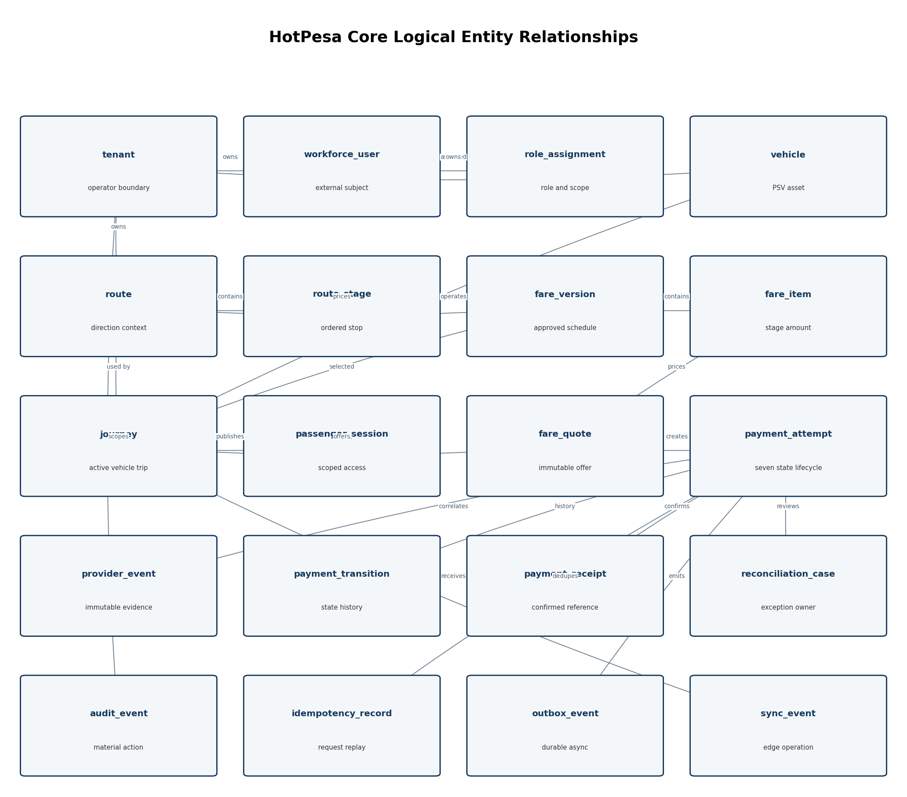
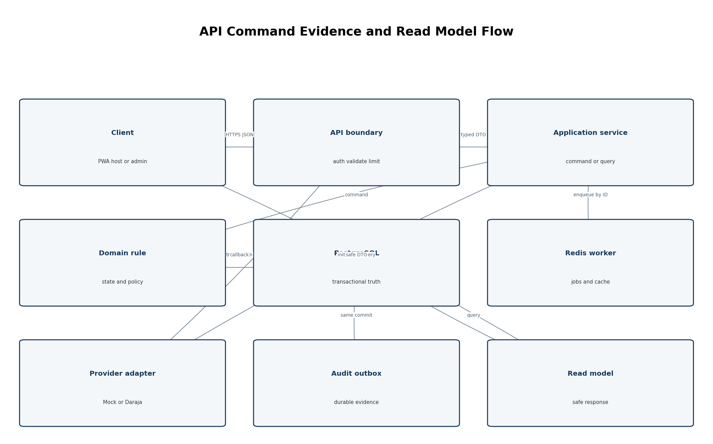

> Controlled source: [06_Data Model and API Contract (DMAC)_HotPesa Pay.docx](../controlled-documents/06_Data%20Model%20and%20API%20Contract%20(DMAC)_HotPesa%20Pay.docx)

> The DOCX source is authoritative. This Markdown copy preserves its controlled status and does not confer approval.

DOCUMENT 06

Data Model and API Contract

HotPesa Pay

 

Authoritative entities, constraints, states, versioned endpoints, schemas, webhooks and contract evidence

  

| Control | Value |
| --- | --- |
| Project | HotPesa Pay |
| Document | Data Model and API Contract |
| Version | 1.0 |
| Status | Detailed final draft for review and approval |
| Lifecycle stage | Data and interface baseline following Documents 01-05 |
| Primary market | Kenya |
| Classification | Confidential - project planning |

 

### Governing question

Which data facts does HotPesa own, how are they constrained, and what exact interface behavior may each client, worker and payment provider rely on?

 

# Document Control

| Field | Controlled value |
| --- | --- |
| Document owner | Data and API Authority, supported by Engineering, Security, Product and Quality Assurance. |
| Upstream authority | Approved HotPesa BRD, PRD, FRS, USUC and TRD, including recorded approval conditions. |
| Reviewers | Product; backend/mobile/web engineering; data; security/privacy; QA; DevOps/SRE; finance/operations; provider integration; pilot operator/SACCO. |
| Approval authority | Engineering and Data Authorities, with Product and Security approval for external/public contracts. |
| Reference use | Mpanga DMAC informed structure; HotPesa entities, state semantics and interfaces are project-specific. |
| Downstream authority | Approved DMAC governs migrations, repositories, DTOs, OpenAPI, provider adapters, clients, test fixtures and contract tests. |
| Change control | Breaking schema/API change requires version impact, migration/consumer plan, traceability and ADR where architectural. |
| Next review | Before Daraja sandbox integration, pilot data migration and every breaking contract release. |

## Status and Interpretation

This detailed final draft defines the logical data model and API behavior expected of the HotPesa MVP. It is implementation-ready at the normalized contract level. Physical names may change only through controlled review without weakening identifiers, constraints, states, privacy or behavior. Provider-specific Daraja fields, final identity claims, retention periods and production infrastructure details remain subject to the recorded decisions. No example contains live credentials or authorizes live payment processing.

## Version History

| Version | Date | Status | Summary |
| --- | --- | --- | --- |
| 0.1 | 18 September 2026 | Initial draft | Seventeen-entity baseline, API standards and twelve endpoints. |
| 1.0 | 19 September 2026 | Detailed final draft | Expanded logical model, field dictionaries, constraints, endpoint/DTO/error/webhook contracts, data governance and traceability. |

## Table of Contents

| Section | Purpose |
| --- | --- |
| 1 Overview and Contract Authority | Scope, authority and implementation boundary |
| 2 Data Architecture and Design Principles | Persistence, ownership and invariants |
| 3 Domain Model and Entity Catalogue | Complete MVP object inventory |
| 4 Entity Relationship Model | Cardinality and authoritative relationships |
| 5 Common Data Conventions | IDs, time, money, audit and naming |
| 6 Tenant Identity and Authorization Data | Tenants, workforce roles and sessions |
| 7 Fleet Route and Journey Data | Vehicles, routes, stages, assignments and journeys |
| 8 Fare Quote and Pricing Data | Versioned fares and immutable quotes |
| 9 Payment Evidence and Receipt Data | Attempts, evidence, transitions and receipts |
| 10 Reconciliation Audit Synchronization and Outbox Data | Exception, audit, edge and durable async records |
| 11 Relationships Constraints and Integrity Rules | Foreign keys, uniqueness and state integrity |
| 12 Keys Identifiers and Reference Strategy | Internal, public and external reference rules |
| 13 Indexing Query and Performance Design | Indexes, bounded queries and projections |
| 14 Validation Classification and Privacy Metadata | Field rules, sensitivity and minimization |
| 15 Data Retention Archival and Rights | Retention, holds, deletion and archive |
| 16 Schema Migration and Data Lifecycle | Versioned migrations and compatibility |
| 17 API Architecture and Standards | Protocol, base path and representation |
| 18 Authentication Authorization and Session Contracts | Identity, passenger session and policy context |
| 19 Idempotency Concurrency and Consistency Contracts | Replay, race and transaction semantics |
| 20 Passenger Journey and Fare Endpoints | Accountless passenger API surface |
| 21 Journey Fleet and Assignment Endpoints | Field operations API surface |
| 22 Fare and Tenant Administration Endpoints | Configuration and approval API surface |
| 23 Payment Provider and Reconciliation Endpoints | Payment and provider API surface |
| 24 Reporting Support and Audit Endpoints | Controlled reads, exports and evidence |
| 25 Request Response and DTO Definitions | Canonical JSON shapes and examples |
| 26 Enumerations and State Contracts | Seven states and controlled enums |
| 27 Pagination Filtering Sorting and Search | Collection behavior and safe search |
| 28 Error Model and HTTP Status Codes | Problem details and response mapping |
| 29 M Pesa Callback and Provider Contract | Authenticity, dedupe and acknowledgement |
| 30 Async Event Job and Synchronization Contracts | Outbox, jobs, sync and internal events |
| 31 OpenAPI SDK and Contract Testing | Machine-readable source and consumer proof |
| 32 Security Privacy and Data Protection Controls | Access, masking, encryption and audit |
| 33 Requirements Traceability | FRS/USUC/TRD to schema/API linkage |
| 34 Open Decisions Assumptions and Dependencies | Items not safe to invent |
| 35 Approval and Sign Off | Stakeholder contract acceptance |
| 36 Final DMAC Readiness Checklist | Completion and release gate |

 

# 1 Overview and Contract Authority

HotPesa uses PostgreSQL as the durable system of record for tenant, journey, fare, payment, provider evidence, reconciliation and audit facts. Redis supports cache, job coordination and leases but is not a financial authority. The external API is HTTPS REST/JSON under /api/v1 for the MVP. Provider callbacks use dedicated integration endpoints and are transformed into normalized evidence before any payment state transition.

| Contract layer | Authority | Implementation consequence |
| --- | --- | --- |
| Logical data model | This document. | Repositories/migrations preserve entity meaning, cardinality and constraints. |
| Physical schema | Version-controlled migrations aligned to this model. | Names/types may be refined; invariants and traceability may not be weakened. |
| External API | OpenAPI generated/validated against this document. | Clients rely only on published fields, statuses and error codes. |
| Provider contract | Adapter-specific contract plus normalized provider evidence model. | Provider fields do not leak into domain/client contracts without approval. |
| Internal events/jobs | Versioned schemas owned by producing module. | Consumers are idempotent and compatible with at-least-once delivery. |
| Examples | Illustrative non-secret payloads. | Examples clarify shape but schema and rules remain authoritative. |

 

## 1.1 Scope Boundaries

MVP tenant, workforce, fleet, route, fare, journey, passenger session, payment, reconciliation, audit and reporting data.

Passenger, conductor/host, administration, payment-provider and operational API contracts.

State, validation, idempotency, error, pagination, filtering, versioning and webhook behavior.

Wallet, reservations, loyalty, lending, insurance, advertising and cross-operator settlement are excluded.

# 2 Data Architecture and Design Principles

| ID | Data principle |
| --- | --- |
| DP-001 | PostgreSQL owns durable business truth; Redis/cache can be rebuilt. |
| DP-002 | Every tenant-owned row carries tenant_id and is accessed through tenant-scoped repositories. |
| DP-003 | Payment/provider/audit evidence is append-only; corrections create new records. |
| DP-004 | Money is integer minor units plus ISO currency; KES uses minor-unit policy defined in contract. |
| DP-005 | UTC instants are stored; Africa/Nairobi is presentation/business-calendar context. |
| DP-006 | Server-generated opaque IDs are distinct from public and provider references. |
| DP-007 | State changes pass through controlled transition rules and history. |
| DP-008 | Effectful operations have idempotency and concurrency controls. |
| DP-009 | Sensitive data is minimized, classified, masked and retained by purpose. |
| DP-010 | Schema and API evolve through additive compatibility and reviewed migration. |

 

## 2.1 Database Organization

| Logical area | Owned entities | Primary owner |
| --- | --- | --- |
| identity | tenant, workforce_user, role_assignment, device_registration | Identity/access module |
| fleet | vehicle, route, route_stage, crew_assignment | Tenant/fleet module |
| fare | fare_version, fare_item, fare_quote | Fare module |
| journey | journey, passenger_session, journey_incident | Journey module |
| payment | payment_attempt, payment_transition, payment_receipt, idempotency_record | Payment module |
| provider | provider_event, provider_configuration_reference | Provider evidence/adapter |
| reconciliation | reconciliation_case, reconciliation_action | Finance/reconciliation |
| platform | audit_event, outbox_event, sync_event, export_request | Audit/operations/reporting |

# 3 Domain Model and Entity Catalogue

| Entity | Purpose | Classification |
| --- | --- | --- |
| tenant | SACCO/operator isolation and commercial/operational boundary. | Internal |
| workforce_user | HotPesa application profile mapped to external identity subject. | Personal |
| role_assignment | Tenant/resource/context authorization grant. | Restricted |
| device_registration | Revocable conductor-host device enrollment metadata. | Restricted |
| vehicle | Tenant PSV asset used by journeys. | Internal |
| route | Tenant route and direction definition. | Public/Internal |
| route_stage | Ordered boarding/destination point. | Public/Internal |
| crew_assignment | Time-bounded driver/conductor assignment. | Internal |
| fare_version | Draft/approved/effective fare schedule version. | Internal |
| fare_item | Amount for supported origin/destination or destination context. | Public/Internal |
| fare_quote | Immutable server offer used by one payment attempt. | Restricted |
| journey | Active operational vehicle trip. | Internal |
| passenger_session | Short-lived accountless journey-scoped access. | Restricted |
| journey_incident | Operational/safety incident linked to journey. | Restricted |
| payment_attempt | Immutable fare payment request and seven-state aggregate. | Restricted |
| payment_transition | Append-only payment state change history. | Restricted |
| provider_event | Immutable callback/status evidence receipt. | Restricted |
| payment_receipt | Minimal confirmed fare proof/reference. | Restricted |
| idempotency_record | Effectful request key, canonical hash and original outcome. | Restricted |
| reconciliation_case | Owned mismatch/late/conflict investigation. | Restricted |
| reconciliation_action | Append-only review action/evidence reference. | Restricted |
| audit_event | Material security/business action record. | Restricted |
| outbox_event | Durable internal event for asynchronous delivery. | Internal/Restricted |
| sync_event | Edge/client operational event and sync result. | Restricted |
| export_request | Controlled report/export job and artifact reference. | Restricted |

# 4 Entity Relationship Model

Figure 1  HotPesa core logical entities and authoritative relationships

 

## 4.1 Cardinality Summary

| Parent | Relationship | Child | Integrity rule |
| --- | --- | --- | --- |
| tenant | 1 to many | users, roles, vehicles, routes, fares, journeys, payments, audit | Child tenant_id is mandatory and immutable after creation except controlled migration. |
| route | 1 to many ordered | route_stage | Unique sequence and active stage identity per route/direction. |
| fare_version | 1 to many | fare_item | Items cannot change after activation; new version replaces. |
| journey | 1 to many | passenger_session, fare_quote, payment_attempt, incidents | Closed journey rejects new attempts but preserves existing evidence. |
| fare_quote | 0 or 1 to 1 | payment_attempt | An attempt uses exactly one immutable accepted quote. |
| payment_attempt | 1 to many | provider_event and payment_transition | All evidence retained; effective state remains one. |
| payment_attempt | 0 or 1 to 1 | payment_receipt | Receipt exists only for confirmed and is unique. |
| payment_attempt | 0 to many | reconciliation_case | Only one active case per reason/policy where configured. |
| business aggregate | 1 to many | audit_event and outbox_event | Material mutation is traceable; delivery does not redefine source state. |

# 5 Common Data Conventions

| Concern | Canonical rule |
| --- | --- |
| Primary ID | UUID v4/v7 or ULID stored in a PostgreSQL-native/safe type; selected once by ADR/migration standard. |
| Public reference | Random/non-sequential human-safe reference where users need support/receipt lookup; never database sequence exposure. |
| External reference | Provider/identity reference stored separately, scoped by provider/configuration and never used as sole internal key. |
| Timestamps | created_at, updated_at and relevant occurred_at/effective_at are timestamptz UTC; database/server time authoritative. |
| Optimistic version | version integer on mutable aggregates requiring lost-update/concurrency control. |
| Soft deletion | Only for approved nonfinancial catalogue/profile data; financial/evidence/audit records use lifecycle/archive, not ordinary deletion. |
| Money | amount_minor bigint or integer within validated range plus currency char(3); no float/decimal API ambiguity. |
| Phone | Normalized E.164 for provider use, encrypted/tokenized as approved; masked derivative for views/search. |
| Enums | Controlled lowercase kebab/snake values in JSON/schema; database check or reference policy prevents unknown state. |
| JSON | Use JSONB only for provider-specific normalized metadata or extensible evidence under schema/version; not as substitute for modeled columns. |
| Audit actor | actor_type plus actor_id/service name and tenant context; no unstructured identity-only string. |
| Names | Database snake_case; JSON lowerCamelCase; mapping is explicit in schema tooling. |

## 5.1 Standard Mutable Entity Fields

| Field | Type/nullable | Rule |
| --- | --- | --- |
| id | uuid/ulid, not null | Server generated primary key. |
| tenant_id | uuid, not null for tenant-owned | Foreign key and repository scope. |
| created_at | timestamptz, not null | Server/database generated. |
| created_by | uuid/string, nullable by entity | Actor/service reference; required for administrative creation. |
| updated_at | timestamptz, not null | Changed on successful mutation. |
| updated_by | uuid/string, nullable by entity | Actor/service responsible. |
| version | integer, not null default 1 | Increment for optimistic concurrency where enabled. |
| status | controlled enum, not null | Lifecycle defined per entity. |

# 6 Tenant Identity and Authorization Data

## 6.1 tenant

| Field | Type and nullability | Constraint and meaning | Classification |
| --- | --- | --- | --- |
| id | uuid not null | Primary key. | Internal |
| code | varchar not null | Unique stable tenant code; not secret. | Internal |
| display_name | varchar not null | Approved operator/SACCO name. | Public/Internal |
| country_code | char(2) not null | ISO 3166-1; MVP KE. | Internal |
| timezone | varchar not null | IANA zone; default Africa/Nairobi. | Internal |
| status | tenant_status not null | provisioning, active, suspended, closed. | Internal |
| created_at / updated_at | timestamptz not null | Server audit times. | Internal |

## 6.2 workforce_user

| Field | Type and nullability | Constraint and meaning | Classification |
| --- | --- | --- | --- |
| id | uuid not null | Application profile key. | Personal |
| tenant_id | uuid not null | Owning tenant membership context. | Internal |
| identity_provider | varchar not null | Configured OIDC issuer/provider code. | Restricted |
| external_subject | varchar not null | Unique with issuer; never exposed to ordinary clients. | Restricted |
| display_name | varchar not null | Operational name. | Personal |
| email_masked / phone_masked | varchar nullable | Display/search derivative only. | Personal |
| status | user_status not null | invited, active, suspended, disabled. | Internal |
| last_access_at | timestamptz nullable | Security/operations metadata. | Restricted |
| version | integer not null | Concurrency control. | Internal |

## 6.3 role_assignment and device_registration

| Field | Type and nullability | Constraint and meaning | Classification |
| --- | --- | --- | --- |
| role_assignment.id | uuid not null | Primary key. | Restricted |
| role_assignment.user_id | uuid not null | Workforce user FK. | Restricted |
| role | role_code not null | conductor, driver, operations, owner, finance, support, tenant-admin, platform-admin, auditor. | Restricted |
| scope_type / scope_id | enum + uuid nullable | Tenant/fleet/vehicle/route/resource boundary. | Restricted |
| valid_from / valid_to | timestamptz | Time-bounded access; valid_to optional. | Restricted |
| approved_by / reason | uuid + text nullable/required by policy | Required for privileged change. | Restricted |
| device_registration.id | uuid not null | Revocable host registration. | Restricted |
| device_fingerprint_hash | varchar nullable | Privacy-reviewed stable derivative; never raw hardware ID unless approved. | Restricted |
| platform / app_version | varchar not null | Compatibility/operations fields. | Internal |
| status / revoked_at | enum + timestamptz | pending, active, revoked. | Restricted |

# 7 Fleet Route and Journey Data

## 7.1 vehicle

| Field | Type and nullability | Constraint and meaning | Classification |
| --- | --- | --- | --- |
| id / tenant_id | uuid not null | Primary and tenant keys. | Internal |
| registration_number | varchar not null | Normalized; unique within active tenant or approved national rule. | Internal |
| public_label | varchar nullable | Passenger-recognizable safe identifier. | Public |
| capacity | smallint nullable | Positive when recorded. | Internal |
| status | vehicle_status not null | active, inactive, maintenance, retired. | Internal |
| metadata | jsonb nullable | Schema-controlled non-sensitive extensions. | Internal |
| version / timestamps | integer + timestamptz | Concurrency and audit. | Internal |

## 7.2 route and route_stage

| Field | Type and nullability | Constraint and meaning | Classification |
| --- | --- | --- | --- |
| route.id / tenant_id | uuid not null | Tenant route key. | Internal |
| route.code / name | varchar not null | Code unique within tenant; approved display name. | Public/Internal |
| direction_code | varchar not null | Stable direction identity; no free-form runtime inference. | Internal |
| origin_name / destination_name | varchar not null | Passenger display context. | Public |
| route.status | route_status not null | draft, active, inactive, archived. | Internal |
| stage.id / route_id | uuid not null | Stage key and FK. | Internal |
| stage.sequence | integer not null | Positive; unique per route version/direction. | Internal |
| stage.code / name | varchar not null | Stable code and display name. | Public/Internal |
| latitude / longitude | numeric nullable | Optional approved geospatial coordinates; valid ranges. | Public/Internal |
| stage.status | stage_status not null | active, inactive. | Internal |

## 7.3 crew_assignment journey and passenger_session

| Field | Type and nullability | Constraint and meaning | Classification |
| --- | --- | --- | --- |
| crew_assignment.id | uuid not null | Primary key. | Internal |
| vehicle_id / user_id / role | uuid + enum | Same tenant; driver or conductor; valid period. | Internal |
| valid_from / valid_to | timestamptz | No prohibited overlapping assignment. | Internal |
| journey.id / public_reference | uuid + varchar | Opaque internal key and safe field reference. | Internal/Public |
| journey.vehicle_id / route_id / fare_version_id | uuid not null | Same tenant and effective at start. | Internal |
| journey.started_at / closed_at | timestamptz | Server times; closed_at after started_at. | Internal |
| journey.state | journey_state not null | draft, active, closing, closed, suspended, cancelled. | Internal |
| journey.close_reason | varchar nullable | Required for configured exceptional closure. | Restricted |
| passenger_session.id | uuid not null | Short-lived scoped access. | Restricted |
| token_hash / public_alias | varchar not null | Store verifier/hash, never recoverable bearer token; alias non-authoritative. | Restricted/Public |
| expires_at / revoked_at | timestamptz | Expiry and invalidation. | Restricted |

# 8 Fare Quote and Pricing Data

## 8.1 fare_version

| Field | Type and nullability | Constraint and meaning | Classification |
| --- | --- | --- | --- |
| id / tenant_id / route_id | uuid not null | Same tenant and route. | Internal |
| version_number | integer not null | Unique per route/direction and positive. | Internal |
| currency | char(3) not null | ISO currency; MVP KES. | Public |
| effective_from / effective_to | timestamptz | Valid interval; no prohibited active overlap. | Internal |
| status | fare_status not null | draft, pending-approval, active, superseded, withdrawn. | Internal |
| created_by / approved_by | uuid | Creator required; approver required for approval. | Restricted |
| approval_reason | text nullable | Required by approval policy. | Restricted |
| activated_at | timestamptz nullable | Server activation evidence. | Internal |

## 8.2 fare_item and fare_quote

| Field | Type and nullability | Constraint and meaning | Classification |
| --- | --- | --- | --- |
| fare_item.id / fare_version_id | uuid not null | Item and parent FK. | Internal |
| origin_stage_id | uuid nullable | Optional when boarding origin is implicit; otherwise same route. | Public/Internal |
| destination_stage_id | uuid not null | Same route and after origin under route rule. | Public/Internal |
| amount_minor | bigint not null | Positive and within configured bounds. | Public |
| fare_quote.id | uuid not null | Immutable server quote. | Restricted |
| journey_id / fare_item_id / fare_version_id | uuid not null | Exact context used to calculate amount. | Restricted |
| amount_minor / currency | bigint + char(3) | Copied immutable value. | Restricted |
| quoted_at / expires_at | timestamptz not null | Server times; expiry after quote. | Restricted |
| quote_signature_hash | varchar nullable | Integrity derivative when needed; not client price authority. | Restricted |

# 9 Payment Evidence and Receipt Data

## 9.1 payment_attempt

| Field | Type and nullability | Constraint and meaning | Classification |
| --- | --- | --- | --- |
| id / public_reference | uuid + varchar | Internal key and safe recoverable reference. | Restricted |
| tenant_id / journey_id / fare_quote_id | uuid not null | Same tenant and immutable context. | Restricted |
| amount_minor / currency | bigint + char(3) | Copied from quote; immutable. | Restricted |
| payer_phone_ciphertext | encrypted value nullable | Only if approved/required for provider and retention. | Restricted |
| payer_phone_hash | varchar nullable | Keyed/tokenized equality lookup if approved; not reversible. | Restricted |
| payer_phone_masked | varchar not null | Safe display derivative. | Personal |
| state | payment_state not null | created, initiating, pending, confirmed, failed, expired, review-required. | Restricted |
| state_version | integer not null | Incremented by central transition. | Internal |
| provider_code / merchant_config_ref | varchar not null | Adapter and protected configuration reference. | Restricted |
| provider_request_ref / provider_transaction_ref | varchar nullable | External correlation; unique/scoped where applicable. | Restricted |
| created_at / updated_at / confirmed_at | timestamptz | Confirmed_at only when state confirmed. | Restricted |
| failure_code | varchar nullable | Safe normalized category, not raw provider message. | Restricted |

## 9.2 provider_event and payment_transition

| Field | Type and nullability | Constraint and meaning | Classification |
| --- | --- | --- | --- |
| provider_event.id | uuid not null | Internal receipt key. | Restricted |
| provider_event.provider_event_key | varchar not null | Unique per provider/config; stable callback/status identity. | Restricted |
| attempt_id | uuid nullable | Nullable until correlation; unknown evidence quarantined. | Restricted |
| source_type | enum not null | callback, status-query, initiation-response. | Internal |
| authenticity_status | enum not null | accepted, rejected, not-applicable under controlled adapter. | Restricted |
| payload_hash / schema_version | varchar not null | Integrity and parser version; raw storage policy separate. | Restricted |
| normalized_result | enum nullable | success, failure, pending, unknown. | Restricted |
| amount_minor / currency | bigint + char(3) nullable | Evidence comparison values. | Restricted |
| received_at / provider_occurred_at | timestamptz | Server receipt and provider asserted time. | Restricted |
| processing_status | enum not null | received, validated, rejected, duplicate, quarantined, processed. | Restricted |
| transition.id / attempt_id | uuid not null | Append-only history. | Restricted |
| from_state / to_state / signal | enum not null | Permitted central transition and cause. | Restricted |
| provider_event_id | uuid nullable | Evidence link when transition evidence-led. | Restricted |
| occurred_at / actor_type / actor_id | timestamptz + refs | Attributable transition. | Restricted |

## 9.3 payment_receipt and idempotency_record

| Field | Type and nullability | Constraint and meaning | Classification |
| --- | --- | --- | --- |
| receipt.id / attempt_id | uuid not null | One-to-one; unique attempt_id. | Restricted |
| receipt_reference | varchar not null | Unique safe human/support reference. | Restricted |
| issued_at | timestamptz not null | At or after confirmed transition. | Restricted |
| verification_token_hash | varchar nullable | Store verifier/hash; do not expose reusable secret. | Restricted |
| idempotency.id | uuid not null | Primary key. | Restricted |
| scope_key / operation | varchar not null | Actor/session plus endpoint/command scope. | Restricted |
| idempotency_key | varchar not null | Unique with scope and operation. | Restricted |
| request_hash | varchar not null | Canonical material request hash. | Restricted |
| resource_type / resource_id | varchar + uuid nullable | Created/original result reference. | Restricted |
| response_status / response_body_ref | integer + ref | Safe replay outcome; sensitive body handling controlled. | Restricted |
| expires_at | timestamptz nullable | Retention long enough for retry policy and dispute safety. | Restricted |

 

# 10 Reconciliation Audit Synchronization and Outbox Data

## 10.1 reconciliation_case and reconciliation_action

| Field | Type and nullability | Constraint and meaning | Classification |
| --- | --- | --- | --- |
| case.id / tenant_id / attempt_id | uuid not null | Case, tenant and attempt linkage. | Restricted |
| reason_code | enum not null | unmatched, amount-mismatch, merchant-mismatch, late-evidence, conflicting-evidence, retry-exhausted. | Restricted |
| status | case_status not null | open, assigned, investigating, resolved, escalated. | Restricted |
| owner_user_id | uuid nullable | Authorized finance/review owner. | Restricted |
| opened_at / resolved_at | timestamptz | Lifecycle times. | Restricted |
| resolution_code / rationale | enum + text nullable | Required on resolution; cannot invent provider success. | Restricted |
| action.id / case_id | uuid not null | Append-only case action. | Restricted |
| action_type / evidence_ref | enum + varchar | assign, note, query, escalate, resolve; evidence pointer. | Restricted |
| actor_id / occurred_at | uuid + timestamptz | Attribution. | Restricted |

## 10.2 audit_event outbox_event sync_event and export_request

| Field | Type and nullability | Constraint and meaning | Classification |
| --- | --- | --- | --- |
| audit_event.id / tenant_id | uuid + uuid nullable | Platform events may have no tenant. | Restricted |
| actor_type / actor_id | enum + varchar | passenger-session, workforce, service, provider. | Restricted |
| action / resource_type / resource_id | varchar | Controlled action and target. | Restricted |
| result / reason_code | enum + varchar nullable | success, denied, failed and safe reason. | Restricted |
| correlation_id / occurred_at | varchar + timestamptz | End-to-end trace. | Restricted |
| details | jsonb nullable | Schema-controlled, redacted metadata only. | Restricted |
| outbox_event.id / aggregate | uuid + refs | Durable event after business commit. | Internal |
| event_type / schema_version / payload | varchar + jsonb | Versioned minimal internal contract. | Internal/Restricted |
| published_at / attempts | timestamptz + integer | Delivery status; does not alter source truth. | Internal |
| sync_event.id / device_id / journey_id | uuid refs | Permitted edge event. | Restricted |
| client_event_id / state | uuid + enum | Unique per device; queued, synchronized, conflict, dead-letter. | Restricted |
| export_request.id / filters / status | uuid + jsonb + enum | Authorized bounded export job. | Restricted |
| artifact_ref / expires_at | varchar + timestamptz nullable | Protected short-lived output reference. | Restricted |

# 11 Relationships Constraints and Integrity Rules

| ID | Integrity rule |
| --- | --- |
| C-001 | Every tenant-owned FK chain resolves to the same tenant; cross-tenant association is rejected. |
| C-002 | A vehicle has at most one conflicting active journey under the approved overlap rule. |
| C-003 | Route-stage sequence is unique and positive within the route/direction version. |
| C-004 | Only one applicable active fare rule may exist for the same route/direction/stage context and effective instant. |
| C-005 | Active fare_version and fare_item rows are immutable; changes create a new version. |
| C-006 | Fare quote amount/currency/version are copied to the payment attempt and never retroactively changed. |
| C-007 | Idempotency key is unique within scope/operation; same hash replays, different hash conflicts. |
| C-008 | Provider event key is unique within provider/configuration; duplicate receipt creates no second effect. |
| C-009 | One receipt per confirmed attempt; non-confirmed attempts cannot have an issued receipt. |
| C-010 | Payment state changes require an allowed transition and increment state_version. |
| C-011 | Provider/audit/transition records cannot be updated/deleted through ordinary application roles. |
| C-012 | Closing/closed journey rejects new quotes/attempts while existing attempts remain processable. |
| C-013 | Confirmed value alone contributes to confirmed revenue; all other states aggregate separately. |
| C-014 | Reconciliation resolution requires actor, rationale and allowed disposition; raw evidence is immutable. |
| C-015 | Financial/evidence records use restrictive delete behavior; catalogue deletion cannot cascade into history. |

## 11.1 Database Enforcement

| Mechanism | Use |
| --- | --- |
| Foreign keys | Referential integrity with RESTRICT for financial/history and controlled SET NULL only where justified. |
| Unique indexes | Tenant codes, external subject+issuer, active vehicle/journey rule, idempotency scope/key, provider event key, receipt attempt. |
| Check constraints | Positive money/capacity/sequence, valid timestamps, state-dependent required fields, coordinate ranges. |
| Exclusion/partial indexes | Effective fare overlap or single active journey where PostgreSQL design supports it. |
| Transactions/locking | Attempt transition, provider-event processing and material audit/outbox atomicity. |
| Triggers | Avoid business logic triggers where application service can be tested; allow narrow updated_at/invariant support only by ADR. |

# 12 Keys Identifiers and Reference Strategy

| Identifier | Audience | Rule |
| --- | --- | --- |
| Internal id | Services/database | Opaque UUID/ULID; never guessable sequence. |
| Tenant code | Admin/operations | Stable unique non-secret code; changing display name does not change it. |
| Journey public reference | Passenger/crew/support | Short enough for assistance; random/check character where useful; cannot grant broad access alone. |
| Payment public reference | Passenger/support | Safe lookup under scoped session/authorization; not provider transaction ID. |
| Receipt reference | Passenger/auditor | Unique minimal confirmed proof reference. |
| Provider request/transaction reference | Provider/finance | Stored exactly and indexed under provider/configuration; restricted display. |
| Correlation ID | Diagnostics | Per request/workflow; safe random value; not an authorization credential. |
| Idempotency key | Client/server effect control | Opaque client/session-generated within limits; never reused for different material request. |

## 12.1 Canonicalization

Normalize phone to approved E.164 representation before provider use and request hashing.

Canonical idempotency request hash includes material semantic fields in stable order, excluding volatile transport metadata.

Do not trim, case-fold or reinterpret provider references unless provider contract explicitly defines normalization.

Use Unicode normalization and controlled length for human text; preserve original approved display where needed.

# 13 Indexing Query and Performance Design

| Table | Required index/query pattern | Reason |
| --- | --- | --- |
| payment_attempt | tenant_id + created_at; journey_id + state; public_reference; provider refs; state + updated_at. | Status board, finance search, reconciliation and support. |
| provider_event | provider/config + provider_event_key unique; attempt_id + received_at; processing_status + received_at. | Dedupe, timeline and quarantine. |
| payment_transition | attempt_id + occurred_at/id. | Ordered timeline. |
| journey | tenant_id + state + started_at; vehicle_id + active partial uniqueness; public_reference. | Operations and conflict prevention. |
| fare_version/item | tenant/route/direction/status/effective range; destination/origin item lookup. | Quote selection and overlap validation. |
| role_assignment | user_id + valid range; tenant + role + scope. | Authorization evaluation/access review. |
| audit_event | tenant + occurred_at; resource; actor; correlation. | Controlled audit search. |
| reconciliation_case | tenant + status + opened_at; owner + status; attempt. | Work queue. |
| outbox/sync | delivery state + next attempt; device/client event unique. | Worker and edge reliability. |
| export_request | tenant + requester + created_at/status. | Export management. |

## 13.1 Query Rules

Every list endpoint has bounded page size and deterministic stable sort.

Unbounded date ranges and wildcard full-table search are rejected or moved to approved asynchronous export.

Explain plans and representative data verify critical indexes before pilot.

Sensitive equality search uses approved keyed/tokenized derivative; never weak unsalted hash of phone number.

# 14 Validation Classification and Privacy Metadata

| Field/category | Validation | Classification/handling |
| --- | --- | --- |
| MSISDN | Approved Kenyan E.164 pattern and provider rules; reject malformed/unsupported. | Restricted source; encrypted/tokenized/masked derivatives. |
| Money | Positive integer minor units, supported currency, exact quote/evidence match. | Restricted transaction fact; no float. |
| Route/stage | Active, same tenant/route/direction, valid sequence and fare context. | Public/Internal. |
| Journey | Active/eligible state; assigned vehicle/crew; same tenant; no prohibited conflict. | Internal. |
| Provider event | Size/schema/authenticity/event key/correlation/result/amount/merchant validation. | Restricted; normalized ordinary view. |
| Free text | Length, Unicode, prohibited control characters; sanitize on display; no secret entry. | Classification inherited from entity; minimize. |
| Coordinates | Optional numeric ranges and approved precision. | Public/Internal; do not infer passenger location. |
| Export filters | Authorized fields, bounded range/page, tenant/resource scope. | Restricted output with expiry/audit. |

## 14.1 Field-Level Metadata

Schema definitions should carry description, format, minimum/maximum, enum, nullable, readOnly/writeOnly, example, sensitivity classification and masking rule where relevant. Sensitive fields are excluded by default from generic serialization, logging and analytics.

# 15 Data Retention Archival and Rights

| Data | Proposed lifecycle | Decision authority |
| --- | --- | --- |
| Passenger session/token verifier | Short journey-linked expiry; revoke on closure/policy; remove device cache after safe sync/window. | Product/Security/Privacy |
| Phone ciphertext/token/hash | Keep only where provider, support, dispute or lawful purpose requires; masking derivative preferred. | Privacy/Legal/Finance |
| Payment, receipt and provider evidence | Retain for approved statutory, tax, contract and dispute period; restricted archive if appropriate. | Legal/Finance/Provider |
| Audit/security events | Retention aligned to assurance and incident needs; append-only/protected archive. | Security/Legal |
| Diagnostic logs/traces | Short purpose-limited retention with redaction and access control. | SRE/Security/Privacy |
| Reconciliation/support cases | Case lifecycle plus approved dispute/assurance period. | Finance/Support/Legal |
| Exports | Short-lived protected artifact; request/audit metadata retained separately. | Data owner/Privacy |
| Backups | Encrypted schedule and expiry aligned to recovery and deletion exception policy. | SRE/Legal |

## 15.1 Data Subject and Legal Hold

Identity verification and tenant/purpose authorization precede access/export/correction requests.

Erasure cannot silently destroy payment, tax, dispute, fraud, audit or legal-hold evidence.

Correction creates attributable new facts or controlled profile update; provider evidence remains immutable.

Retention periods remain Decision Required until Kenyan legal/privacy/commercial counsel approves them.

# 16 Schema Migration and Data Lifecycle

| Migration stage | Required practice |
| --- | --- |
| Design | Map change to requirement, entity owner, sensitivity, indexes, backward compatibility and rollback/forward plan. |
| Expand | Add nullable/default-compatible columns/tables/indexes without breaking current application. |
| Backfill | Idempotent bounded job with progress, validation and no secret leakage. |
| Dual compatibility | Old and new application versions tolerate the expanded schema during rollout. |
| Switch | Deploy readers/writers to new contract with metrics and verification. |
| Contract | Remove old column/constraint only after usage proof, backup and approved change window. |
| Recovery | Prefer application rollback with compatible schema; destructive migration requires restore/forward-fix evidence. |

## 16.1 Seed and Reference Data

Migrations create schema; controlled seed commands create synthetic local/test tenants, routes, fares and users.

Production operational data is not embedded in source-control migrations.

Enum/reference additions are additive and versioned; removals require consumer/data migration.

Test fixtures use deterministic synthetic Kenyan-format values and known totals.

# 17 API Architecture and Standards

Figure 2  API boundary, domain transaction, provider and asynchronous flow

| Concern | Contract |
| --- | --- |
| Base URL | /api/v1 for platform API; /api/v1/integrations/mpesa/... for provider callbacks; health endpoints outside business namespace as approved. |
| Protocol/encoding | HTTPS; JSON UTF-8; ISO 8601 UTC; content-type application/json unless file export/download. |
| Naming | lowerCamelCase JSON; plural resource paths; nouns for resources, explicit action subresources only for domain commands. |
| Authentication | Bearer OIDC/session for workforce; scoped passenger session; service/provider authenticity for integrations. |
| Authorization | Server resolves tenant, role, resource, assignment, purpose and action; client tenant fields do not grant access. |
| Schema | Runtime request/response validation against versioned OpenAPI/JSON Schema. |
| Idempotency | Idempotency-Key required for designated effectful commands; replay/changed-payload behavior is defined. |
| Errors | application/problem+json-compatible envelope with stable HotPesa code and correlationId. |
| Compatibility | Additive changes within v1; breaking semantic/schema change requires /v2 or negotiated webhook version. |
| Limits | Explicit body, field, page, date-range, rate and timeout limits; published in OpenAPI/config where appropriate. |

## 17.1 Standard Headers

| Header | Direction | Use |
| --- | --- | --- |
| Authorization | Request | Bearer workforce/passenger token where applicable. |
| Idempotency-Key | Request | Required on designated create/action endpoints. |
| If-Match | Request | Optional/required aggregate version for lost-update-sensitive admin mutations. |
| X-Correlation-ID | Both | Accepted if safe or server generated; returned on response. |
| X-Request-ID | Response | Unique server request identifier where distinct. |
| Retry-After | Response | Rate limit/service unavailable guidance when safe. |
| Content-Type | Both | JSON/problem+json/export MIME. |
| Webhook signature/auth headers | Request | Provider-specific; validated only in adapter boundary. |

# 18 Authentication Authorization and Session Contracts

| Principal | Credential/session | Permitted scope | Data returned |
| --- | --- | --- | --- |
| Passenger | Short-lived journey-scoped session token. | Read recognized journey/fares; create/read own scoped attempt/reference. | Minimal safe journey and payment DTOs; masked payer. |
| Conductor host | Workforce OIDC token plus approved device context. | Assigned journeys, board and closure/incident commands. | Tenant/assignment-scoped operational data. |
| Tenant workforce | OIDC token mapped to role/resource/context. | Admin functions defined by policy. | Field masking and export restrictions by role/purpose. |
| Platform service/worker | Workload identity/internal service credential. | Specific internal operations/jobs. | Minimal entity references and normalized result. |
| M-Pesa/provider | Approved callback authenticity control. | Dedicated callback endpoint only. | Safe acknowledgement; no internal resource detail. |

## 18.1 Passenger Session Claims

| Claim/attribute | Rule |
| --- | --- |
| sessionId | Opaque server-known identifier or token subject. |
| journeyId | Server-bound scope; cannot be changed by client body. |
| tenantId | Server-bound and not exposed unless needed as safe reference. |
| allowedActions | Narrow set such as readJourney, readFare, createAttempt, readOwnAttempt. |
| expiresAt | Short expiry; closure/revocation may end earlier. |
| nonce/version | Optional revocation/key-rotation support; no price or payment-success claim. |

# 19 Idempotency Concurrency and Consistency Contracts

| Scenario | Contract behavior | HTTP result |
| --- | --- | --- |
| First valid idempotent command | Create processing record/aggregate transactionally and execute once. | 201/202 with resource and replay metadata as approved. |
| Same key and same canonical request | Return original status/body or current resource reference; create no new effect. | Original compatible success status or 200. |
| Same key different material request | Reject; audit conflict. | 409 IDEMPOTENCY_KEY_REUSED. |
| Concurrent payment transitions | Use state_version/lock and central rules; one commit wins, loser reloads/re-evaluates. | 200 safe current state or 409 only where client action must resolve. |
| Duplicate provider event | Persist/identify duplicate; no second transition/receipt; safe provider acknowledgement. | Provider-required 2xx acknowledgement. |
| Stale admin update | Reject If-Match/version mismatch and return safe current version reference. | 412 PRECONDITION_FAILED or 409 by endpoint contract. |
| Read after write | Mutation response reflects committed aggregate; immediate authoritative GET reads primary/source truth. | 2xx committed response. |
| Report/eventual view | May lag within NFR bound; include generatedAt/asOf and refresh semantics. | 200 with metadata. |

# 20 Passenger Journey and Fare Endpoints

| Method | Path | Purpose | Principal | Idempotent |
| --- | --- | --- | --- | --- |
| GET | /api/v1/public/journeys/{alias} | Resolve safe active journey and establish/refresh passenger session. | Passenger | N/A |
| GET | /api/v1/passenger/journey | Read current scoped journey identity and state. | Passenger session | N/A |
| GET | /api/v1/passenger/destinations | List valid route stages/destinations for active journey. | Passenger session | N/A |
| POST | /api/v1/passenger/fare-quotes | Create immutable quote for selected destination. | Passenger session | Yes |
| GET | /api/v1/passenger/fare-quotes/{quoteId} | Read current valid/expired quote. | Passenger session | N/A |
| POST | /api/v1/passenger/payment-attempts | Create and initiate one fare payment attempt. | Passenger session | Required |
| GET | /api/v1/passenger/payment-attempts/{attemptId} | Read scoped current state and safe timeline/next action. | Passenger session | N/A |
| POST | /api/v1/passenger/payment-attempts/{attemptId}/status-checks | Request permitted status refresh/reconciliation. | Passenger session | Required |
| GET | /api/v1/passenger/payment-attempts/{attemptId}/receipt | Read minimal receipt when confirmed. | Passenger session | N/A |

# 21 Journey Fleet and Assignment Endpoints

| Method | Path | Purpose | Principal | Idempotent |
| --- | --- | --- | --- | --- |
| GET | /api/v1/me/assignments | List current user assignments. | Workforce | N/A |
| GET | /api/v1/vehicles | List authorized tenant/fleet vehicles. | Ops/owner/admin | N/A |
| POST | /api/v1/vehicles | Create vehicle. | Tenant admin/ops | Required |
| PATCH | /api/v1/vehicles/{vehicleId} | Update approved mutable vehicle fields. | Tenant admin/ops | Conditional |
| GET | /api/v1/routes | List authorized active/configured routes. | Workforce | N/A |
| POST | /api/v1/routes | Create route draft. | Tenant ops | Required |
| POST | /api/v1/routes/{routeId}/stages | Add/update ordered stage through controlled command. | Tenant ops | Required |
| POST | /api/v1/journeys | Start journey from assignment/context. | Assigned conductor | Required |
| GET | /api/v1/journeys/{journeyId} | Read authorized journey and connectivity/summary. | Crew/ops | N/A |
| GET | /api/v1/journeys/{journeyId}/payment-board | Read state counts and masked attempt rows. | Crew/ops | N/A |
| POST | /api/v1/journeys/{journeyId}/close | Move to closing/closed under rules. | Conductor/ops | Required |
| POST | /api/v1/journeys/{journeyId}/incidents | Record operational/safety incident. | Authorized crew | Required |

# 22 Fare and Tenant Administration Endpoints

| Method | Path | Purpose | Principal | Idempotent |
| --- | --- | --- | --- | --- |
| GET | /api/v1/fare-versions | List/filter fare versions. | Fare roles/ops | N/A |
| POST | /api/v1/fare-versions | Create draft version and items. | Fare creator | Required |
| GET | /api/v1/fare-versions/{fareVersionId} | Read version, items and approval history. | Authorized workforce | N/A |
| PATCH | /api/v1/fare-versions/{fareVersionId} | Edit draft only with version precondition. | Fare creator | Conditional |
| POST | /api/v1/fare-versions/{fareVersionId}/submit | Submit for approval. | Fare creator | Required |
| POST | /api/v1/fare-versions/{fareVersionId}/approve | Approve/schedule activation. | Fare approver | Required |
| POST | /api/v1/fare-versions/{fareVersionId}/withdraw | Withdraw under lifecycle rule. | Fare approver/admin | Required |
| GET | /api/v1/users | List tenant workforce under field masking. | Tenant admin | N/A |
| POST | /api/v1/users/invitations | Initiate approved identity onboarding. | Tenant admin | Required |
| POST | /api/v1/users/{userId}/role-assignments | Assign scoped role. | Tenant admin | Required |
| POST | /api/v1/role-assignments/{id}/revoke | Revoke role assignment. | Tenant admin | Required |
| POST | /api/v1/devices | Enroll/register conductor host device. | Authorized workforce/admin | Required |
| POST | /api/v1/devices/{deviceId}/revoke | Revoke device. | Tenant admin/security | Required |

# 23 Payment Provider and Reconciliation Endpoints

| Method | Path | Purpose | Principal | Idempotent |
| --- | --- | --- | --- | --- |
| POST | /api/v1/integrations/mpesa/callback | Receive provider callback evidence. | M-Pesa/provider | Provider event key |
| POST | /api/v1/payments/{attemptId}/status-checks | Run authorized provider query. | Finance/system | Required |
| GET | /api/v1/payments/{attemptId} | Read authorized full normalized attempt timeline. | Finance/support/ops | N/A |
| GET | /api/v1/provider-events | Search normalized event receipts. | Finance/platform ops | N/A |
| GET | /api/v1/reconciliation-cases | List/filter owned exception cases. | Finance/reviewer | N/A |
| POST | /api/v1/reconciliation-cases | Open controlled case where automatic rule did not. | Finance/system | Required |
| POST | /api/v1/reconciliation-cases/{caseId}/assign | Assign owner. | Finance lead | Required |
| POST | /api/v1/reconciliation-cases/{caseId}/actions | Add note/query/escalation evidence. | Assigned reviewer | Required |
| POST | /api/v1/reconciliation-cases/{caseId}/resolve | Record allowed disposition and rationale. | Authorized reviewer | Required |
| GET | /api/v1/integrations/mpesa/health | Read non-secret provider readiness. | Platform ops | N/A |

# 24 Reporting Support and Audit Endpoints

| Method | Path | Purpose | Principal | Idempotent |
| --- | --- | --- | --- | --- |
| GET | /api/v1/reports/journeys | Journey/state/revenue summaries with bounded filters. | Owner/ops/finance | N/A |
| GET | /api/v1/reports/payments | State-separated payment report. | Finance/owner | N/A |
| POST | /api/v1/exports | Create controlled asynchronous export. | Authorized workforce | Required |
| GET | /api/v1/exports/{exportId} | Read export status/short-lived download metadata. | Requester/authorized role | N/A |
| GET | /api/v1/support/search | Search by approved safe reference. | Support | N/A |
| POST | /api/v1/support/cases/{caseId}/notes | Add controlled support note/escalation. | Support | Required |
| GET | /api/v1/audit-events | Search authorized audit event view. | Auditor/admin/security | N/A |
| GET | /health/live | Process liveness only. | Platform | N/A |
| GET | /health/ready | Dependency/schema/provider-config readiness as approved. | Platform | N/A |
| GET | /version | Build/revision and contract version without secrets. | Platform/support | N/A |

# 25 Request Response and DTO Definitions

## 25.1 Fare Quote Request and Response

| DTO field | Type | Required | Rule |
| --- | --- | --- | --- |
| destinationStageId | uuid | Yes | Must be valid for scoped active journey. |
| originStageId | uuid | No | Omit when journey/boarding context supplies origin. |
| clientRequestId | uuid | No | Correlation only; not idempotency authority. |
| quoteId | uuid | Response | Opaque immutable quote ID. |
| amountMinor | integer | Response | Positive server-derived amount. |
| currency | string | Response | ISO code; KES in MVP. |
| fareVersion | integer/string | Response | Stable version reference. |
| quotedAt / expiresAt | date-time | Response | UTC; expiry after quote. |
| journey | object | Response | Safe operator/route/vehicle context. |

POST /api/v1/passenger/fare-quotes {   "destinationStageId": "bda0...",   "originStageId": "5f21..." }  201 Created {   "data": {"quoteId":"9a11...","amountMinor":10000,"currency":"KES",     "fareVersion":3,"quotedAt":"2026-09-19T10:00:00Z",     "expiresAt":"2026-09-19T10:05:00Z"},   "meta": {"correlationId":"corr_..."} }

## 25.2 Payment Attempt Create and Safe Response

| DTO field | Type | Required | Rule |
| --- | --- | --- | --- |
| fareQuoteId | uuid | Yes | Valid, unexpired and scoped to passenger journey. |
| payerPhone | string | Yes | Approved Kenyan format; writeOnly; never returned. |
| consent | boolean | Yes | Must be true with approved wording/version if captured. |
| attemptId | uuid | Response | Opaque internal/public-scoped ID. |
| publicReference | string | Response | Safe support reference. |
| amountMinor / currency | integer/string | Response | Immutable copy from quote. |
| state | payment_state | Response | One of seven controlled values. |
| nextAction | object/string | Response | Safe state-specific client behavior. |
| payerPhoneMasked | string | Response | Example +2547*****01; exact masking policy controlled. |
| createdAt / updatedAt | date-time | Response | UTC server timestamps. |

POST /api/v1/passenger/payment-attempts Idempotency-Key: 7ee6... {   "fareQuoteId":"9a11...",   "payerPhone":"+254700000001",   "consent":true }  202 Accepted {   "data":{"attemptId":"3cd4...","publicReference":"HP-7K4M2Q",     "amountMinor":10000,"currency":"KES","state":"initiating",     "payerPhoneMasked":"+2547*****01"},   "meta":{"correlationId":"corr_...","idempotentReplay":false} }

## 25.3 Standard Resource Envelope

| Field | Rule |
| --- | --- |
| data | Resource/object/array on success; never mixed with error envelope. |
| meta.correlationId | Always returned on business endpoints. |
| meta.generatedAt / asOf | Required for reports/eventual read models where staleness matters. |
| meta.pagination | Cursor, hasNext and optional count only when safe/efficient. |
| links | Optional safe self/next links; never include bearer tokens or secrets. |

# 26 Enumerations and State Contracts

| Enum | Allowed values | Rule |
| --- | --- | --- |
| payment_state | created, initiating, pending, confirmed, failed, expired, review-required | Only central transition service changes; unknown value is contract-breaking unless consumer supports forward-compatible display. |
| journey_state | draft, active, closing, closed, suspended, cancelled | Closed/cancelled are terminal for new payment attempts. |
| fare_status | draft, pending-approval, active, superseded, withdrawn | Only active/effective creates new quotes. |
| provider_event_status | received, validated, rejected, duplicate, quarantined, processed | Processing history is append-only/evidence-led. |
| reconciliation_status | open, assigned, investigating, resolved, escalated | Resolution requires allowed code and rationale. |
| sync_state | queued, sending, synchronized, conflict, dead-letter | Financial conflict never last-write-wins. |
| tenant_status | provisioning, active, suspended, closed | Suspended/closed stops new journeys/attempts under policy. |
| user_status | invited, active, suspended, disabled | Suspended/disabled cannot create new sessions. |
| export_status | requested, generating, ready, failed, expired | Ready artifact has short expiry and protected download. |

## 26.1 Payment Transition Matrix

| From | Allowed to | Trigger class |
| --- | --- | --- |
| created | initiating, failed, expired | Dispatch start or controlled pre-dispatch failure/expiry. |
| initiating | pending, confirmed, failed, expired, review-required | Provider response/evidence or controlled expiry/conflict. |
| pending | confirmed, failed, expired, review-required | Trusted callback/status, expiry or conflict. |
| confirmed | review-required only under approved conflict handling | Later trusted conflict; refund/reversal is a separate future record. |
| failed | review-required or confirmed only under approved late-evidence rule | Later trusted evidence. |
| expired | review-required or confirmed only under approved late-evidence rule | Late trusted evidence. |
| review-required | Resolved disposition under approved policy | Authorized evidence-led review; raw evidence unchanged. |

# 27 Pagination Filtering Sorting and Search

| Concern | Contract |
| --- | --- |
| Cursor | Opaque server cursor encodes stable position and query signature; client must not construct/modify. |
| Page size | Default and maximum published per endpoint; values above maximum rejected or clamped only by explicit contract. |
| Sort | Allow-listed fields and direction; deterministic unique tie-breaker such as id. |
| Filters | Allow-listed exact/range/status/tenant-authorized filters; repeated/array syntax defined in OpenAPI. |
| Date range | UTC inclusive/exclusive semantics documented; maximum synchronous range enforced. |
| Search | Safe reference exact/prefix search preferred; no unrestricted wildcard on encrypted personal data. |
| Counts | Exact total optional and omitted when costly/sensitive; meta.hasNext is primary. |
| Export | Large/complex queries become audited asynchronous export rather than unbounded API page. |

GET /api/v1/payments?state=pending&createdFrom=2026-09-19T00:00:00Z&limit=50&sort=-createdAt  {   "data":[...],   "meta":{"correlationId":"corr_...","pagination":{"nextCursor":"opaque...","hasNext":true}} }

# 28 Error Model and HTTP Status Codes

## 28.1 Problem Details Envelope

| Field | Type | Meaning |
| --- | --- | --- |
| type | uri/string | Stable documentation/error family identifier. |
| title | string | Short safe category. |
| status | integer | HTTP status. |
| code | string | Stable HotPesa machine code. |
| detail | string | Safe contextual message; not stack/provider secret. |
| correlationId | string | Support/diagnostic reference. |
| retryable | boolean | Whether same operation may be safely retried, subject to idempotency/next action. |
| fieldErrors | array | Optional path, code and safe message for validation. |
| currentState/currentVersion | optional | Safe conflict recovery information where authorized. |

{   "type":"https://errors.hotpesa.example/idempotency-key-reused",   "title":"Request conflict",   "status":409,   "code":"IDEMPOTENCY_KEY_REUSED",   "detail":"The idempotency key was already used for a different request.",   "correlationId":"corr_...",   "retryable":false }

## 28.2 Status and Error Catalogue

| HTTP | Representative code | Use |
| --- | --- | --- |
| 400 | VALIDATION_FAILED | Malformed or field/business input invalid before domain command. |
| 401 | AUTHENTICATION_REQUIRED / TOKEN_INVALID | Missing/invalid/expired credential without revealing resource. |
| 403 | ACTION_NOT_PERMITTED | Authenticated but tenant/role/resource/context denies action. |
| 404 | RESOURCE_NOT_FOUND | Absent or intentionally concealed unauthorized resource. |
| 409 | IDEMPOTENCY_KEY_REUSED / STATE_CONFLICT / ACTIVE_JOURNEY_EXISTS | Business/concurrency conflict. |
| 410 | JOURNEY_SESSION_EXPIRED / EXPORT_EXPIRED | Known resource no longer usable. |
| 412 | VERSION_PRECONDITION_FAILED | If-Match/aggregate version stale. |
| 422 | QUOTE_EXPIRED / INVALID_STATE_TRANSITION / PROVIDER_EVIDENCE_MISMATCH | Semantically understood but cannot execute. |
| 429 | RATE_LIMITED | Published rate control with safe Retry-After. |
| 500 | INTERNAL_ERROR | Unexpected safe failure; correlation only. |
| 502 | PROVIDER_BAD_RESPONSE | Provider returned invalid/unusable response; state preserved. |
| 503 | DEPENDENCY_UNAVAILABLE | Database/provider/required dependency unavailable; retry policy applies. |
| 504 | PROVIDER_TIMEOUT | External timeout; state remains durable and reconciliation may follow. |

# 29 M Pesa Callback and Provider Contract

## 29.1 Callback Processing Contract

| Step | Required behavior |
| --- | --- |
| 1 Receive | Dedicated endpoint applies TLS, size/rate controls and provider-specific authenticity validation. |
| 2 Parse | Strict adapter schema version; reject/quarantine malformed payload without client-visible internals. |
| 3 Receipt | Persist immutable provider_event identity, hash, received time and validation result. |
| 4 Deduplicate | Database unique key determines original versus duplicate before business effect. |
| 5 Correlate | Resolve merchant/config/request/attempt; unknown events quarantine and never create attempts. |
| 6 Compare | Match amount, currency, merchant and result to immutable attempt. |
| 7 Transition | Apply normalized evidence through central state service in controlled transaction. |
| 8 Audit/outbox | Record effect/duplicate/mismatch and durable internal event. |
| 9 Acknowledge | Return provider-required safe response; duplicate success is acknowledged without duplicate effect. |
| 10 Reconcile | Ambiguous, missing or conflicting evidence enters status query/review workflow. |

## 29.2 Normalized Provider Evidence

| Field | Required | Rule |
| --- | --- | --- |
| providerCode / adapterVersion | Yes | Identifies parser/contract. |
| eventKey | Yes | Stable dedupe key from provider or approved derived canonical fields. |
| sourceType | Yes | callback, status-query or initiation-response. |
| merchantReference | As contract | Protected matching context. |
| providerRequestReference | As contract | Correlates initiation. |
| providerTransactionReference | On terminal evidence if supplied | Restricted external reference. |
| normalizedResult | Yes after parse | success, failure, pending or unknown. |
| amountMinor / currency | When supplied/required | Must match attempt for confirmation. |
| payerReferenceMasked | Optional | No raw unrestricted phone in ordinary event view. |
| providerOccurredAt | Optional | Retain separately from receivedAt; never replaces server time. |
| safeReasonCode | Optional | Normalized allowed category; raw message protected. |

## 29.3 Authenticity Decision

The exact Daraja callback authenticity mechanism, stable event identifier and acknowledgement body are Decision Required because they depend on the approved M-Pesa product and provider agreement. The adapter contract must be completed from official provider documentation and sandbox evidence before implementation is accepted. IP allowlisting alone is not treated as sufficient unless the provider contract and security review approve it as part of layered control.

# 30 Async Event Job and Synchronization Contracts

| Contract | Key fields | Semantics |
| --- | --- | --- |
| PaymentStateChanged v1 | eventId, occurredAt, tenantId, attemptId, fromState, toState, signal, correlationId | Published from durable outbox; consumers idempotent; no full phone/raw provider payload. |
| JourneyClosed v1 | eventId, tenantId, journeyId, closedAt, stateCounts, correlationId | Triggers report/read-model work; source journey remains authoritative. |
| ReconciliationRequested v1 | jobId, attemptId, reason, requestedBy, attemptNumber | At-least-once worker; handler checks current state and provider rate. |
| AttemptExpiryCheck v1 | jobId, attemptId, targetExpiryAt | Re-evaluates current state; cannot overwrite confirmed. |
| ExportRequested v1 | exportId, tenantId, requesterId, reportType, normalizedFilters | Generates protected artifact and expiry; audit maintained. |
| SyncOperationalEvent v1 | clientEventId, deviceId, journeyId, eventType, occurredAt, payloadSchemaVersion | Only approved nonfinancial events; duplicate safe; conflicts preserved. |

## 30.1 Event Compatibility

Event type includes major schema version; additions are optional and backward-compatible within version.

Consumers ignore documented optional fields but reject unsupported major versions to dead-letter/alert.

Outbox record and business mutation share a transaction; broker/Redis delivery may be at least once.

Event payload contains references/minimal facts, not credentials or unrestricted personal/provider payload.

# 31 OpenAPI SDK and Contract Testing

| Artifact/control | Requirement |
| --- | --- |
| OpenAPI source | Checked into contracts package or generated deterministically from runtime schemas; one authoritative source chosen. |
| Lint | CI validates OpenAPI syntax, operation IDs, unique paths, security declarations, examples and breaking changes. |
| Runtime validation | Server validates requests and serializes approved response schema; no accidental field leakage. |
| Client types | Passenger, host and admin clients consume generated or schema-verified TypeScript types. |
| Mock server | Contract examples support UI development without inventing fields; deterministic payment scenarios remain explicit. |
| Consumer tests | Critical clients prove required fields/enums/error handling against published contract. |
| Provider adapter tests | Mock and Daraja adapters pass the same normalized evidence contract fixtures. |
| Migration tests | Database migration from previous supported version plus fresh install; constraints/indexes verified. |
| Negative tests | Unknown fields, oversized bodies, invalid enums, cross-tenant IDs, replay, duplicate callback and secret/redaction cases. |
| Publication | Internal developer documentation is versioned with build/revision and contains no live secrets. |

## 31.1 Breaking Change Examples

Removing/renaming a field, endpoint, enum value or error code used by a consumer.

Changing money units, timestamp semantics, authorization scope or idempotency behavior.

Making optional input required, narrowing accepted validation without migration, or changing success meaning.

Changing callback acknowledgement/authentication or event identity in a way the provider depends on.

# 32 Security Privacy and Data Protection Controls

| Control area | DMAC requirement |
| --- | --- |
| Tenant isolation | tenant_id on owned data; policy/repository enforcement; no tenant grant from request body. |
| Encryption | TLS; managed storage encryption; sensitive phone/provider fields additionally protected where threat model requires. |
| Secrets | Never modeled as readable API resource; store vault reference/write-only configuration only. |
| Masking | Safe DTO serializers return masked phone/reference; full value reveal is exceptional, purpose-based and audited. |
| Logging | Schema redaction rules applied before structured log/trace; request/response body logging disabled for sensitive routes. |
| Raw provider data | Retain only under approved purpose, encryption and access; normalized evidence is default operational view. |
| Audit | Material access/change/export and denied privileged actions recorded with correlation. |
| Deletion | RESTRICT financial/evidence deletion; governed retention, archive, hold and data-subject workflow. |
| Exports | Server generated, bounded, masked, short-lived, protected and audited. |
| Non-production | Synthetic data and isolated credentials; production extracts prohibited unless formally sanitized/approved. |

# 33 Requirements Traceability

| DMAC area | Upstream requirements | Implementation and test evidence |
| --- | --- | --- |
| Tenant identity access | FR-ADM-003 to 010; FR-PAD-*; US-TAD/PAD/SEC-* | Tenant/user/role/device migrations, policy tests and cross-tenant API tests. |
| Fleet route journey | FR-JRN-*; FR-CRW-*; US-CON/DRV/OPS-* | Vehicle/route/stage/assignment/journey schema and journey API/e2e. |
| Fare/quote | FR-FAR-*; US-PAX-003/004; US-FAR-* | Version/item/quote constraints and mid-attempt fare-change tests. |
| Payment lifecycle | FR-PAY-*; US-PAX-006 to 011; UC-PAY-001 | Attempt/transition/idempotency tables, DTOs and state/replay tests. |
| Provider evidence | FR-REC-001 to 012; US-PRV/FIN-* | Event receipt/dedupe/quarantine schema and callback/status contract tests. |
| Reconciliation | FR-FIN-003/004; UC-REC-001/002 | Case/action schema, endpoints and separation-of-duty tests. |
| Reporting support audit | FR-RPT/SUP/AUD-*; US-RPT/SUP/AUD-* | Query/export/audit DTOs, redaction and known-dataset aggregation tests. |
| Offline sync/outbox | FR-OFF-*; UC-OFF-001; TR-OFF-* | Sync/outbox/job schemas, duplicate/conflict/restart tests. |
| API/security | TR-API-001/002; TR-SEC-*; FR-COM-* | OpenAPI lint/breaking checks, validation, authorization, error and secret scans. |

## 33.1 Control Rule

Every physical table, column, constraint, index, migration, API operation, DTO, error code, webhook field and asynchronous event shall trace to this document and at least one upstream requirement. Implementation may introduce operational fields, but it may not weaken the defined state, tenant, evidence, idempotency, privacy or compatibility rules without controlled change and an ADR where architectural.

# 34 Open Decisions Assumptions and Dependencies

| ID | Decision required | Owner | Due gate | Status |
| --- | --- | --- | --- | --- |
| OD-DMAC-001 | Exact PostgreSQL identifier type and migration/data-access tooling. | Data/Architecture | Before schema baseline | Open |
| OD-DMAC-002 | Daraja product-specific fields, callback authenticity, event key and acknowledgement. | Payments/Security/Provider | Before sandbox adapter | Open |
| OD-DMAC-003 | Identity provider claims, issuer/subject mapping and device enrollment. | Security/Identity | Before workforce API | Open |
| OD-DMAC-004 | Phone encryption/tokenization/search design and key management. | Privacy/Security/Data | Before production data | Open |
| OD-DMAC-005 | Retention periods, raw provider payload, dispute hold and deletion exceptions. | Legal/Finance/Privacy | Before pilot approval | Open |
| OD-DMAC-006 | Fare origin model when boarding stage is implicit versus selected. | Product/Pilot Ops | Before fare schema freeze | Open |
| OD-DMAC-007 | Passenger-session token form, expiry and status-recovery window. | Security/Product | Before PWA contract freeze | Open |
| OD-DMAC-008 | Exact API page/rate/body/date-range limits and performance budgets. | Engineering/NFR | Before pilot load test | Open |
| OD-DMAC-009 | Report/export columns and any permitted full-identifier reveal. | Finance/Privacy | Before reporting acceptance | Open |
| OD-DMAC-010 | Refund/reversal entities and endpoints if Phase 2 scope is approved. | Product/Finance/Legal | Post-MVP or before inclusion | Deferred |

## 34.1 Assumptions and Dependencies

| Type | Item | Impact if invalid |
| --- | --- | --- |
| Assumption | One payment attempt uses one immutable fare quote, amount and currency. | Payment model and idempotency contract require redesign. |
| Assumption | MVP remains non-custodial with direct merchant settlement. | Settlement entities and regulatory scope expand materially. |
| Assumption | Provider supplies stable correlation and callback/status evidence. | Adapter needs stronger derived-key/manual reconciliation design. |
| Dependency | Approved TRD modular boundaries and PostgreSQL authority. | Physical schema/API ownership is unstable. |
| Dependency | Pilot route/fare/crew operating model. | Stage, fare and assignment constraints cannot be finalized. |
| Dependency | Security Privacy and NFR specification. | Retention, limits, encryption, recovery and release targets remain incomplete. |
| Dependency | Official M-Pesa/Daraja contract and sandbox. | Webhook/provider DTOs cannot become approved production contract. |

# 35 Approval and Sign Off

Approval establishes the logical entities, invariants, states, API conventions and normalized interface contracts as the implementation authority for migrations, OpenAPI, clients and provider adapters. It does not authorize live M-Pesa, production credentials, final retention periods or public release without the separate architecture, security, privacy, legal, provider and operational gates.

| Role | Name | Decision | Signature | Date |
| --- | --- | --- | --- | --- |
| Product Owner |  | Approve / Conditional / Reject |  |  |
| Engineering Authority |  | Approve / Conditional / Reject |  |  |
| Data Authority |  | Approve / Conditional / Reject |  |  |
| API/Integration Authority |  | Approve / Conditional / Reject |  |  |
| Security and Privacy Authority |  | Approve / Conditional / Reject |  |  |
| Quality Assurance Authority |  | Approve / Conditional / Reject |  |  |
| Finance and Operations Authority |  | Approve / Conditional / Reject |  |  |
| Pilot Operator/SACCO Representative |  | Approve / Conditional / Reject |  |  |

## 35.1 Approval Conditions

| Condition | Status |
| --- | --- |
| Documents 01-05 approved or conditionally approved with recorded impacts. | Pending |
| Entity relationship model and integrity constraints reviewed. | Pending |
| OpenAPI generated and validated from the controlled source. | Pending |
| Database migrations implement keys, FKs, uniqueness, checks and indexes. | Pending |
| Provider callback/status contract completed from official Daraja evidence. | Pending |
| Privacy classification, phone protection and retention schedule approved. | Pending |
| Consumer/provider contract and real PostgreSQL tests included in CI. | Pending |

# 36 Final DMAC Readiness Checklist

| Readiness item | Status |
| --- | --- |
| Scope, authority and source-of-truth boundaries are explicit. | Complete |
| Core logical entities and relationship cardinalities are defined. | Complete |
| Field dictionaries cover tenant, journey, fare, payment, evidence and operations. | Complete |
| Primary/foreign keys, uniqueness, checks, indexes and transaction invariants are specified. | Complete |
| Seven payment states and evidence-led transition rules align to the FRS/TRD. | Complete |
| Versioned API standards and endpoint catalogues are complete for MVP domains. | Complete |
| Canonical DTOs, examples, enums, pagination and error contracts are included. | Complete |
| Provider callback, idempotency, concurrency, async event and sync contracts are included. | Complete |
| Security, privacy, retention, migration and OpenAPI governance are included. | Complete |
| Upstream and downstream traceability is included. | Complete |
| Daraja, identity, retention, phone protection and quantitative limits are approved. | Pending |
| Physical migrations, OpenAPI and contract test evidence pass. | Pending |
| Live-provider and production release authorization granted. | Not authorized |

## 36.1 Completion Statement

This DMAC is a detailed final draft suitable for professional review and controlled implementation. It provides the normalized data and API baseline required to build migrations, repositories, OpenAPI, clients, provider adapters and automated contract tests while keeping undecided provider, identity, privacy and production parameters explicit. It becomes the approved implementation contract after the approval conditions and decision register are closed or formally accepted with recorded conditions.
