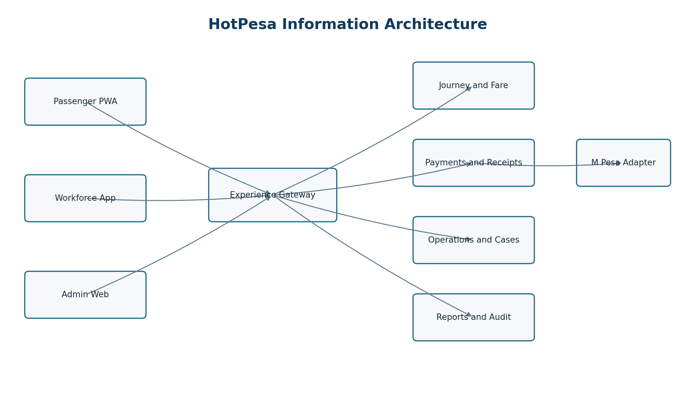
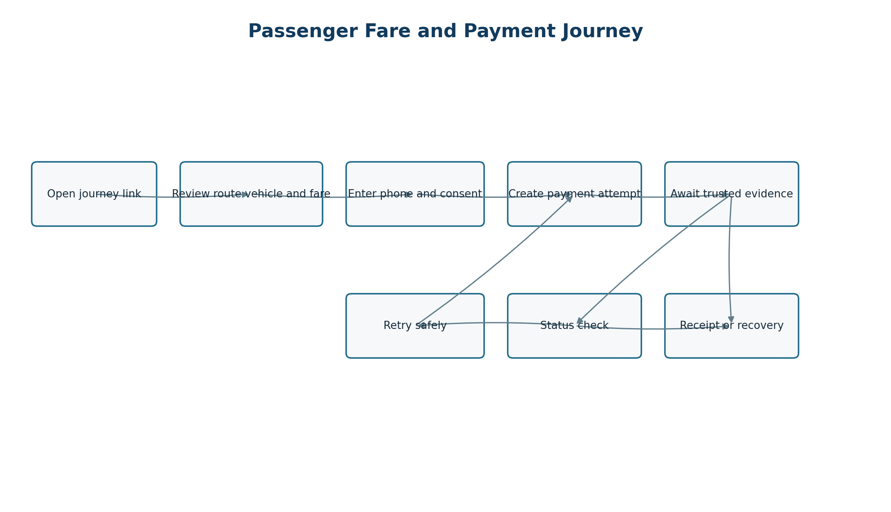
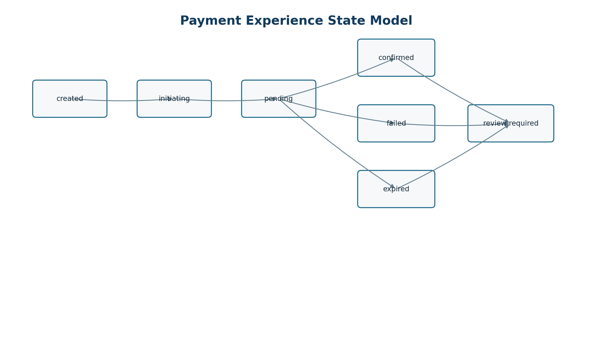
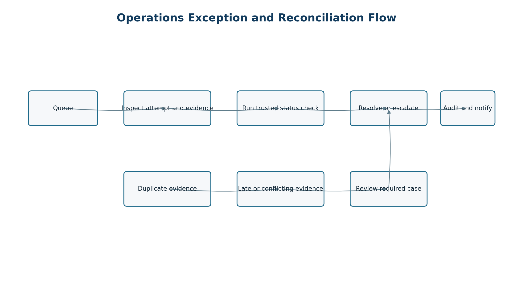

> Controlled source: [07_Application Flow and Information Architecture (AFIA)_HotPesa Pay.docx](../controlled-documents/07_Application%20Flow%20and%20Information%20Architecture%20(AFIA)_HotPesa%20Pay.docx)

> The DOCX source is authoritative. This Markdown copy preserves its controlled status and does not confer approval.

DOCUMENT 07

Application Flow and Information Architecture

HotPesa Pay

Authoritative screen hierarchy, navigation, user journeys, state handling and operational flows for the HotPesa Pay passenger and workforce experience

| Control | Value |
| --- | --- |
| Project | HotPesa Pay |
| Document | Application Flow and Information Architecture |
| Version | 1.0 |
| Status | Detailed final draft for review and approval |
| Lifecycle stage | Pre-code and controlled implementation |
| Primary market | Kenya |
| Classification | Confidential - project planning |

Governing question: Which screens, journeys and recovery paths must connect so that passengers can pay safely and operators can act on trusted evidence?

 

# Document Control

| Field | Controlled value |
| --- | --- |
| Document owner | Product and Experience Architecture, supported by Engineering, Operations, Finance, Security and Privacy |
| Upstream authority | BRD, PRD, FRS, USUC, TRD and DMAC |
| Approval authority | Product Owner, Experience Lead, Engineering Authority, Operations, Finance, Security and Privacy |
| Reference use | UX design, routing, frontend implementation, acceptance tests, training and operating procedures |
| Next review | Before design-system freeze, production identity integration, Daraja sandbox integration and pilot readiness |

## Status and interpretation

This document defines the target information architecture and interaction behaviour expected of HotPesa Pay. It distinguishes Phase 0 demonstration behaviour from the MVP target, treats payment confirmation as a server-evidence decision, and specifies how every important state remains understandable and recoverable. Screen names are logical contracts; final visual composition is controlled by the UI and UX Design Specification.

## Version history

| Version | Date | Status | Summary |
| --- | --- | --- | --- |
| 0.1 | 18 September 2026 | Outline | Initial section framework. |
| 1.0 | 19 September 2026 | Detailed final draft | Expanded application hierarchy, screen catalogue, role journeys, state handling, accessibility, traceability and approval gates. |

## Document conventions

| Term | Meaning |
| --- | --- |
| Must | Required for the stated release or control gate. |
| Should | Expected unless an approved exception is recorded. |
| Passenger session | Short-lived journey and payment context; not a stored-value wallet. |
| Trusted evidence | Validated server-side provider callback or provider status response. |
| Review required | Operational state for late, conflicting or exceptional trusted evidence. |
| Phase 0 | Browser-testable vertical slice using synthetic data and Mock M-Pesa only. |
| MVP | Approved pilot release after production gates close. |

# Table of Contents

| Section | Title |
| --- | --- |
| 1 | Purpose Scope and Design Authority |
| 2 | Experience Principles and Flow Rules |
| 3 | Actors Roles and Access Contexts |
| 4 | Information Architecture |
| 5 | Application Sitemap |
| 6 | Navigation Model |
| 7 | Screen Inventory |
| 8 | Passenger Primary Journey |
| 9 | Passenger Secondary and Recovery Journeys |
| 10 | Workforce Journeys |
| 11 | Administration Operations and Finance Journeys |
| 12 | Authentication Registration and Onboarding |
| 13 | Payment State and Evidence Experience |
| 14 | Reconciliation Exception and Support Flows |
| 15 | Offline Weak Network and Synchronization |
| 16 | Loading Empty Success Error and Timeout States |
| 17 | Unauthorized Forbidden and Session Expiry States |
| 18 | Notifications Receipts and User Communication |
| 19 | Mobile Navigation and Responsive Behaviour |
| 20 | Desktop Navigation and Operational Workspaces |
| 21 | Accessibility Language and Inclusive Design |
| 22 | Privacy Consent and Data Minimization in Flows |
| 23 | Analytics Audit and Observability Events |
| 24 | Deep Links Routing and URL Contracts |
| 25 | Content Taxonomy Labels and Search |
| 26 | Screen and Flow Acceptance Criteria |
| 27 | Requirements Traceability |
| 28 | Open Decisions Assumptions and Dependencies |
| 29 | Approval and Sign Off |
| 30 | Final AFIA Readiness Checklist |

# 1 Purpose Scope and Design Authority

The AFIA converts approved business, product, functional, use-case, technical and API requirements into an implementable experience map. It tells designers and engineers what users can see, where they can go, which decisions are made by the server, how state is preserved, and how users recover from interruption or ambiguity.

| In scope | Out of scope |
| --- | --- |
| Passenger PWA journey context, fare quote, payment initiation, status, receipt and recovery. | Final brand artwork, pixel dimensions and component styling. |
| Workforce journey, assignment, payment assistance and operational views. | Live Daraja credentials, production callback secrets or real-money authorization. |
| Admin, finance, support, reconciliation, reporting and audit workspaces. | Wallet, lending, insurance, seat reservation and cross-border settlement. |
| Responsive navigation, state handling, accessibility and traceability. | Unapproved post-MVP capabilities and commercial policy. |

## 1.1 Authority hierarchy

| Question | Primary authority | AFIA responsibility |
| --- | --- | --- |
| Why and what value | BRD and PRD | Preserve intended outcomes and release scope. |
| Required behaviour | FRS and USUC | Map requirements to screens, paths and exceptions. |
| Technical feasibility | TRD | Respect trust boundaries, modules and deployment constraints. |
| Data and interfaces | DMAC | Use canonical entities, states, DTOs and endpoints. |
| Visual and interaction detail | UI UX Specification | Implement this flow without weakening its controls. |

# 2 Experience Principles and Flow Rules

| ID | Principle | Application rule |
| --- | --- | --- |
| AF-P01 | Truth before optimism | Never show paid, successful or receipt-complete until trusted server evidence confirms the attempt. |
| AF-P02 | Context before action | Show route, destination, operator or vehicle context and fare before phone entry or payment initiation. |
| AF-P03 | One obvious next action | Each state presents the safest primary action and no competing confirmation path. |
| AF-P04 | Progress survives interruption | A user can reopen a supported link or status reference and obtain authoritative current state. |
| AF-P05 | Neutral pending language | Initiating and pending are neither success nor failure; explain what is known and what happens next. |
| AF-P06 | Safe repetition | Retries and refreshes use idempotency and do not create accidental duplicate charges. |
| AF-P07 | Least privilege | Navigation and actions reflect role, tenant, assignment and case authority. |
| AF-P08 | Low bandwidth first | Essential text and status remain useful under weak connectivity; decorative assets never block payment. |
| AF-P09 | Privacy by design | Collect only necessary data, mask identifiers and avoid exposing internal provider payloads. |
| AF-P10 | Auditable operations | Material administrative actions require reason, actor attribution and evidence-linked history. |

## 2.1 Global flow invariants

The browser or client never declares a payment confirmed.

A hotspot connection, HTTP 200 response, initiated prompt, timeout or passenger claim is not proof of payment.

A fare quote and amount are immutable once attached to a payment attempt.

Back, refresh, reconnect and duplicate callback paths must preserve one authoritative attempt state.

Late or conflicting trusted evidence is routed to review required rather than silently overwriting history.

Every blocked action explains why it is unavailable and what the user may do next.

# 3 Actors Roles and Access Contexts

| Actor | Primary goal | Entry context | Access model |
| --- | --- | --- | --- |
| Passenger | Understand journey and fare, initiate M-Pesa payment and obtain status or receipt. | Journey deep link, QR or trusted shared URL. | Short-lived passenger session; no workforce privileges. |
| Conductor or crew | Start or manage assigned journey, help passengers and view permitted payment status. | Authenticated workforce app and active assignment. | Tenant, role, vehicle, route and assignment scoped. |
| Driver | View assignment, journey readiness and limited operational status. | Authenticated workforce app. | Assignment scoped; no financial administration. |
| SACCO or operator manager | Manage fleet, routes, fares, assignments and operational performance. | Authenticated admin web. | Tenant-scoped role and policy permissions. |
| Finance officer | Review confirmed receipts, exceptions, reconciliation and exports. | Authenticated admin web. | Financial scope with separation of duties. |
| Support officer | Locate passenger attempt safely and guide recovery. | Authenticated support workspace. | Masked data, case scope and audited reveal policy. |
| Platform administrator | Manage tenants, controls, health and approved platform configuration. | Privileged administration. | Elevated, strongly authenticated and audited. |
| Payment provider | Supply callback or status evidence. | Server-to-server endpoint or outbound status query. | Dedicated adapter and authenticity controls. |

## 3.1 Role visibility matrix

| Capability | Passenger | Crew | Manager | Finance | Support | Platform admin |
| --- | --- | --- | --- | --- | --- | --- |
| Journey and fare | Own context | Assigned | Tenant | Read | Masked | Support |
| Initiate payment | Own | Assist | No | No | No | No |
| See payment state | Own | Assigned | Tenant | Tenant | Case | Exceptional |
| Run provider status check | Own limited | Assigned limited | Authorized | Authorized | Authorized | Exceptional |
| Configure fare | No | No | Authorized | Read | No | Support |
| Resolve reconciliation | No | No | Escalate | Authorized | Escalate | Exceptional |
| View audit | Own receipt only | Limited | Tenant | Finance | Case | Platform |
| Export data | No | No | Policy | Policy | Restricted | Exceptional |

# 4 Information Architecture

HotPesa separates passenger simplicity from workforce and administrative complexity. All channels use the same authoritative journey, fare, payment, evidence, reconciliation and audit services; navigation differs according to user intent and permission.

Figure 1 HotPesa logical information architecture and channel boundaries

## 4.1 Domain grouping

| Domain | Primary objects | Primary consumers | Navigation consequence |
| --- | --- | --- | --- |
| Identity and tenancy | Tenant, user, role, device, assignment | Workforce and administration | Not exposed in passenger navigation. |
| Fleet and route | Vehicle, route, stage, journey, assignment | Crew, managers and passenger context | Passenger sees contextual subset only. |
| Fare | Fare version, fare item, quote | Passenger, crew and fare administrators | Quote precedes payment action. |
| Payment | Attempt, transition, provider event, receipt | All roles under scope | State is read-only to clients except permitted commands. |
| Operations | Case, reconciliation action, sync event | Operations, finance and support | Queue-oriented task navigation. |
| Governance | Audit event, export request, configuration | Authorized administrators | Explicit privilege and reason gates. |

# 5 Application Sitemap

| Channel | Level 1 | Level 2 and key destinations |
| --- | --- | --- |
| Passenger PWA | Journey | Context; destination; fare quote; help. |
| Passenger PWA | Payment | Phone and consent; attempt status; status check; retry; receipt. |
| Passenger PWA | Support | Reference lookup; guidance; privacy and terms. |
| Workforce app | Today | Assignment; vehicle; route; journey readiness. |
| Workforce app | Journey | Start; active journey; passenger assistance; payment lookup; close. |
| Workforce app | Sync | Pending actions; conflict guidance; last synchronization. |
| Admin web | Overview | Operational summary; payment state summary; alerts. |
| Admin web | Operations | Journeys; assignments; vehicles; routes; exception cases. |
| Admin web | Finance | Payment attempts; receipts; reconciliation; exports. |
| Admin web | Configuration | Fares; users and roles; tenant settings; provider settings. |
| Admin web | Governance | Audit; access reviews; system health; controlled actions. |

## 5.1 Navigation depth rule

Passenger critical journeys should reach the payment action within three meaningful decisions after a valid journey link. Workforce and admin task paths should expose overview, filtered queue, record detail and permitted action without forcing users through unrelated dashboards.

# 6 Navigation Model

| Pattern | Passenger | Workforce mobile | Admin desktop |
| --- | --- | --- | --- |
| Primary navigation | Journey, payment status and help in the task flow. | Today, journeys, activity and more. | Persistent side navigation grouped by domain. |
| Context | Route, vehicle or operator and fare remain visible near action. | Active assignment and sync status remain visible. | Tenant, role, environment and applied filters remain visible. |
| Back behaviour | Returns to the previous safe step without losing attempt reference. | Returns within assignment context. | Returns to queue with filters and cursor retained. |
| Deep link | Journey and safe status routes. | Assignment and case links after authentication. | Entity and case links with permission evaluation. |
| Destructive action | Not applicable in MVP. | Confirmation plus reason where permitted. | Confirmation, reason, re-authentication where risk requires. |
| Exit | Clear safe-close guidance and recovery reference. | Sign out and device state policy. | Sign out, session expiry and unsaved-change warning. |

## 6.1 Breadcrumb and return rules

Use breadcrumbs on desktop record and configuration pages, not on the linear passenger payment flow.

Preserve queue filters, sort, cursor and scroll when returning from a detail page.

Never use browser back to reverse an already accepted payment command; return to the authoritative status view.

External links open with a clear label and must not obscure the payment reference or current state.

# 7 Screen Inventory

| ID | Channel | Screen or view | Purpose | Primary states |
| --- | --- | --- | --- | --- |
| P-01 | Passenger | Journey landing | Show operator, vehicle, route, destination choices and service context. | Loading, ready, unavailable. |
| P-02 | Passenger | Fare confirmation | Show selected destination, fixed quote, currency and validity. | Quoted, expired quote, changed selection. |
| P-03 | Passenger | Payment details | Collect approved phone format and consent; create attempt. | Valid, invalid, submitting. |
| P-04 | Passenger | Payment status | Show authoritative state and next safe action. | All seven payment states. |
| P-05 | Passenger | Receipt | Show receipt reference and confirmed payment details. | Confirmed, unavailable, recoverable. |
| P-06 | Passenger | Status recovery | Recover an existing attempt without creating a new one. | Found, not found, expired session. |
| P-07 | Passenger | Help and safety | Explain pending, retry, support and privacy guidance. | Static or context-sensitive. |
| W-01 | Workforce | Sign in and device check | Establish authenticated, approved device context. | Ready, challenge, blocked. |
| W-02 | Workforce | Today and assignment | Show current vehicle, route and duty context. | Assigned, no assignment, changed. |
| W-03 | Workforce | Journey workspace | Start, monitor and close permitted journey. | Scheduled, active, paused, closed. |
| W-04 | Workforce | Passenger assistance | Locate permitted attempt and show safe guidance. | Found, not found, restricted. |
| W-05 | Workforce | Sync centre | Show pending sync, failures and conflict steps. | Synced, pending, failed, conflict. |
| A-01 | Admin | Overview | Summaries, alerts and shortcuts based on role. | Normal, partial data, degraded. |
| A-02 | Admin | Journey and fleet queues | Manage routes, vehicles, assignments and journeys. | Filtered, empty, error. |
| A-03 | Admin | Fare management | Draft, review, approve and activate fare versions. | Draft, pending, approved, active. |
| A-04 | Admin | Payment attempts | Find attempts and inspect evidence-linked history. | All payment states. |
| A-05 | Admin | Reconciliation cases | Work exceptions with ownership and resolution. | Open, assigned, escalated, resolved. |
| A-06 | Admin | Reports and exports | Run governed summaries and asynchronous exports. | Queued, ready, failed, expired. |
| A-07 | Admin | Users roles and devices | Manage least-privilege workforce access. | Active, suspended, revoked. |
| A-08 | Admin | Audit and health | Inspect control evidence and platform status. | Normal, warning, degraded. |

# 8 Passenger Primary Journey

Figure 2 Passenger fare and payment flow including recovery paths

| Step | User intent | System behaviour | Exit or exception |
| --- | --- | --- | --- |
| 1 Enter | Open trusted journey link or QR. | Resolve public journey reference; load active route, operator and vehicle context. | Invalid or inactive reference shows safe unavailable state. |
| 2 Select | Choose destination or approved fare option. | Return applicable immutable fare quote and validity. | No fare route offers help; expired quote is refreshed before payment. |
| 3 Review | Confirm route, destination, amount and currency. | Keep context visible and require affirmative continuation. | Back changes selection without creating an attempt. |
| 4 Provide details | Enter phone number and accept necessary notices. | Validate Kenyan format, normalize server-side and protect identifier. | Inline error preserves non-sensitive input; no attempt created. |
| 5 Initiate | Request M-Pesa payment once. | Create idempotent server attempt, call provider adapter and move to initiating or pending. | Retry command reuses or safely creates according to contract. |
| 6 Await | Respond to provider prompt and wait. | Poll or receive updates; explain that pending is not paid. | Missing callback exposes trusted status check when eligible. |
| 7 Complete | See confirmed receipt or clear failure/recovery. | Only trusted evidence confirms; receipt is immutable and share-safe. | Late/conflicting evidence becomes review required with support guidance. |

## 8.1 Passenger acceptance outcomes

The amount and destination are visible before phone submission.

The passenger cannot supply provider evidence or force confirmation.

Refresh and reopening the supported status route preserve the same attempt.

Full phone numbers, provider secrets and raw callbacks never appear.

Receipt language clearly separates confirmed payment from an initiated request.

# 9 Passenger Secondary and Recovery Journeys

| Journey | Trigger | Required path | Outcome |
| --- | --- | --- | --- |
| Change destination | Before payment attempt. | Return to destination selection, request a new quote and invalidate display of the old quote. | Only the selected current quote may be paid. |
| Invalid phone | Client or server validation. | Show field-specific guidance without logging or echoing unnecessary digits. | Corrected submission allowed. |
| Provider-declared failure | Trusted failure evidence. | Show non-alarming failure reason category and safe retry rules. | New attempt only when contract permits. |
| Missing callback | Pending beyond normal wait. | Offer provider status check; keep pending until trusted result. | Confirmed, failed, expired or remains pending. |
| Duplicate callback | Repeated evidence ID or semantic duplicate. | No duplicate state change; preserve duplicate audit event. | User sees stable current state. |
| Late success | Success arrives after expiry or conflicting terminal state. | Move to review required; prevent automatic receipt finalization. | Operations resolves with audit trail. |
| Lost browser context | Tab closed or device reconnects. | Use safe status route or support reference lookup. | Authoritative state restored without new charge. |
| Journey unavailable | Inactive or closed journey. | Explain unavailability; do not accept payment. | User returns to trusted entry source. |
| Support request | User cannot interpret state. | Present masked reference and approved contact path. | Support works case without exposing sensitive data. |

# 10 Workforce Journeys

## 10.1 Start duty and journey

| Step | Crew action | System response | Control |
| --- | --- | --- | --- |
| Authenticate | Sign in on approved device. | Establish tenant and role claims. | Strong identity and session policy. |
| Review assignment | Open Today view. | Show vehicle, route and time-bounded assignment. | No cross-tenant or unassigned access. |
| Readiness | Confirm vehicle and operational prerequisites. | Show blocking and advisory items. | Reason and actor recorded for overrides. |
| Start journey | Submit start command. | Server validates assignment and allowed transition. | Idempotent command with audit event. |
| Operate | Use active journey workspace. | Show current context and permitted assistance actions. | Payment truth remains server controlled. |
| Close | Review summary and submit close. | Validate unresolved blockers and close safely. | Late evidence remains reconcilable. |

## 10.2 Passenger assistance

Crew may explain fare and status, locate a permitted attempt using a masked reference, and invoke an approved status check. Crew cannot mark an attempt paid, edit provider evidence, alter the immutable amount, or expose another passenger’s data. Assistance actions remain attributable to the active assignment and user.

## 10.3 No assignment and reassignment

No-assignment state explains that journey controls are unavailable and offers a refresh or manager contact path.

Reassignment invalidates stale journey authority before showing the new assignment.

Offline cached assignment data is labelled with its last verified time and cannot silently authorize a high-risk action.

# 11 Administration Operations and Finance Journeys

| Workspace | Primary task flow | Required safeguards |
| --- | --- | --- |
| Overview | Review role-specific counts, alerts and recent exceptions; drill into a filtered queue. | No misleading global totals; disclose refresh time and partial-data state. |
| Journey operations | Filter journeys; open detail; assign vehicle and crew; start or correct permitted metadata. | Tenant scope, optimistic concurrency and change reason. |
| Fare administration | Draft version; validate overlaps; request approval; approve; schedule activation. | Maker-checker policy where approved; active paid quote remains immutable. |
| Payments | Search attempt; inspect timeline, receipt and evidence summaries; run permitted status check. | Mask phone; never show secrets/raw payload by default; commands are idempotent. |
| Reconciliation | Open queue; claim case; compare evidence; record action; resolve or escalate. | Separation of duties, mandatory reason and immutable history. |
| Reports | Choose controlled report; constrain date and tenant; run async export; retrieve before expiry. | Column policy, row limits, audit and protected delivery. |
| Access administration | Invite or link user; assign role and scope; approve device; suspend or revoke. | Least privilege, re-authentication for elevated changes and access review. |
| Audit and health | Filter audit events or inspect service status. | Read-only evidence, restricted sensitive details and time normalization. |

## 11.1 Queue-detail-action pattern

Operational workspaces use a consistent pattern: a filterable queue, a stable record detail route, an evidence timeline, and a permission-controlled action area. Returning to the queue preserves filters and cursor. Mutating actions report accepted, completed or failed independently when work is asynchronous.

# 12 Authentication Registration and Onboarding

## 12.1 Passenger access

MVP passenger payment does not require a conventional account. A short-lived, least-privilege passenger session is established from a valid journey context and may access only its own quote, attempt status and receipt. The exact signed-token mechanism and expiry remain an approved security decision before pilot release.

## 12.2 Workforce sign in

| Stage | Behaviour | Failure path |
| --- | --- | --- |
| Identify | Redirect to or invoke approved identity provider. | Do not disclose whether an account exists beyond approved identity behaviour. |
| Authenticate | Complete required credential and MFA policy. | Rate-limit and provide recovery through approved workforce process. |
| Authorize | Resolve tenant, role, scope, device and assignment. | Authenticated but unauthorized users receive a clear restricted state. |
| Establish session | Issue short-lived application session and record security event. | Reject invalid issuer, audience, nonce or expired assertion. |
| Return | Use validated return route or safe default dashboard. | Never honor an unvalidated external redirect. |

## 12.3 Workforce onboarding

| Step | Owner | Screen outcome |
| --- | --- | --- |
| Invite or identity link | Authorized tenant admin | Pending workforce identity with role proposal. |
| Accept and verify | User and identity provider | Verified identity; no business access until policy complete. |
| Assign role and scope | Authorized manager/admin | Tenant and operational permissions established. |
| Register or approve device | User and authorized approver | Device approved, challenged or rejected. |
| Training and acknowledgement | User | Required notices and operational guidance recorded. |
| Activate | System/approver | Today view opens with assigned or no-assignment state. |

# 13 Payment State and Evidence Experience

Figure 3 User-visible payment states controlled by trusted evidence

| State | Passenger message intent | Primary action | Operational meaning |
| --- | --- | --- | --- |
| created | Payment request is being prepared; no payment confirmed. | Wait or safely return. | Attempt exists, provider call not yet accepted. |
| initiating | M-Pesa request is being sent; do not retry immediately. | Wait. | Provider request in progress. |
| pending | Confirmation has not yet arrived; this is not proof of payment. | Refresh or eligible status check. | Awaiting trusted callback or status evidence. |
| confirmed | Payment is confirmed and receipt is available. | View receipt. | Trusted evidence confirmed the amount and attempt. |
| failed | The provider reported that payment did not complete. | Retry when eligible or get help. | Trusted failure evidence recorded. |
| expired | Confirmation did not arrive within the permitted window. | Check guidance or start a new attempt. | Attempt closed without confirmation. |
| review required | The payment needs operational review; do not pay again unless instructed. | Keep reference and contact support. | Late, conflicting or exceptional trusted evidence exists. |

## 13.1 Visual-semantic rules

Use success colour and check icon only for confirmed.

Initiating and pending use neutral progress treatment, not green success or red failure.

State is always expressed in text; icon and colour are supplementary.

Show last checked time and whether automatic refresh is active.

Disable repeated payment submission while the same command is in flight.

Any retry that can create a new attempt explicitly distinguishes it from refreshing the old attempt.

# 14 Reconciliation Exception and Support Flows

Figure 4 Operations flow for payment exceptions and trusted reconciliation

| Case type | Detection | Operator path | Resolution evidence |
| --- | --- | --- | --- |
| Missing callback | Pending beyond configured threshold. | Run provider status query; record result; reschedule or resolve. | Status response identity and normalized evidence. |
| Duplicate evidence | Repeated provider event or equivalent evidence. | Confirm deduplication; no state mutation; close informational item. | Original event link and duplicate audit event. |
| Conflicting terminal evidence | Success and failure, or changed provider outcome. | Claim case; compare chronology; escalate if policy requires. | Case action, decision reason and approver. |
| Late confirmation | Trusted success after expiry. | Prevent automatic overwrite; assess passenger and settlement evidence. | Approved resolution and receipt disposition. |
| Amount mismatch | Evidence amount differs from immutable attempt. | Block confirmation; escalate to finance/security. | Provider reference, attempt amount and investigation outcome. |
| Unknown correlation | Evidence cannot map safely to one attempt. | Quarantine evidence; search controlled identifiers; escalate. | Mapping decision or unresolved disposition. |
| Passenger dispute | Passenger challenges status or duplicate debit. | Open support case; locate masked attempt; follow provider and finance process. | Case timeline and approved customer communication. |

# 15 Offline Weak Network and Synchronization

| Context | Allowed behaviour | Blocked behaviour | Recovery |
| --- | --- | --- | --- |
| Passenger journey not loaded | Show connection guidance and retry. | Do not invent fare or accept payment. | Reload current journey reference. |
| Passenger status unavailable | Retain masked reference and last verified state with timestamp. | Do not display confirmed from local assumption. | Retry authoritative status read. |
| Workforce cached assignment | Show last verified assignment and read-only essential context. | Do not use stale cache to authorize sensitive commands. | Reauthenticate and synchronize. |
| Queued low-risk action | Store locally only when explicitly approved by action policy. | Never queue confirmation evidence or unrestricted admin commands. | Submit with idempotency key; show result. |
| Sync conflict | Preserve server version and local intent separately. | Do not last-write-wins over financial or assignment state. | Show conflict resolution guidance or create case. |
| Admin connectivity loss | Keep unsaved draft locally only when safe and disclosed. | Do not imply server acceptance. | Revalidate version before resubmission. |

## 15.1 Sync centre

The workforce Sync centre shows last successful synchronization, queued items, failed items, conflicts and safe actions. Each item has a local correlation key, command type, created time, current retry status and server result when available. Sensitive payloads are minimized and encrypted according to the Security and NFR Specification.

# 16 Loading Empty Success Error and Timeout States

| State | Required content | Primary action | Prohibited treatment |
| --- | --- | --- | --- |
| Loading | What is loading; stable skeleton or progress; accessible announcement. | Wait or cancel when safe. | Spinner without context for long operations. |
| Empty | What is absent; whether filters caused it; permission-aware explanation. | Clear filters, create permitted item or return. | Treating access denial as empty. |
| Success | What completed, reference, timestamp and next safe step. | View result or continue. | Success before server acceptance/evidence. |
| Validation error | Field-level cause and correction; summary for accessibility. | Correct and resubmit. | Clearing valid entries or exposing sensitive values. |
| Business-rule error | Rule that prevented action and current record state. | Refresh, choose allowed option or contact owner. | Generic technical message. |
| System error | Stable error reference, safe retry policy and support route. | Retry when safe. | Stack trace, secret or raw provider payload. |
| Timeout | Whether request may still be processing and how status is checked. | Check status, not blind repeat. | Assuming failure or encouraging duplicate action. |
| Partial data | Which region is unavailable and data freshness. | Refresh affected panel. | Showing incomplete totals as authoritative. |

# 17 Unauthorized Forbidden and Session Expiry States

| Condition | User-facing behaviour | Security behaviour |
| --- | --- | --- |
| Unauthenticated | Prompt workforce sign-in or restore passenger context where permitted. | Do not reveal protected resource existence. |
| Authenticated but forbidden | Explain insufficient permission and identify approved escalation path. | Return 403; log material access denial. |
| Wrong tenant | Use generic unavailable or forbidden state according to disclosure policy. | Never switch tenant based only on URL input. |
| Assignment missing | Show no-assignment state and refresh or manager contact. | Do not expose journey operational controls. |
| Session expired | Preserve a safe return intent; require reauthentication. | Discard sensitive transient state and rotate session. |
| Device revoked | Block workforce access and provide approved support route. | Revoke tokens and record security event. |
| Step-up required | Explain that extra verification protects a sensitive action. | Reauthenticate before role, export or financial action. |

# 18 Notifications Receipts and User Communication

| Message type | Channel | Trigger | Content minimum | Privacy rule |
| --- | --- | --- | --- | --- |
| In-app status | PWA/app/web | State read or update. | State, reference, time and next action. | Mask phone and provider identifiers. |
| Receipt | In-app/download/share-safe | Confirmed trusted evidence. | Amount, currency, journey context, time, receipt reference. | No secret, raw payload or unnecessary personal data. |
| Operational alert | Admin/workforce | Threshold, exception or degraded service. | Severity, affected scope, time and destination link. | Role and tenant scoped. |
| Export ready | Admin | Asynchronous export completes. | Report name, period, expiry and retrieval link. | Protected delivery; no attachment by default. |
| Security notice | Workforce/admin | New device, role change or session event. | What changed, when and response path. | Avoid credential or token content. |
| Support update | Approved channel | Case state change. | Case reference, current status and next step. | Identity verification and minimum disclosure. |

## 18.1 Content language

Messages use plain Kenyan English, unambiguous KES amounts, local date and time display, and terms familiar to PSV passengers and operators. “Paid” and “confirmed” are reserved for trusted confirmation. “Sent”, “requested”, “processing” and “pending” describe non-terminal steps precisely.

# 19 Mobile Navigation and Responsive Behaviour

| Area | Mobile rule | Rationale |
| --- | --- | --- |
| Passenger task | Single-column linear flow; persistent context summary near payment action. | Reduces cognitive load and wrong-route payment. |
| Primary actions | Minimum 44 by 44 CSS pixel target and reachable without horizontal scroll. | Touch and accessibility. |
| Navigation | No more than four primary workforce destinations; overflow under More. | Keeps active duty tasks prominent. |
| Tables | Transform operational rows into labelled cards or allow purposeful contained scroll. | Prevents unreadable compressed columns. |
| Status | State label, explanation and next action appear above secondary detail. | Supports quick interpretation. |
| Keyboard | Logical focus order, visible focus and no keyboard traps. | Accessibility and external keyboards. |
| Safe areas | Respect browser/device insets and on-screen keyboard. | Prevents obscured controls. |
| Connectivity | Visible offline/sync indicator with last verified time. | Avoids stale-data ambiguity. |

# 20 Desktop Navigation and Operational Workspaces

| Element | Specification |
| --- | --- |
| Global frame | Tenant/environment indicator, side navigation, page title, user menu and service-status entry. |
| Queue header | Search, structured filters, date range, saved view if approved, result count and export if permitted. |
| Queue body | Stable columns, sortable permitted fields, cursor pagination, loading/empty/error states and row link. |
| Record detail | Identity summary, current state, timeline/evidence, related records and permission-controlled actions. |
| Action panel | Command description, consequence, reason field, validation, confirmation and server result. |
| Filter persistence | URL or session-safe state so return navigation preserves work without exposing sensitive terms. |
| Multi-tab safety | Record version or ETag checked before mutation; stale views require refresh. |
| Density | Comfortable default; compact mode only if accessibility remains acceptable. |

# 21 Accessibility Language and Inclusive Design

| Control | Requirement | Evidence |
| --- | --- | --- |
| Semantics | Correct headings, landmarks, labels, buttons, tables and status regions. | Automated checks plus screen-reader review. |
| Keyboard | All functionality operable with keyboard; visible focus; predictable order. | Keyboard journey test. |
| Contrast | Text, icons, focus and state indicators meet approved WCAG target. | Contrast audit against design tokens. |
| Motion | Respect reduced-motion preference; no required meaning conveyed by motion. | Browser and automated check. |
| Touch | Interactive targets at least 44 by 44 CSS pixels where applicable. | Responsive browser test. |
| Errors | Programmatically associated field errors and focusable summary. | Form validation test. |
| Status updates | Non-disruptive accessible live-region announcements. | Assistive technology test. |
| Language | Plain English baseline; Swahili localization plan and terminology review before inclusion. | Content review and locale tests. |
| Numbers and time | KES, E.164 normalization, Africa/Nairobi display and UTC storage clearly separated. | Locale and timezone tests. |
| Low literacy | Short sentences, explicit verbs, recognizable icons with text and guided recovery. | Usability testing with pilot participants. |

# 22 Privacy Consent and Data Minimization in Flows

| Flow point | Data | Required treatment |
| --- | --- | --- |
| Journey landing | Public journey context | Expose only approved public label, vehicle/route context and active fare options. |
| Phone entry | Passenger phone | Explain purpose; validate and normalize server-side; mask after submission. |
| Payment status | Attempt and provider references | Use opaque public reference; do not expose internal IDs or raw provider data. |
| Receipt | Payment and journey summary | Include only fields required for passenger proof and support. |
| Support lookup | Reference and verification attributes | Collect minimum attributes; rate-limit; reveal masked match only. |
| Admin search | Phone or provider reference | Permission gate, exact or protected search design and audit where sensitive. |
| Export | Report data | Approved columns, purpose, expiry and delivery control. |
| Audit | Actor, action, target, result | Exclude credentials, tokens, unnecessary phone digits and raw payloads. |

## 22.1 Consent and notice rules

Necessary payment processing notice is separated from optional communications.

No preselected optional consent.

Notice version and acceptance context are recorded where legally required.

Declining optional consent cannot block the core payment flow.

Final wording and retention remain subject to Kenyan legal and privacy approval.

# 23 Analytics Audit and Observability Events

| Event family | Example events | Purpose | Prohibited payload |
| --- | --- | --- | --- |
| Journey | journey_viewed, destination_selected, quote_loaded | Measure path health and content availability. | Full phone, precise unnecessary location. |
| Payment UX | payment_submitted, status_viewed, status_check_requested | Measure completion and recovery friction. | Provider secret, raw callback, PIN. |
| Outcome | payment_confirmed_viewed, failure_viewed, review_required_viewed | Measure state communication and support demand. | Unmasked identifiers. |
| Workforce | assignment_opened, journey_started, sync_conflict_viewed | Operational adoption and reliability. | Cached sensitive payload. |
| Admin | queue_filtered, case_claimed, export_requested | Workflow efficiency and control evidence. | Report contents in analytics. |
| Security | sign_in_result, device_blocked, forbidden_action | Detect abuse and support investigations. | Credentials or tokens. |

## 23.1 Event contract

Each event has a controlled name, schema version, UTC event time, channel, environment, tenant where authorized, pseudonymous session or actor reference, correlation reference, outcome and consent category where applicable. Product analytics and security audit are separate stores with separate purposes and retention.

# 24 Deep Links Routing and URL Contracts

| Route pattern | Audience | Behaviour | Failure behaviour |
| --- | --- | --- | --- |
| /journey/{publicReference} | Passenger | Resolve active journey context; create short-lived session as permitted. | Unavailable without leaking internal ID. |
| /journey/{publicReference}/payment/{publicAttemptReference} | Passenger | Read only the authorized attempt status and receipt availability. | Restore or require safe verification. |
| /workforce/assignments/{id} | Workforce | Authenticate, authorize tenant/assignment, then open detail. | Forbidden or no longer assigned. |
| /admin/payments/{id} | Authorized staff | Open payment detail with current record version. | Forbidden, not found or wrong tenant. |
| /admin/reconciliation/{id} | Finance/operations | Open case and preserve queue return context. | Forbidden or resolved read-only. |
| /admin/reports/exports/{id} | Authorized staff | Show export job and protected retrieval if ready. | Expired, forbidden or unavailable. |

## 24.1 Routing safeguards

Public references are opaque and non-sequential.

No secret, phone number, access token or raw provider reference appears in a URL.

Return URLs are allowlisted and normalized.

Routes are version-tolerant where bookmarks or receipts require longevity.

Analytics strip or hash identifiers according to the event contract.

# 25 Content Taxonomy Labels and Search

| Canonical term | Use | Avoid |
| --- | --- | --- |
| Journey | A scheduled or active vehicle-route operation. | Trip when it would conflict with the domain contract. |
| Fare quote | Server-calculated amount offered for a selected context and validity. | Price estimate when amount is fixed. |
| Payment attempt | One immutable request to pay one fare quote. | Transaction before provider evidence exists. |
| Confirmed | Trusted provider evidence confirms payment. | Paid for pending or initiated. |
| Review required | Operational review is needed for exceptional evidence. | Error when the financial truth is unresolved. |
| Receipt | Immutable passenger-facing evidence after confirmation. | Ticket unless ticketing is separately approved. |
| Status check | Trusted server query to the provider. | Refresh when it may imply only client reload. |
| Reference | Safe identifier used for status or support. | Internal ID. |

## 25.1 Search behaviour

Search is domain-specific rather than global by default. Payment and support search accepts only approved references and protected phone lookup patterns. Results are tenant and role scoped, paginated, rate-limited and explicit when filters or permissions affect visibility. No-result states do not confirm the existence of another tenant’s record.

# 26 Screen and Flow Acceptance Criteria

| ID | Acceptance criterion | Evidence |
| --- | --- | --- |
| AF-AC-001 | A valid journey link shows operator/vehicle, route or journey and fare context before phone entry. | Browser journey test. |
| AF-AC-002 | Passenger payment initiation uses idempotency and cannot be double-submitted from the same in-flight action. | API and browser test. |
| AF-AC-003 | Only trusted evidence produces confirmed presentation and receipt access. | State-transition and browser tests. |
| AF-AC-004 | All seven payment states have unique text, action and accessible status semantics. | Component and browser matrix. |
| AF-AC-005 | Missing callback can be repaired only through trusted status evidence. | Integration test. |
| AF-AC-006 | Duplicate callbacks produce one state change and a duplicate audit event. | Integration and E2E test. |
| AF-AC-007 | 390 pixel viewport has no page-level horizontal overflow and critical controls meet target size. | Responsive Playwright test. |
| AF-AC-008 | Reduced motion is respected and no essential meaning relies on animation. | Browser preference test. |
| AF-AC-009 | Queue return preserves filters and record detail rejects stale mutation. | Admin browser/API test. |
| AF-AC-010 | Unauthorized and wrong-tenant routes do not disclose protected record data. | Security integration test. |
| AF-AC-011 | Offline or stale data is labelled with last verified time and never confirms payment. | Offline journey test. |
| AF-AC-012 | Receipt, audit and analytics outputs contain no full phone, token, secret or raw provider payload. | Redaction and schema tests. |

# 27 Requirements Traceability

| AFIA area | Upstream requirements | Implementation and test evidence |
| --- | --- | --- |
| Passenger context and fare | BRD value proposition; PRD MVP; FRS journey/fare requirements; USUC passenger journey; DMAC journey and quote endpoints. | P-01/P-02 routes, quote contract, component tests and browser journey. |
| Payment initiation and state | FRS payment requirements; USUC payment use cases; TRD evidence-led architecture; DMAC attempt/state contracts. | P-03/P-04, idempotency tests, provider adapter tests and E2E states. |
| Receipt and recovery | FRS receipt/status; USUC recovery exceptions; DMAC receipt/status endpoints. | P-05/P-06, missing-callback and reopen tests. |
| Workforce journey | PRD operator scope; FRS crew functions; USUC role flows; TRD identity boundaries. | W-01 to W-05, authorization and assignment tests. |
| Administration | FRS admin/reporting; USUC operational flows; DMAC admin endpoints. | A-01 to A-08, role matrix and queue/detail browser tests. |
| Reconciliation | FRS exception handling; TRD provider/reconciliation modules; DMAC evidence and case model. | Case workflow, duplicate/conflict/late evidence tests and audit. |
| Accessibility and responsive | PRD usability; Security Privacy and NFR specification; UI UX specification. | Automated accessibility, keyboard, contrast and viewport evidence. |
| Privacy and audit | BRD trust; TRD security; DMAC classifications/audit contract. | Redaction, access control, audit and export tests. |

## 27.1 Traceability rule

Every implemented screen and flow must identify its AFIA screen ID, upstream requirement IDs, API operations, canonical states and automated acceptance evidence. A route or feature without this chain is not release ready and requires either traceability completion or an approved scope decision.

# 28 Open Decisions Assumptions and Dependencies

| ID | Decision required | Owner | Due gate | Status |
| --- | --- | --- | --- | --- |
| OD-AFIA-001 | Passenger session token, recovery proof, expiry and supported cross-device behaviour. | Security/Product | Before PWA contract freeze | Open |
| OD-AFIA-002 | Exact production Daraja prompt, callback timing, status-query and acknowledgement behaviour. | Payments/Provider | Before sandbox adapter | Open |
| OD-AFIA-003 | Workforce identity provider, MFA, device approval and recovery experience. | Security/Identity | Before workforce pilot | Open |
| OD-AFIA-004 | Pilot journey entry method: QR placement, conductor sharing and operator branding. | Product/Pilot Ops | Before field usability test | Open |
| OD-AFIA-005 | Fare origin-selection rule where boarding stage is implicit or unknown. | Product/Operations | Before fare UX freeze | Open |
| OD-AFIA-006 | Swahili scope, terminology ownership and fallback behaviour. | Product/Content | Before localization inclusion | Open |
| OD-AFIA-007 | Support verification, contact channels, operating hours and escalation SLA. | Support/Operations | Before pilot support readiness | Open |
| OD-AFIA-008 | Notification channels and consent basis beyond in-app messages. | Product/Privacy | Before notification build | Open |
| OD-AFIA-009 | Export presentation, permitted columns and sensitive-data reveal controls. | Finance/Privacy | Before report acceptance | Open |
| OD-AFIA-010 | Offline command allowlist and device storage controls. | Engineering/Security | Before offline expansion | Open |

## 28.1 Assumptions and dependencies

| Type | Item | Impact if invalid |
| --- | --- | --- |
| Assumption | MVP remains non-custodial and passengers do not maintain a stored-value wallet. | Account, balance, settlement and regulatory flows expand materially. |
| Assumption | One attempt pays one immutable fare quote in KES. | Fare and payment journey must be redesigned. |
| Assumption | Provider returns stable correlation and trusted callback/status evidence. | Recovery and reconciliation require alternative mapping controls. |
| Dependency | Approved UI UX Design Specification and design tokens. | Visual state semantics and responsive behaviour cannot be frozen. |
| Dependency | Security Privacy and NFR Specification. | Session, retention, accessibility, recovery and performance limits remain incomplete. |
| Dependency | Pilot operating model and real participant usability testing. | Crew and passenger flow assumptions remain unvalidated. |
| Dependency | Official Daraja documentation and sandbox evidence. | Production provider screens and timing cannot be approved. |

# 29 Approval and Sign Off

Approval authorizes this screen hierarchy, navigation, user journey, state and recovery model as the design and implementation baseline. It does not authorize live M-Pesa, production credentials, public launch or unapproved post-MVP scope.

| Role | Name | Decision | Signature | Date |
| --- | --- | --- | --- | --- |
| Product Owner |  | Approve / Conditional / Reject |  |  |
| Experience and Content Lead |  | Approve / Conditional / Reject |  |  |
| Engineering Authority |  | Approve / Conditional / Reject |  |  |
| Operations Authority |  | Approve / Conditional / Reject |  |  |
| Finance Authority |  | Approve / Conditional / Reject |  |  |
| Security and Privacy Authority |  | Approve / Conditional / Reject |  |  |
| Quality Assurance Authority |  | Approve / Conditional / Reject |  |  |
| Pilot Operator Representative |  | Approve / Conditional / Reject |  |  |

## 29.1 Approval conditions

| Condition | Status |
| --- | --- |
| BRD through DMAC are approved or conditionally approved with recorded impacts. | Pending |
| All screen IDs and flows map to requirements, APIs and acceptance evidence. | Pending |
| Production identity and Daraja decisions are closed for their applicable release. | Pending |
| Accessibility, privacy, security and low-connectivity reviews pass. | Pending |
| Pilot users validate passenger, crew and operational recovery journeys. | Pending |
| UI UX Specification implements state semantics without weakening controls. | Pending |

# 30 Final AFIA Readiness Checklist

| Readiness item | Status |
| --- | --- |
| Purpose, authority, scope and cross-document boundaries are explicit. | Complete |
| Actors, channels, role visibility and least-privilege contexts are defined. | Complete |
| Information architecture, sitemap and navigation models are defined. | Complete |
| Passenger, workforce, administration, finance and support screens are inventoried. | Complete |
| Primary, secondary, exception, reconciliation and recovery journeys are defined. | Complete |
| Seven payment states use evidence-led messages and permitted actions. | Complete |
| Loading, empty, success, error, offline, timeout and access-denial states are defined. | Complete |
| Mobile, desktop, accessibility, privacy, analytics and deep-link rules are included. | Complete |
| Acceptance criteria and cross-document traceability are included. | Complete |
| Open decisions, assumptions, dependencies and approval conditions are registered. | Complete |
| Production identity, Daraja, support, localization and offline decisions are approved. | Pending |
| UI UX designs and pilot usability evidence pass against this AFIA. | Pending |
| Live-provider and production release authorization is granted. | Not authorized |

## 30.1 Completion statement

This AFIA is a detailed final draft suitable for professional review and controlled design implementation. It provides the application hierarchy, route and screen inventory, role journeys, evidence-led payment states, exception handling, responsive navigation and acceptance baseline required for the UI UX Design Specification and frontend delivery. It becomes the approved experience contract after the stated decisions and approval conditions are closed or formally accepted with recorded conditions.
