> Controlled source: [08_UI-UX Design Specification (UIUX)_HotPesa Pay.docx](../controlled-documents/08_UI-UX%20Design%20Specification%20(UIUX)_HotPesa%20Pay.docx)

> The DOCX source is authoritative. This Markdown copy preserves its controlled status and does not confer approval.

DOCUMENT 08

User Interface and User Experience Design Specification

HotPesa Pay

Authoritative visual language, design tokens, components, interaction behaviour, responsive rules and low fidelity screen wireframes

| Control | Value |
| --- | --- |
| Project | HotPesa Pay |
| Document | User Interface and User Experience Design Specification |
| Version | 1.0 |
| Status | Detailed final draft for review and approval |
| Lifecycle stage | Pre-code and controlled implementation |
| Primary market | Kenya |
| Classification | Confidential - project planning |

Governing question: How must HotPesa look, feel and behave so that a passenger can pay confidently and an operator can act safely on trusted evidence?

 

# Document Control

| Field | Controlled value |
| --- | --- |
| Document owner | Product Design and Experience, supported by Product, Engineering, Operations, Security, Privacy and Quality Assurance |
| Upstream authority | BRD, PRD, FRS, USUC, TRD, DMAC and AFIA |
| Approval authority | Product Owner, Design Lead, Engineering Authority, Operations, Security, Privacy and QA |
| Reference use | Design files, frontend implementation, component library, accessibility tests, browser tests and design review |
| Wireframe status | Low fidelity structure and behaviour; not final brand artwork or production layout |
| Next review | Before design-system freeze, usability testing, Daraja sandbox integration and pilot readiness |

## Status and interpretation

This specification defines the design baseline for HotPesa Pay. It translates the approved application flows into visual roles, reusable components, responsive layouts and testable interaction states. Payment truth remains controlled by trusted server evidence. The wireframes show hierarchy and behaviour, not pixel-perfect artwork, final photography or provider-owned interfaces.

## Version history

| Version | Date | Status | Summary |
| --- | --- | --- | --- |
| 0.1 | 18 September 2026 | Outline | Initial UI UX section framework. |
| 1.0 | 19 September 2026 | Detailed final draft | Expanded design system, component/state rules, responsive and accessible behaviour, and twenty screen wireframes. |

 

# Table of Contents

| Section | Title |
| --- | --- |
| 1 | Design Authority Scope and Objectives |
| 2 | Users Context and Experience Principles |
| 3 | Brand and Content Language |
| 4 | Visual Design Language |
| 5 | Colour System |
| 6 | Typography |
| 7 | Spacing Grid and Layout |
| 8 | Iconography Radius Elevation and Imagery |
| 9 | Design Tokens and Theming |
| 10 | Navigation Components |
| 11 | Buttons Forms and Inputs |
| 12 | Cards Tables Dialogs and Notifications |
| 13 | Payment State Components |
| 14 | Loading Empty Error and Access States |
| 15 | Motion Feedback and Microinteractions |
| 16 | Responsive Breakpoints and Device Behaviour |
| 17 | Accessibility and Inclusive Design |
| 18 | Data Visualization Map and Reporting Rules |
| 19 | Design System Governance |
| 20 | Component Specifications |
| 21 | Wireframe Reading Guide |
| 22 | Passenger Wireframes |
| 23 | Workforce Wireframes |
| 24 | Administration Wireframes |
| 25 | Prototype Usability and Design Validation |
| 26 | Design QA and Acceptance Criteria |
| 27 | Requirements Traceability |
| 28 | Open Decisions Assumptions and Dependencies |
| 29 | Approval and Sign Off |
| 30 | Final UI UX Readiness Checklist |

 

# 1 Design Authority Scope and Objectives

The UI UX specification is the implementation authority for presentation, component behaviour and responsive interaction. It must preserve AFIA routes and state semantics, consume DMAC contracts, respect TRD trust boundaries, and satisfy the Security Privacy and NFR Specification when approved.

| In scope | Out of scope |
| --- | --- |
| Passenger PWA, workforce mobile and administration web design patterns. | Provider-owned M-Pesa prompt screens and handset USSD/SIM toolkit UI. |
| Design tokens, components, states, responsive rules and accessibility. | Final logo trademark work, photography production and marketing campaign assets. |
| Low-fidelity wireframes for all twenty AFIA screens. | Wallet, seat booking, loyalty, lending, insurance and other post-MVP products. |
| Design QA, usability and traceability evidence. | Live-provider authorization or production launch approval. |

## 1.1 Design outcomes

Passengers understand the journey, fare, payment state and next safe action without training.

Crew can assist without gaining authority to declare payment.

Operations and finance can scan queues, inspect evidence and resolve exceptions efficiently.

The same design semantics survive small screens, weak networks, keyboard use and assistive technology.

Reusable tokens and components reduce divergence across three channels.

 

# 2 Users Context and Experience Principles

| ID | Principle | Design consequence |
| --- | --- | --- |
| UX-P01 | Truth before optimism | Success colour, receipt and paid language appear only for confirmed trusted evidence. |
| UX-P02 | Context before commitment | Route, destination, fare and phone purpose remain visible before payment submission. |
| UX-P03 | Calm under uncertainty | Pending and review-required states use neutral, specific language and one safe next action. |
| UX-P04 | Low bandwidth first | Essential text, buttons and status load before decorative assets. |
| UX-P05 | Inclusive by default | Keyboard, contrast, touch size, reduced motion and plain language are baseline requirements. |
| UX-P06 | Progressive disclosure | Passenger screens show essential detail first; operations can reveal evidence under permission. |
| UX-P07 | Recoverable actions | Refresh, back, reconnect and timeout paths preserve reference and do not create duplicate payment. |
| UX-P08 | Familiar Kenyan context | KES, Kenyan phone guidance, local time display and PSV terminology are unambiguous. |
| UX-P09 | Visible control boundaries | Disabled or forbidden actions explain their condition and escalation path. |
| UX-P10 | Consistent components | One token and component system governs equivalent actions and states. |

## 2.1 Usage conditions

| Context | Design response |
| --- | --- |
| Passenger standing in a vehicle | Large touch targets, minimal typing, strong fare hierarchy and resilient recovery. |
| Bright outdoor light | High contrast, solid surfaces and no low-contrast placeholder-only labels. |
| Weak or intermittent network | Visible connection/status freshness and no optimistic confirmation. |
| Crew under time pressure | Assignment context, safe payment lookup and constrained actions. |
| Finance reviewing many records | Scannable tables, stable filters, cursor pagination and evidence timeline. |
| User with assistive technology | Semantic structure, programmatic labels, live status and logical focus. |

 

# 3 Brand and Content Language

| Attribute | Expression | Avoid |
| --- | --- | --- |
| Trustworthy | Direct statements, stable references, visible timestamps and explicit evidence source. | Celebratory success before confirmation or vague assurances. |
| Practical | Short task labels and familiar payment language. | Marketing slogans inside critical flows. |
| Calm | Neutral pending tone and measured colour. | Flashing alerts, excessive urgency or blame. |
| Respectful | Non-judgmental failure and support language. | Suggesting passenger fault without evidence. |
| Kenyan | KES formatting, +254 guidance, Africa/Nairobi display and PSV vocabulary. | Unlocalized currency or ambiguous international terminology. |
| Secure | Masked identifiers and clear support routes. | Full phone numbers, secrets or internal provider payloads. |

## 3.1 Canonical interface terms

| Use | Meaning | Do not substitute |
| --- | --- | --- |
| Journey | The active or scheduled vehicle-route operation. | Trip where it conflicts with the data contract. |
| Fare quote | The server-calculated amount for the selected context. | Estimate when the fare is fixed. |
| Payment attempt | One request to pay one immutable fare quote. | Transaction before confirmation. |
| Confirmed | Trusted provider evidence confirms payment. | Paid for initiating or pending. |
| Review required | Operations must resolve exceptional evidence. | Error when truth remains under review. |
| Status check | Trusted server query to provider. | Refresh if it obscures the external check. |
| Reference | Safe identifier for status or support. | Internal database ID. |

 

# 4 Visual Design Language

HotPesa uses a restrained civic-financial visual language: stable navy structure, teal actions, generous white space, clear type hierarchy and purposeful status colour. Decorative styling must never compete with fare, payment state or recovery guidance.

| Layer | Rule |
| --- | --- |
| Foundation | White and neutral surfaces; 8-point spacing; accessible type; visible focus. |
| Structure | Navy identifies global navigation, table headers and high-level grouping. |
| Action | Teal identifies the primary interactive path and focus emphasis. |
| Status | Green is exclusive to confirmed; amber covers pending/review; red covers failure or destructive risk. |
| Evidence | References, timestamps and state history use structured, readable metadata. |
| Density | Passenger screens remain spacious; administrative density may increase without reducing readability. |

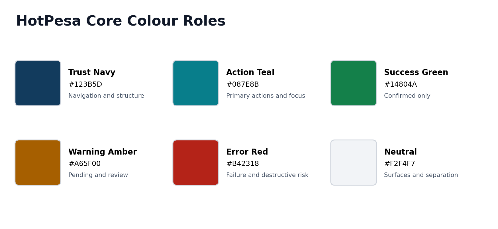

Figure 1 Core colour roles and intended semantic use

 

# 5 Colour System

| Token | Hex | Use | Restriction |
| --- | --- | --- | --- |
| color.brand.navy.700 | #123B5D | Navigation, table headers, strong structural emphasis. | Not a payment success signal. |
| color.action.teal.600 | #087E8B | Primary buttons, links, selected controls and focus support. | Must meet contrast in each use. |
| color.success.green.700 | #14804A | Confirmed badge, receipt confirmation and successful completed action. | Never use for initiating or pending. |
| color.warning.amber.700 | #A65F00 | Pending, review required and caution. | Pair with text and icon. |
| color.error.red.700 | #B42318 | Failure, validation and destructive action. | Do not use for ordinary pending delay. |
| color.text.primary | #101828 | Primary text. | Default on light surfaces. |
| color.text.secondary | #475467 | Supporting text and metadata. | Must remain readable at small size. |
| color.border.default | #D0D5DD | Controls, cards and table divisions. | Not the only focus indicator. |
| color.surface.subtle | #F2F4F7 | Secondary surfaces and group separation. | Avoid reducing contrast. |
| color.surface.base | #FFFFFF | Default content surface. | Use spacing, not excessive shadow, to group. |

## 5.1 Contrast and state rules

All text and meaningful icons must meet the approved WCAG contrast target.

Colour never carries state alone; use label, icon and explanatory text.

Focus ring must remain visible on every surface and must differ from error indication.

Charts use patterns, labels or markers in addition to colour.

Dark mode is deferred for MVP unless separately approved and tested; the token model remains theme-ready.

# 6 Typography

| Role | Font | Size and line height | Weight | Use |
| --- | --- | --- | --- | --- |
| Display | Aptos or approved product sans | 32 / 40 px | 700 | Rare marketing or major desktop heading. |
| Page title | Aptos | 24 / 32 px | 700 | Passenger and workspace page title. |
| Section heading | Aptos | 20 / 28 px | 700 | Major section within page. |
| Card heading | Aptos | 16 / 24 px | 600 | Card, dialog and panel title. |
| Body | Aptos | 16 / 24 px passenger; 14 / 20 px admin | 400 | Instructions and descriptions. |
| Label | Aptos | 14 / 20 px | 600 | Form labels and metadata labels. |
| Caption | Aptos | 12 / 18 px | 400 | Supporting metadata only. |
| Numeric amount | Aptos with tabular figures | 28 / 36 px | 700 | Fare and confirmed amount. |
| Code/reference | Aptos Mono or system mono | 13 / 20 px | 500 | Safe public references only. |

## 6.1 Typography rules

Never rely on placeholder text as the field label.

Long references may wrap at safe delimiters but must remain copyable.

Use sentence case for buttons, headings and labels.

Avoid all caps except short table headers where legibility remains acceptable.

Amounts use KES and grouping consistently; timestamps display local timezone context.

 

# 7 Spacing Grid and Layout

| Token | Value | Typical use |
| --- | --- | --- |
| space.1 | 4 px | Tight icon and label gaps. |
| space.2 | 8 px | Inline separation and compact metadata. |
| space.3 | 12 px | Control internal spacing. |
| space.4 | 16 px | Default component and mobile gutter. |
| space.5 | 24 px | Card padding and section separation. |
| space.6 | 32 px | Major section separation. |
| space.8 | 48 px | Large desktop separation. |
| space.10 | 64 px | Page-level hero spacing only. |

## 7.1 Grid

| Viewport | Columns | Gutter | Outer margin | Content rule |
| --- | --- | --- | --- | --- |
| Small mobile 320-479 | 4 | 16 px | 16 px | Single-column critical flow. |
| Large mobile 480-767 | 4 | 20 px | 20-24 px | Single column; wider cards. |
| Tablet 768-1023 | 8 | 24 px | 24-32 px | Two-column only when sequence remains clear. |
| Desktop 1024-1439 | 12 | 24 px | 32 px | Navigation plus flexible workspace. |
| Wide desktop 1440+ | 12 | 24-32 px | Auto; max content width | Keep reading width and avoid stretched forms. |

## 7.2 Layout rules

Passenger content max width is approximately 480 px for payment forms and 680 px for help content.

Administrative forms avoid fields wider than their expected content.

Primary action follows the content it commits; sticky mobile actions must not hide errors or safe-area content.

Desktop queue and detail layouts preserve filter and context visibility.

Page-level horizontal scrolling is prohibited at 390 px; contained table scroll must be labelled and keyboard accessible.

# 8 Iconography Radius Elevation and Imagery

| Element | Specification |
| --- | --- |
| Icon style | Simple outline icons with consistent 1.5-2 px stroke; filled variant only for selected navigation or status when tested. |
| Icon size | 16 px compact, 20 px default, 24 px mobile action, 32 px major status. |
| Text pairing | Every unfamiliar or critical icon has a visible label; tooltips supplement rather than replace labels. |
| Radius | 4 px small controls, 8 px buttons/cards, 12 px prominent passenger panels; avoid excessive pill shapes. |
| Elevation | Borders and spacing first; subtle shadow only for floating menus, dialogs or sticky layers. |
| Imagery | No stock photography inside payment flow. Operator branding or vehicle images require approval, optimization and useful alt text. |
| Logo | Use approved HotPesa asset only; do not reconstruct or distort in implementation. |
| Provider marks | Use M-Pesa/Safaricom marks only under approved brand and integration guidance. |

# 9 Design Tokens and Theming

| Token category | Examples | Governance |
| --- | --- | --- |
| Colour | color.action.primary, color.status.confirmed, color.focus.ring | Semantic tokens map to palette values; components never hard-code state colours. |
| Typography | font.family.body, font.size.body, line.height.body | One responsive type scale; browser zoom remains supported. |
| Spacing | space.1 through space.10 | 8-point base with 4-point refinement. |
| Shape | radius.control, radius.card, border.width.default | Shared across channels. |
| Elevation | shadow.menu, shadow.dialog, shadow.sticky | Use sparingly and test against high contrast. |
| Motion | duration.fast, duration.standard, easing.enter | Reduced-motion override is mandatory. |
| Breakpoints | bp.sm, bp.md, bp.lg, bp.xl | CSS and design source use the same values. |
| Z index | layer.base, sticky, menu, dialog, toast | Central scale prevents stacking conflicts. |

## 9.1 Token delivery

Tokens are maintained in the shared design-token package, emitted as CSS custom properties and typed TypeScript definitions, versioned with change notes, and validated in component stories or equivalent visual fixtures. Breaking token changes require design and frontend approval.

# 10 Navigation Components

| Component | Behaviour | Responsive rule | Accessibility |
| --- | --- | --- | --- |
| Passenger header | HotPesa identity, context-safe Help and no distracting global menu. | Compact on mobile; context remains in page. | Landmark, labelled help link. |
| Workforce bottom navigation | Today, Journeys, Activity and More with active state. | Mobile only; desktop may use rail. | Visible label, current-page state. |
| Admin side navigation | Domain groups and permitted destinations. | Persistent desktop; drawer below desktop. | Keyboard roving/standard link model; escape closes drawer. |
| Breadcrumb | Queue-to-detail hierarchy. | Desktop detail/configuration; omitted in linear passenger flow. | Ordered list with current item. |
| Tabs | Related views within one record. | Scrollable only in controlled container. | Tablist semantics and keyboard movement. |
| Pagination | Cursor-aware next/previous and page-size policy. | Compact on mobile administration. | Buttons with disabled explanation and result count. |
| Back action | Returns without reversing accepted commands. | Preserves queue filters or safe passenger step. | Real button/link with explicit label. |

 

# 11 Buttons Forms and Inputs

## 11.1 Button hierarchy

| Variant | Use | Rules |
| --- | --- | --- |
| Primary | One main safe action per view or dialog. | Teal fill; action verb; loading preserves width; disabled reason available. |
| Secondary | Alternative non-destructive action. | Border or subtle surface; never visually outrank primary. |
| Tertiary or link | Low-emphasis navigation or disclosure. | Clear focus and touch target. |
| Destructive | Revoke, cancel or irreversible controlled action. | Red treatment, consequence, confirmation and reason where required. |
| Icon button | Compact recognized action. | Accessible name, 44 px touch target where applicable, tooltip on hover/focus. |

## 11.2 Form fields

| Element | Specification |
| --- | --- |
| Label | Persistent, sentence case, above field; required status explicit. |
| Helper text | Purpose, format or consequence; not used to hide essential notice. |
| Input | Minimum 44 px mobile height; clear boundary; visible focus; browser autofill tested. |
| Phone | Display Kenyan examples, accept approved forms and normalize server-side; mask after submission. |
| Amount | Read-only when derived from fare quote; cannot be edited in payment form. |
| Select | Native or accessible custom; search only when option count justifies it. |
| Validation | Validate on blur and submit as appropriate; preserve valid data; focus summary on submit failure. |
| Sensitive field | No unnecessary reveal, analytics capture, clipboard logging or URL persistence. |
| Submission | Prevent accidental double submit; use idempotency; distinguish accepted command from completed outcome. |

 

# 12 Cards Tables Dialogs and Notifications

| Component | Use | Critical rules |
| --- | --- | --- |
| Context card | Journey, vehicle, destination or assignment summary. | Stable labels; no hidden fare/payment state. |
| Status card | Current payment or sync state and next action. | State text first; colour/icon supplementary; last checked time. |
| Record card | Mobile transformation of an admin/workforce row. | Every value retains its label and row action remains reachable. |
| Data table | Queues, reports and audit. | Semantic headers, stable columns, sort disclosure, contained overflow and empty/error rows. |
| Timeline | Payment, evidence, case or audit chronology. | UTC ordering with local display; source and outcome; no raw sensitive payload. |
| Dialog | Focused confirmation or short task. | Trap focus, labelled title, escape policy, return focus and no long workflows. |
| Toast | Non-blocking confirmation of a completed UI action. | Never sole evidence of payment; persists long enough and is announced. |
| Banner | Page or system-wide condition. | Specific scope, severity and recovery; dismiss only when safe. |
| Tooltip | Short clarification for icon or compact value. | Not required to complete task; works on focus and hover. |

# 13 Payment State Components

| State | Visual role | Headline pattern | Primary action |
| --- | --- | --- | --- |
| created | Neutral structure | Payment request prepared | Wait or safely return. |
| initiating | Neutral progress | Sending M-Pesa request | Wait; prevent repeated submission. |
| pending | Amber information | Waiting for payment confirmation | Refresh or eligible status check. |
| confirmed | Green success | Payment confirmed | View receipt. |
| failed | Red error | Payment did not complete | Retry when eligible or get help. |
| expired | Neutral/amber closure | Payment request expired | Start new attempt or get guidance. |
| review required | Amber high-attention | Payment needs review | Keep reference and contact support. |

## 13.1 Status component anatomy

Visible state label and icon.

One-sentence plain-language meaning.

Amount and safe public reference where relevant.

Last checked or evidence time.

Primary safe action and optional secondary help.

No success treatment unless the canonical state is confirmed.

# 14 Loading Empty Error and Access States

| State | Presentation | Required action |
| --- | --- | --- |
| Loading | Skeleton matching final layout for short waits; named progress for longer work. | Allow cancel only if safe; announce status. |
| Empty | Explain absence and influence of filters or permissions. | Clear filters, create permitted item or return. |
| Validation error | Inline message plus summary after failed submission. | Focus first invalid field; retain valid input. |
| Business-rule error | Explain the rule and current server state. | Refresh or choose an allowed action. |
| System error | Human message and stable error reference. | Safe retry or support route; no stack trace. |
| Timeout | Explain that outcome may still be processing. | Check authoritative status rather than blind repeat. |
| Unauthorized | Sign-in or context recovery. | Do not disclose protected resource. |
| Forbidden | Explain insufficient permission without sensitive detail. | Return or request approved access. |
| Offline | Visible offline state and last verified time. | Retry connection; never infer payment confirmation. |
| Partial data | Identify affected panel and freshness. | Refresh the affected region; avoid misleading totals. |

# 15 Motion Feedback and Microinteractions

| Interaction | Duration | Behaviour |
| --- | --- | --- |
| Hover/focus transition | 100-150 ms | Colour/border change only; no movement that shifts layout. |
| Panel enter | 150-200 ms | Subtle opacity/translate when motion is permitted. |
| Dialog enter/exit | 150-200 ms | Fade and small scale; focus moves after mount. |
| Status refresh | No continuous decorative animation | Brief progress indicator and last-checked update. |
| Confirmation | 150-250 ms | Modest icon/state transition; no confetti in payment flow. |
| Skeleton | Static or subtle pulse | Pulse disabled under reduced motion. |
| Reduced motion | 0-50 ms or none | No parallax, looping motion or essential animated sequence. |

## 15.1 Feedback hierarchy

Field feedback stays near the field, component feedback stays within the component, page feedback uses a banner, and cross-page system conditions use the global frame. Toasts confirm interface actions but never replace durable payment status or receipt evidence.

# 16 Responsive Breakpoints and Device Behaviour

| Breakpoint | Layout behaviour |
| --- | --- |
| < 480 px | Single column; 16 px gutters; stacked actions; cards replace wide tables; no page overflow. |
| 480-767 px | Single column with wider context cards; optional two-up small metadata only. |
| 768-1023 px | Navigation drawer or rail; two columns when tasks are independent; dialogs remain bounded. |
| 1024-1439 px | Persistent admin side navigation; queue/detail may use split layout where useful. |
| 1440 px and above | Max content width; additional whitespace or controlled extra columns; do not stretch reading measure. |

 

## 16.1 Behaviour matrix

| Pattern | Mobile | Tablet | Desktop |
| --- | --- | --- | --- |
| Passenger flow | Linear single column. | Centred single column. | Centred narrow flow; no unnecessary side content. |
| Workforce | Bottom navigation and full-width cards. | Navigation rail or drawer. | Rail/side navigation where deployed. |
| Admin queues | Labelled cards or contained scroll. | Priority columns plus detail drawer. | Full table with filters and detail route. |
| Dialogs | Prefer full-screen sheet for complex task. | Bounded dialog. | Bounded dialog or side panel. |
| Sticky action | Allowed if safe-area aware and errors remain visible. | Optional. | Usually inline in action area. |

# 17 Accessibility and Inclusive Design

| Requirement | Target and implementation evidence |
| --- | --- |
| Standards | Meet approved WCAG 2.2 AA target for applicable web/PWA experiences; document justified exceptions. |
| Keyboard | All functions operable without pointer; visible focus; no traps; logical order. |
| Screen reader | Landmarks, headings, labels, names, roles, values and status announcements verified. |
| Contrast | Text, controls, focus and non-text indicators meet target in every state. |
| Touch | Interactive targets at least 44 by 44 CSS pixels where applicable. |
| Zoom and reflow | Usable at 200 percent zoom and reflows without loss at narrow viewport. |
| Motion | Reduced-motion preference respected; no flashing or essential motion. |
| Errors | Error summary and field association; instructions do not rely on colour or position alone. |
| Language | Plain English baseline; Swahili only after reviewed translation and locale testing. |
| Cognition | Short steps, consistent placement, explicit next action and recovery reference. |
| Testing | Automated accessibility scan plus keyboard, screen-reader and pilot-user manual checks. |

# 18 Data Visualization Map and Reporting Rules

Maps and advanced charts are not required for the Phase 0 payment slice. If approved for MVP operations, they follow the rules below and must not become a prerequisite for passenger payment.

| Element | Rule |
| --- | --- |
| Summary metric | Label, value, period, scope and freshness; totals disclose excluded or partial data. |
| Bar/line chart | Direct labels or accessible legend; readable axis; no 3D; tabular alternative. |
| State composition | Prefer labelled bar over pie when exact comparison matters. |
| Table | Canonical source for exact operational and financial values. |
| Map | List alternative, keyboard-accessible result navigation, non-colour markers and explicit geographic scope. |
| Export | Approved columns, purpose, date range, job state, expiry and protected retrieval. |
| Redaction | No full phone, token, secret or raw provider payload in visualization or export by default. |

# 19 Design System Governance

| Artifact | Owner | Required control |
| --- | --- | --- |
| Design tokens | Design and frontend | Versioned package; semantic naming; automated build and contrast checks. |
| Components | Frontend with design approval | Documented props, states, accessibility and usage examples. |
| Wireframes and prototypes | Product design | AFIA screen ID, version, reviewer and decision history. |
| Content patterns | Product/content/operations | Canonical terms, approved state wording and localization ownership. |
| Visual regression fixtures | Frontend/QA | Representative states and responsive widths in CI. |
| Exceptions | Design authority and product owner | Recorded rationale, affected requirement and expiry/review date. |

## 19.1 Change process

Propose change with user problem and affected screens.

Check AFIA, API, accessibility, privacy and token impacts.

Prototype and test when behaviour changes.

Approve and version tokens/components.

Update traceability and regression fixtures before merge.

# 20 Component Specifications

| Component | Required variants | Required states | Test evidence |
| --- | --- | --- | --- |
| Button | Primary, secondary, tertiary, destructive, icon. | Default, hover, focus, active, disabled, loading. | Keyboard, contrast, touch size, double-submit. |
| Text input | Text, phone, search, reference, reason. | Empty, filled, focus, invalid, disabled, read-only. | Label, helper/error, autofill, masking. |
| Select | Native/custom, single, searchable. | Open, focus, selected, invalid, disabled. | Keyboard and screen reader. |
| Status badge | Seven payment states plus operational states. | Static with icon/text. | Semantic mapping and contrast. |
| Status panel | Passenger and admin detail. | Loading, current, stale, error. | Live announcement and refresh. |
| Context card | Journey, fare, assignment, receipt. | Loading, ready, unavailable. | Responsive and data completeness. |
| Data table | Queue, audit, report. | Loading, populated, empty, error, partial. | Headers, sort, pagination, overflow. |
| Dialog | Confirm, reason, warning. | Open, submitting, error, complete. | Focus trap, escape, return focus. |
| Toast/banner | Success, info, warning, error. | Visible, dismissed, timed where allowed. | Announcement and persistence. |
| Timeline | Payment, evidence, audit, case. | Loading, populated, filtered. | Ordering, redaction, local time. |

 

# 21 Wireframe Reading Guide

The following low-fidelity wireframes are structural design contracts. They show hierarchy, data grouping, navigation and primary actions. They do not prescribe final logo artwork, exact copy length, illustration, photography or provider-owned M-Pesa screens.

| Marker | Interpretation |
| --- | --- |
| Navy header | Channel and global navigation structure. |
| Outlined cards | Grouped context, state, fields or related records. |
| Teal action | Primary permitted action; final enabled state depends on validation and authority. |
| Status panel | Server-controlled state and recovery guidance. |
| Grey lines | Representative content, not placeholder production copy. |
| Desktop side navigation | Role-filtered domains, not a guarantee that every role sees every item. |

## 21.1 Wireframe coverage

| Channel | Screen IDs | Count |
| --- | --- | --- |
| Passenger PWA | P-01 through P-07 | 7 |
| Workforce mobile | W-01 through W-05 | 5 |
| Administration web | A-01 through A-08 | 8 |
| Total |  | 20 |

# 22 Passenger Wireframes

Passenger screens prioritize journey and fare context, one payment action, trustworthy state language and safe recovery. No passenger wireframe includes a control that can declare payment confirmed.

 

# P-01 Journey Landing

Entry screen for a trusted journey link or QR. It establishes confidence before requesting any personal detail.

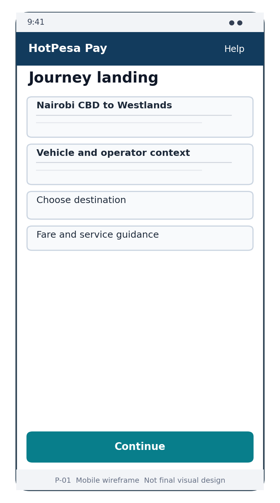

Wireframe P-01 Journey Landing low fidelity structure

| Area | Design requirement |
| --- | --- |
| Context | Operator or SACCO, vehicle/public label, route or journey and active service state. |
| Destination | Approved destination or fare option selection with accessible labels. |
| Safety | Inactive or invalid journeys show unavailable state and accept no payment. |
| Primary action | Continue only after the minimum context and destination are valid. |

# P-02 Fare Confirmation

Review screen that makes the selected journey, destination, amount, currency and quote validity explicit.

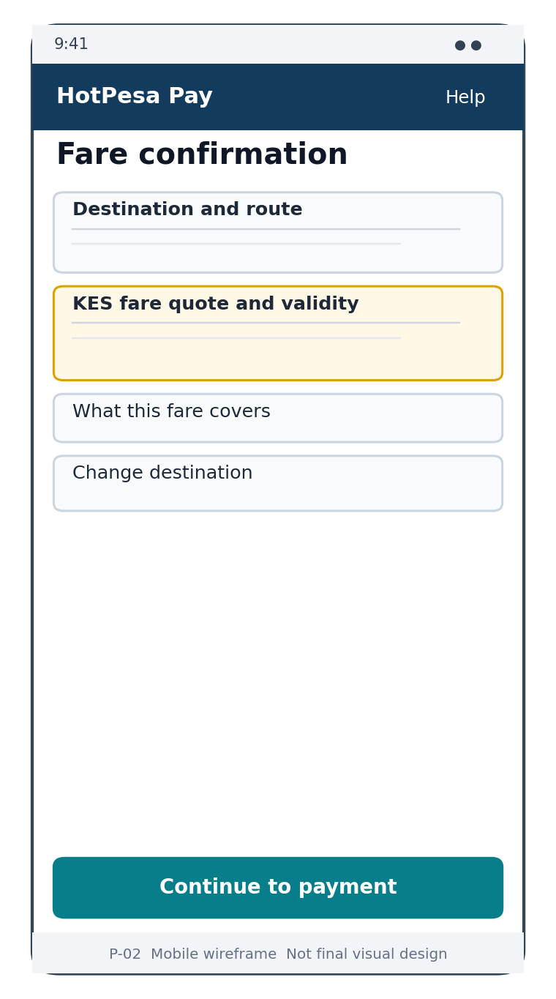

Wireframe P-02 Fare Confirmation low fidelity structure

| Area | Design requirement |
| --- | --- |
| Amount | KES amount is the strongest numeric element and remains read-only. |
| Quote | Validity and source are visible without exposing internal IDs. |
| Change | Passenger may return to selection before an attempt exists. |
| Primary action | Continue to payment; language does not imply that payment is complete. |

 

# P-03 Payment Details

Collect the minimum phone and notice acknowledgement required to create a server-side payment attempt.

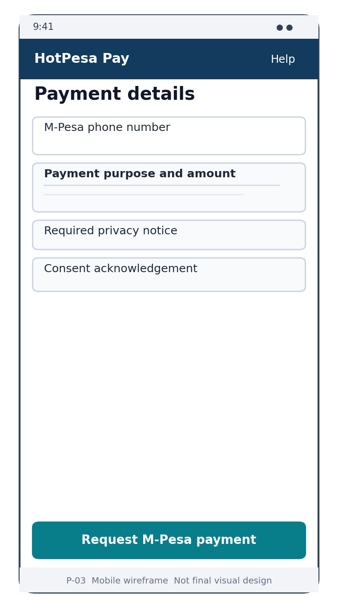

Wireframe P-03 Payment Details low fidelity structure

| Area | Design requirement |
| --- | --- |
| Phone | Persistent label, Kenyan example, accessible validation and masking after submission. |
| Context | Fare and destination remain visible during entry. |
| Notice | Payment purpose and required privacy information precede submission. |
| Submission | Loading prevents repeat; idempotency protects retries. |

# P-04 Payment Status

Authoritative status view for all seven payment states and the primary recovery path.

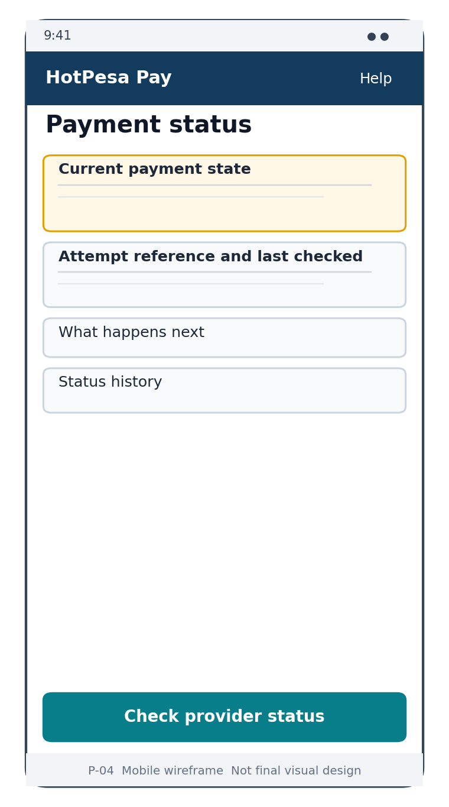

Wireframe P-04 Payment Status low fidelity structure

| Area | Design requirement |
| --- | --- |
| State | Text, icon and semantic colour; success only when confirmed. |
| Freshness | Last checked time and automatic refresh disclosure. |
| Reference | Safe copyable public reference, never internal ID. |
| Action | State-specific refresh, provider status check, retry or support action. |

# P-05 Receipt

Share-safe proof presented only after trusted confirmation.

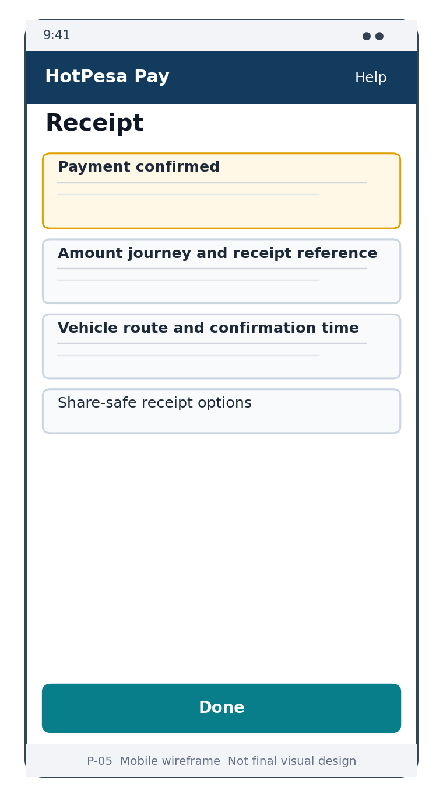

Wireframe P-05 Receipt low fidelity structure

| Area | Design requirement |
| --- | --- |
| Confirmation | Confirmed label and amount are prominent. |
| Details | Receipt reference, journey, operator/vehicle context and confirmation time. |
| Privacy | No full phone, provider secret or raw payload. |
| Action | Download/share only in an approved format; Done safely exits. |

# P-06 Status Recovery

Restore an existing payment attempt without creating a new charge.

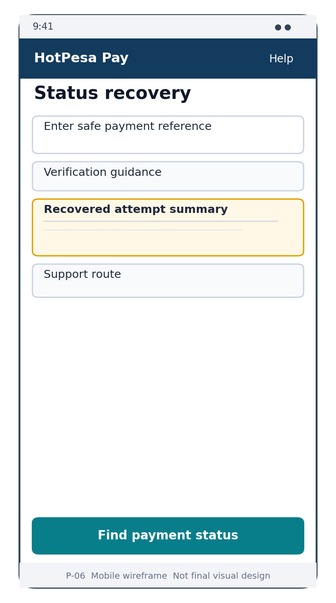

Wireframe P-06 Status Recovery low fidelity structure

| Area | Design requirement |
| --- | --- |
| Reference | Accept only approved public reference and minimum verification. |
| Disclosure | Not-found state does not expose another passenger record. |
| Result | Recovered state uses the same canonical status component. |
| Action | Find status, then continue to the existing attempt rather than pay again. |

# P-07 Help and Safety

Context-sensitive guidance for pending, failed, expired, review-required, privacy and support conditions.

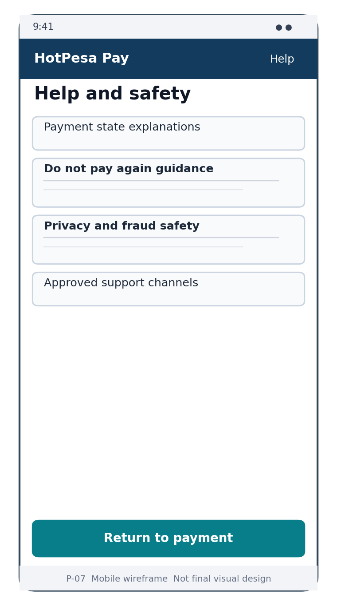

Wireframe P-07 Help and Safety low fidelity structure

| Area | Design requirement |
| --- | --- |
| Structure | Short topics with search or disclosure only if content size justifies it. |
| Safety | Explicit warning not to pay again when status is unresolved. |
| Support | Approved channel, hours and masked reference guidance. |
| Language | Plain English; Swahili only after reviewed localization. |

# 23 Workforce Wireframes

Workforce screens preserve assignment context and provide assistance without granting control over provider evidence or confirmed payment state.

 

# W-01 Workforce Sign In

Authenticate workforce users and establish tenant, role and approved-device context.

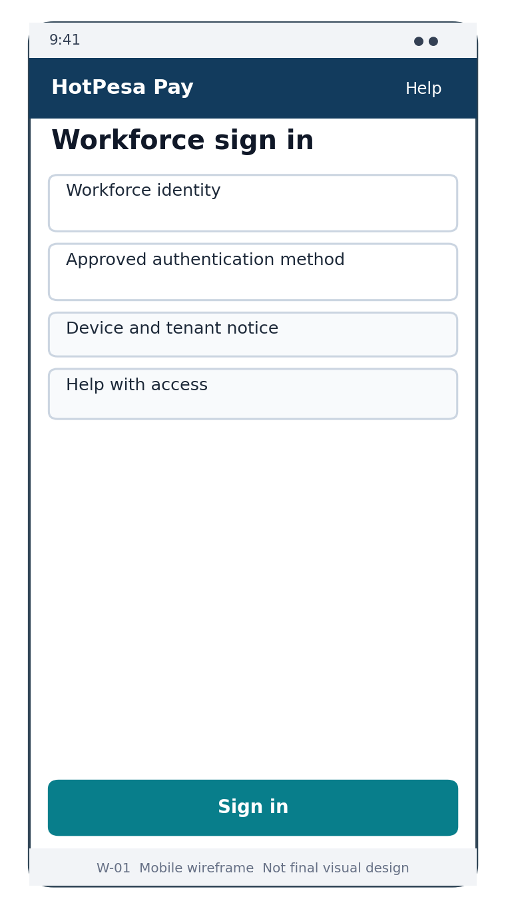

Wireframe W-01 Workforce Sign In low fidelity structure

| Area | Design requirement |
| --- | --- |
| Identity | Approved identity-provider flow; no local credential invention. |
| Device | Show device approval or blocked state clearly. |
| Recovery | Use approved workforce recovery; never disclose account existence unnecessarily. |
| Return | Open validated assignment route or safe Today default. |

# W-02 Today and Assignment

Daily operational entry showing active duty context and readiness.

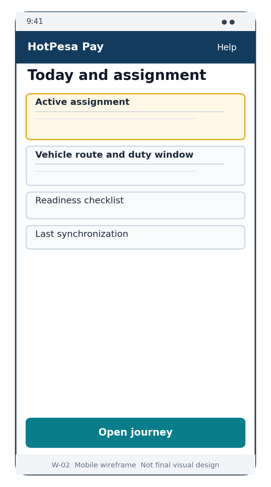

Wireframe W-02 Today and Assignment low fidelity structure

| Area | Design requirement |
| --- | --- |
| Assignment | Vehicle, route, duty window and role are visible. |
| Readiness | Blocking versus advisory checklist items are distinct. |
| Sync | Last verified time and offline condition are visible. |
| Action | Open journey only when assignment and policy permit. |

# W-03 Journey Workspace

Active operational workspace for the assigned crew member.

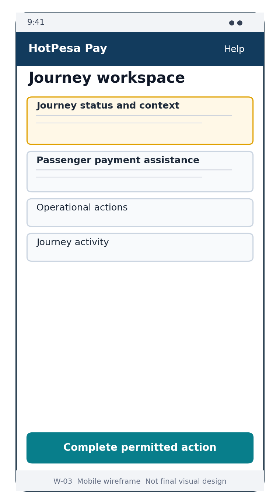

Wireframe W-03 Journey Workspace low fidelity structure

| Area | Design requirement |
| --- | --- |
| Context | Journey state and assignment remain persistent. |
| Assistance | Payment lookup opens the constrained assistance flow. |
| Actions | Only permitted journey transitions; sensitive overrides require reason. |
| Completion | Unresolved blockers are visible before close. |

# W-04 Passenger Assistance

Locate a permitted payment attempt and provide evidence-safe guidance.

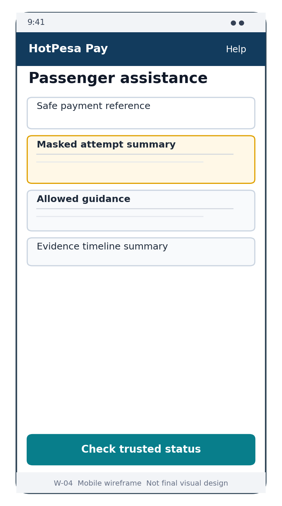

Wireframe W-04 Passenger Assistance low fidelity structure

| Area | Design requirement |
| --- | --- |
| Search | Safe reference and approved masked lookup only. |
| State | Canonical status panel; crew cannot edit state. |
| Evidence | Normalized timeline summary, not raw provider payload. |
| Action | Trusted provider status check only when authorized and eligible. |

# W-05 Sync Centre

Explain offline work, queued safe actions, failures and conflicts.

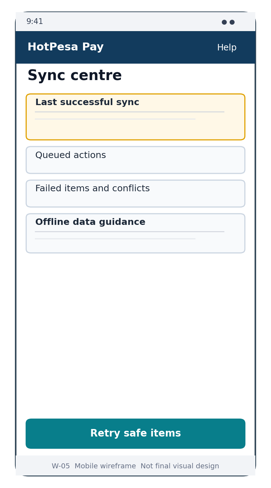

Wireframe W-05 Sync Centre low fidelity structure

| Area | Design requirement |
| --- | --- |
| Freshness | Last successful synchronization and connectivity state. |
| Queue | Each item shows command, age, retry state and server result. |
| Conflict | No last-write-wins for financial or assignment truth. |
| Action | Retry only commands approved for offline queuing. |

# 24 Administration Wireframes

Administration screens use a consistent queue-detail-action model, role-filtered navigation, stable filters and evidence-linked history.

 

# A-01 Operational Overview

Role-specific summary of journeys, payment states and exceptions without misleading global totals.

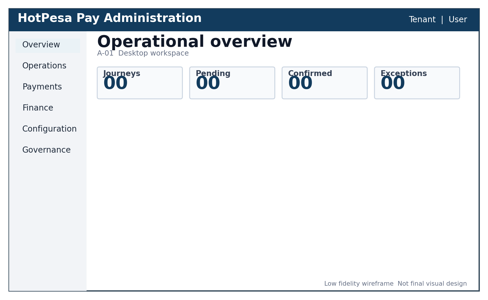

Wireframe A-01 Operational Overview low fidelity structure

| Area | Design requirement |
| --- | --- |
| Metrics | Label, period, scope and freshness. |
| Alerts | Severity and affected scope; direct link to filtered queue. |
| Partial data | Explicitly disclosed; incomplete totals are not presented as authoritative. |
| Role | Cards and shortcuts reflect permission and tenant. |

 

# A-02 Journey and Fleet Queues

Manage journeys, vehicles, routes and assignments through filterable queues.

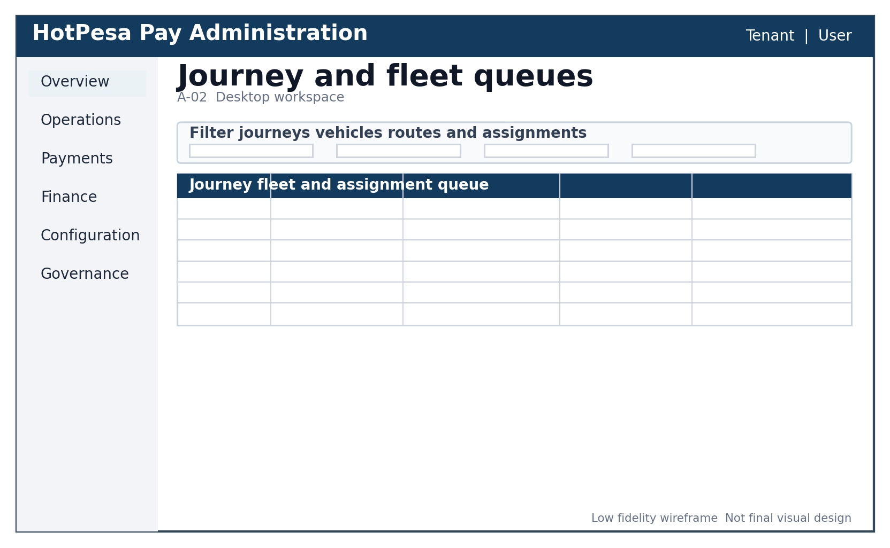

Wireframe A-02 Journey and Fleet Queues low fidelity structure

| Area | Design requirement |
| --- | --- |
| Filters | Structured and URL/session safe; clear-all and result count. |
| Rows | Stable identifiers, state, assignment and freshness. |
| Return | Detail-to-queue navigation preserves filters and cursor. |
| Action | Mutations validate record version and tenant scope. |

 

# A-03 Fare Management

Draft, review, approve and activate versioned fare schedules.

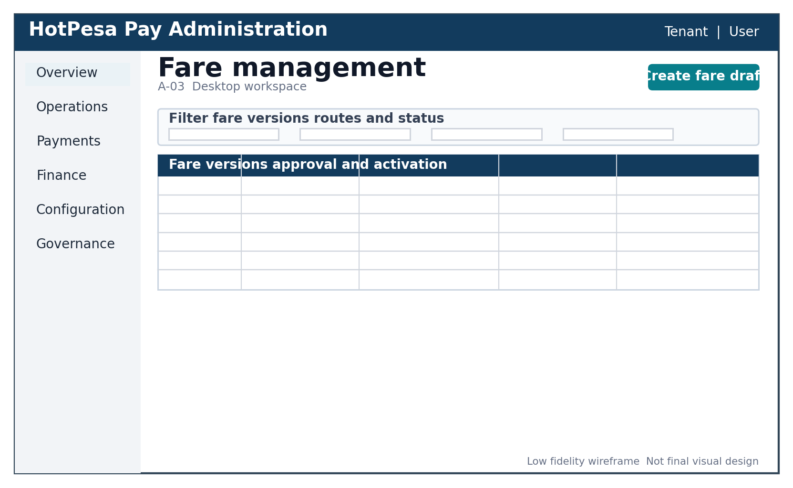

Wireframe A-03 Fare Management low fidelity structure

| Area | Design requirement |
| --- | --- |
| Version | Draft, pending approval, approved, scheduled and active are distinct. |
| Conflict | Overlapping dates or duplicate route/stage combination shown before approval. |
| Control | Maker-checker where policy requires; reason and actor recorded. |
| Immutability | Existing payment quote and attempt are never silently repriced. |

 

# A-04 Payment Attempts

Search and inspect attempts, normalized evidence, receipt and timeline.

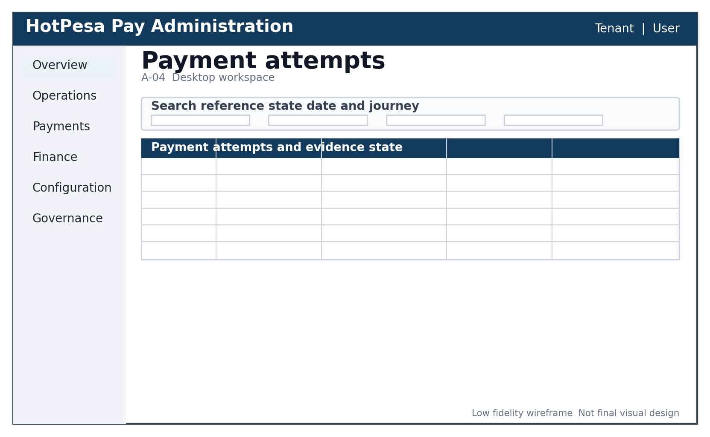

Wireframe A-04 Payment Attempts low fidelity structure

| Area | Design requirement |
| --- | --- |
| Search | Reference, state, date, journey and protected phone lookup. |
| Row | Amount, state, created time, journey and safe reference. |
| Detail | Immutable amount, transitions, evidence and audit relationships. |
| Privacy | Masked phone and restricted reveal/export. |

 

# A-05 Reconciliation Cases

Queue for missing, duplicate, late, conflicting or mismatched provider evidence.

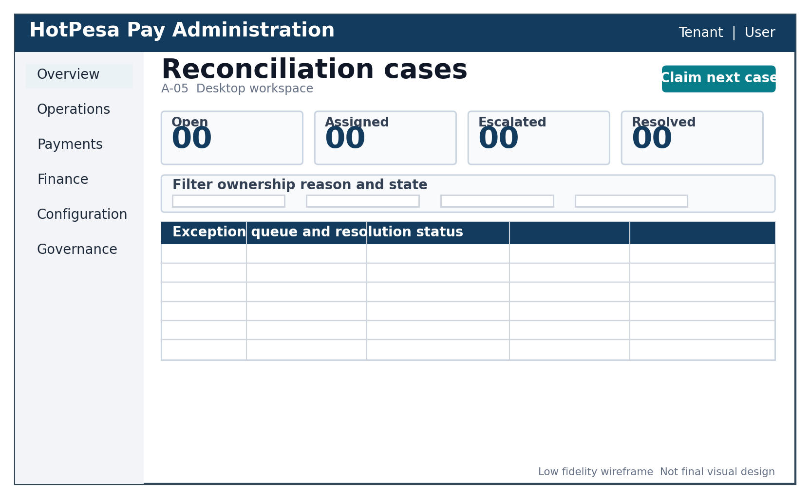

Wireframe A-05 Reconciliation Cases low fidelity structure

| Area | Design requirement |
| --- | --- |
| Summary | Counts disclose filters and refresh time. |
| Ownership | Claim, assign, escalate and resolve under separation-of-duties policy. |
| Evidence | Chronology and normalized provider evidence. |
| Resolution | Mandatory reason, approved action and immutable audit history. |

 

# A-06 Reports and Exports

Governed report selection and asynchronous export job monitoring.

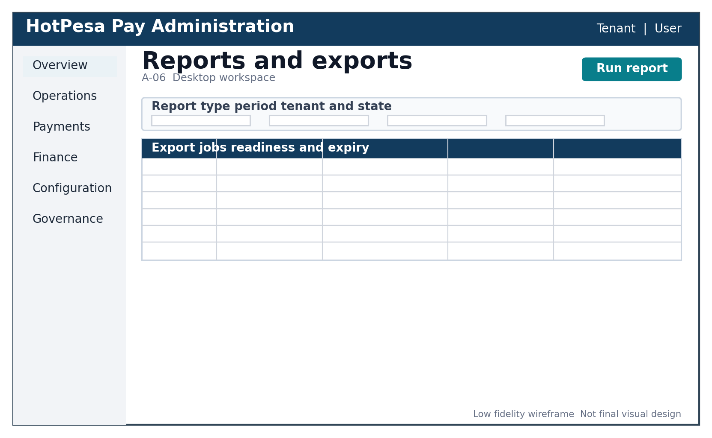

Wireframe A-06 Reports and Exports low fidelity structure

| Area | Design requirement |
| --- | --- |
| Inputs | Report type, period, tenant/scope and approved filters. |
| Job | Queued, running, ready, failed and expired states. |
| Delivery | Protected retrieval with expiry, row/column policy and audit. |
| Privacy | No sensitive identifier reveal unless specifically authorized. |

 

# A-07 Users Roles and Devices

Least-privilege workforce access management.

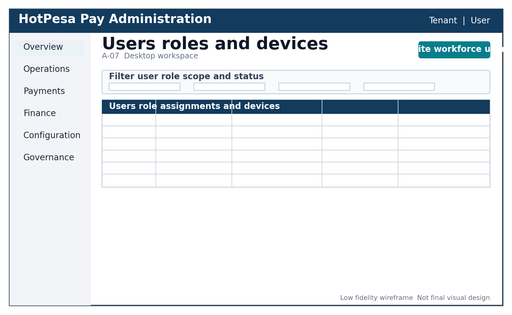

Wireframe A-07 Users Roles and Devices low fidelity structure

| Area | Design requirement |
| --- | --- |
| Scope | Tenant, role, route/fleet scope and device state. |
| Change | Invite/link, assign, suspend, revoke and device approve. |
| Risk | Step-up authentication and reason for elevated changes. |
| Review | Last access, expiry and periodic access-review evidence. |

 

# A-08 Audit and System Health

Read-only control evidence and operational health presentation.

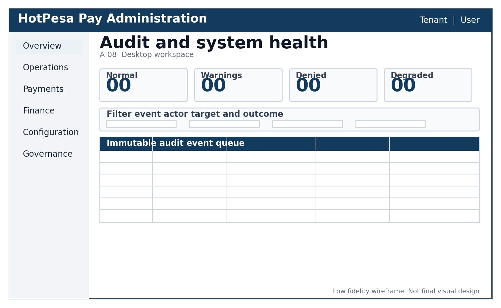

Wireframe A-08 Audit and System Health low fidelity structure

| Area | Design requirement |
| --- | --- |
| Audit | Actor, action, target, result, correlation and UTC/local time. |
| Health | Service condition and affected scope without exposing secrets. |
| Filters | Event type, actor, target, outcome, time and correlation. |
| Immutability | No edit/delete UI for audit evidence; retention follows approved policy. |

 

# 25 Prototype Usability and Design Validation

| Stage | Participants | Tasks | Exit evidence |
| --- | --- | --- | --- |
| Wireframe review | Product, operations, finance, security, privacy, engineering and QA. | Validate hierarchy, authority and missing states. | Recorded decisions and revised wireframes. |
| Clickable prototype | Representative passengers, crew and operational staff. | Fare/payment, pending recovery, assistance and reconciliation journeys. | Task completion, errors, comprehension and qualitative findings. |
| Accessible prototype | Keyboard and assistive-technology users/reviewers. | Navigate, submit, recover, interpret state and correct errors. | Issue log with severity and closure. |
| Responsive implementation | QA across target browsers and viewports. | All twenty screens and state matrix. | Screenshots, automated checks and defect closure. |
| Pilot usability | Approved synthetic/sandbox environment and representative operating conditions. | Realistic journey entry, weak network, support and operations. | Pilot acceptance and residual-risk decision. |

## 25.1 Core research questions

Can a passenger state the route, destination and fare before submitting the phone?

Can users distinguish initiated, pending and confirmed without relying on colour?

Do passengers know what to do after timeout or missing callback without paying twice?

Can crew assist without believing they can mark payment as paid?

Can finance resolve a duplicate or conflicting event using the timeline and controls?

Can keyboard and screen-reader users complete the same critical journeys?

# 26 Design QA and Acceptance Criteria

| ID | Criterion | Evidence |
| --- | --- | --- |
| UIUX-AC-001 | All twenty AFIA screen IDs have a reviewed implementation or approved not-applicable decision. | Screen inventory and design review. |
| UIUX-AC-002 | Only confirmed uses paid/success language and success colour. | State component and browser matrix. |
| UIUX-AC-003 | 390 px viewport has no page-level horizontal overflow. | Automated responsive test. |
| UIUX-AC-004 | Critical mobile controls meet 44 by 44 CSS pixel target. | Browser measurement. |
| UIUX-AC-005 | All interactive elements have visible keyboard focus and accessible names. | Keyboard and accessibility test. |
| UIUX-AC-006 | Reduced motion disables non-essential animation. | Preference test. |
| UIUX-AC-007 | Passenger payment can be understood under loading, pending, timeout, failure, expiry and review-required states. | Usability and browser tests. |
| UIUX-AC-008 | No full phone, secret, token or raw provider payload is rendered or captured in analytics. | Redaction and telemetry tests. |
| UIUX-AC-009 | Admin queue return preserves filters and cursor. | Browser test. |
| UIUX-AC-010 | Every form exposes label, helper/error association and preserved valid values. | Component and E2E tests. |
| UIUX-AC-011 | Text/non-text contrast meets approved target across states. | Token and page contrast audit. |
| UIUX-AC-012 | Design tokens and component fixtures pass visual regression in CI. | Build and regression evidence. |

 

# 27 Requirements Traceability

| UI UX area | Upstream authority | Implementation evidence |
| --- | --- | --- |
| Journey and fare hierarchy | PRD MVP; FRS journey/fare; USUC passenger; AFIA P-01/P-02; DMAC quote. | Context card, fare component and passenger browser journey. |
| Payment form and status | FRS payment; USUC exceptions; TRD evidence architecture; DMAC states; AFIA P-03/P-04. | Form/status components, state matrix and idempotency E2E. |
| Receipt and recovery | FRS receipt/recovery; DMAC receipt/status; AFIA P-05/P-06. | Receipt fixture, masking and recovery E2E. |
| Workforce | FRS crew; USUC role flows; TRD identity; AFIA W-01-W-05. | Responsive workforce views and authorization tests. |
| Administration | FRS admin/reporting; DMAC endpoints; AFIA A-01-A-08. | Queue/detail components, role tests and exports. |
| Accessibility | PRD usability; AFIA accessibility; Security Privacy NFR. | Automated and manual WCAG evidence. |
| Privacy and content | TRD security; DMAC classification; AFIA privacy/canonical terms. | Redaction tests, content review and analytics schema. |
| Responsive/offline | TRD PWA and resilience; AFIA weak-network flows. | Viewport, offline and stale-state browser tests. |

## 27.1 Traceability rule

Every production component and screen references its UIUX component or screen ID, AFIA screen ID, upstream requirement, API operation, state coverage and automated evidence. A visual implementation that breaks canonical state language or trust boundaries is a functional defect, not a styling preference.

 

# 28 Open Decisions Assumptions and Dependencies

| ID | Decision required | Owner | Due gate | Status |
| --- | --- | --- | --- | --- |
| OD-UIUX-001 | Final HotPesa logo, brand ownership and approved provider-mark usage. | Business/Legal/Design | Before visual polish | Open |
| OD-UIUX-002 | Production identity provider surfaces, MFA, recovery and device approval. | Security/Identity/Design | Before workforce UI freeze | Open |
| OD-UIUX-003 | Official Daraja timing/error behaviour and any provider-required wording. | Payments/Provider | Before sandbox validation | Open |
| OD-UIUX-004 | Swahili inclusion, terminology owner and translation QA. | Product/Content | Before localization | Open |
| OD-UIUX-005 | Supported browser/device matrix and minimum OS/browser versions. | Engineering/QA/Product | Before regression baseline | Open |
| OD-UIUX-006 | Support channel, verification wording, hours and escalation SLA. | Support/Operations | Before pilot | Open |
| OD-UIUX-007 | Dark mode release scope. Recommendation: defer beyond MVP. | Product/Design | Before theme build | Open |
| OD-UIUX-008 | Chart/map scope and operational dashboard priorities. | Product/Operations | Before analytics design | Open |
| OD-UIUX-009 | Final quantitative performance, accessibility and usability thresholds. | Product/NFR/QA | Before release gate | Open |
| OD-UIUX-010 | Approved full-identifier reveal and export UX, if any. | Privacy/Finance/Security | Before reporting acceptance | Open |

## 28.1 Assumptions and dependencies

| Type | Item | Impact if invalid |
| --- | --- | --- |
| Assumption | Passenger MVP remains account-light and non-custodial. | Registration, wallet and balance UI expand materially. |
| Assumption | One attempt pays one immutable fare quote in KES. | Fare and payment component model changes. |
| Assumption | The provider supplies trusted callback/status evidence. | Status and recovery content requires alternative operational truth. |
| Dependency | Approved AFIA, DMAC and TRD. | Screen, state and component contracts are unstable. |
| Dependency | Security Privacy and NFR Specification. | Session, retention, quantitative accessibility and performance gates remain incomplete. |
| Dependency | Representative Kenyan passenger and PSV usability testing. | Language, hierarchy and recovery assumptions remain unvalidated. |
| Dependency | Official M-Pesa/Daraja sandbox evidence. | Provider timing and error microcopy cannot be finalized. |

# 29 Approval and Sign Off

Approval establishes this visual language, token architecture, component behaviour, responsive rules and wireframe set as the design implementation baseline. It does not authorize live M-Pesa, production credentials or public release.

| Role | Name | Decision | Signature | Date |
| --- | --- | --- | --- | --- |
| Product Owner |  | Approve / Conditional / Reject |  |  |
| Product Design Lead |  | Approve / Conditional / Reject |  |  |
| Engineering Authority |  | Approve / Conditional / Reject |  |  |
| Operations Authority |  | Approve / Conditional / Reject |  |  |
| Security and Privacy Authority |  | Approve / Conditional / Reject |  |  |
| Quality Assurance Authority |  | Approve / Conditional / Reject |  |  |
| Accessibility Reviewer |  | Approve / Conditional / Reject |  |  |
| Pilot Operator Representative |  | Approve / Conditional / Reject |  |  |

## 29.1 Approval conditions

| Condition | Status |
| --- | --- |
| AFIA and upstream requirements are approved or conditionally approved. | Pending |
| All twenty wireframes are reviewed against real pilot tasks. | Pending |
| Tokens/components pass accessibility and responsive verification. | Pending |
| Production identity and Daraja behaviour are incorporated for applicable screens. | Pending |
| Privacy, content and support wording receive formal review. | Pending |
| Visual regression and browser acceptance evidence pass. | Pending |

# 30 Final UI UX Readiness Checklist

| Readiness item | Status |
| --- | --- |
| Design authority, scope, principles and content language are defined. | Complete |
| Colour, typography, spacing, grid, icon, radius and elevation systems are defined. | Complete |
| Semantic design tokens and governance are specified. | Complete |
| Navigation, buttons, forms, cards, tables, dialogs and notification components are specified. | Complete |
| Seven payment states and all loading/error/access states are defined. | Complete |
| Motion, responsive and accessibility requirements are defined. | Complete |
| Twenty AFIA screen wireframes are included. | Complete |
| Usability validation, design QA and acceptance criteria are defined. | Complete |
| Requirements traceability, open decisions and approval conditions are included. | Complete |
| Brand, identity, Daraja, localization, support and browser decisions are approved. | Pending |
| High-fidelity designs and implementation pass usability/accessibility regression. | Pending |
| Live-provider and production release authorization is granted. | Not authorized |

## 30.1 Completion statement

This UI UX Design Specification is a detailed final draft suitable for professional review and controlled frontend implementation. It provides the design language, semantic tokens, reusable component requirements, state rules, responsive and accessible behaviour, and a complete low-fidelity wireframe set for the approved AFIA screens. It becomes the approved design contract after the stated decisions and approval conditions are closed or formally accepted with recorded conditions.
