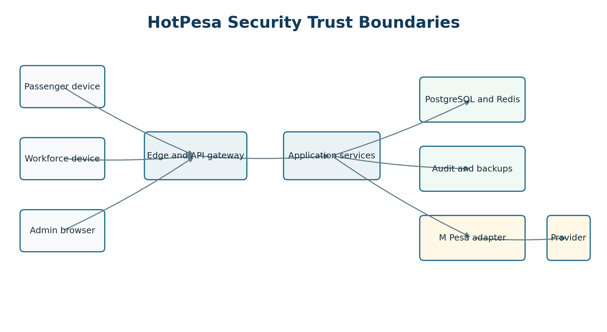
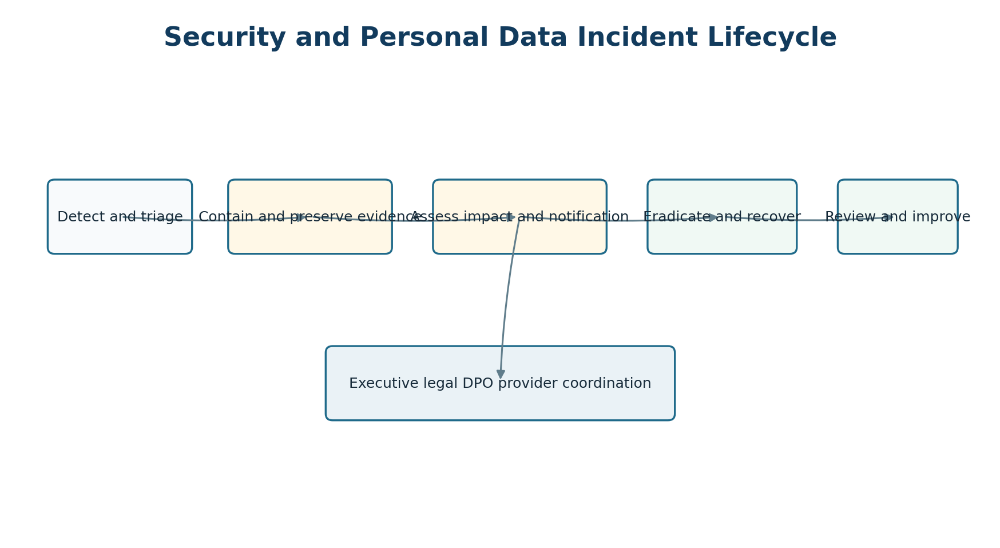

> Controlled source: [09_Security Privacy and NFR Specification (SPNFR)_HotPesa Pay.docx](../controlled-documents/09_Security%20Privacy%20and%20NFR%20Specification%20(SPNFR)_HotPesa%20Pay.docx)

> The DOCX source is authoritative. This Markdown copy preserves its controlled status and does not confer approval.

DOCUMENT 09

Security Privacy and Non Functional Requirements Specification

HotPesa Pay

Authoritative security controls, privacy obligations, measurable service targets, recovery objectives and assurance gates for controlled implementation

| Control | Value |
| --- | --- |
| Project | HotPesa Pay |
| Document | Security Privacy and Non Functional Requirements Specification |
| Version | 1.0 |
| Status | Detailed final draft for review and approval |
| Lifecycle stage | Pre-code and controlled implementation |
| Primary market | Kenya |
| Classification | Confidential - security and project planning |

Governing question: What controls and measurable service qualities must be true before HotPesa handles real passenger identifiers, provider evidence or production payment traffic?

 

# Document Control

| Field | Controlled value |
| --- | --- |
| Document owner | Security and Privacy Authority, supported by Engineering, Product, Operations, Finance, Legal and QA |
| Upstream authority | BRD, PRD, FRS, USUC, TRD, DMAC, AFIA and UI UX Specification |
| Approval authority | Sponsor, Engineering, Security, Privacy/DPO, Legal/Compliance, Operations and QA |
| Reference use | Threat model, implementation controls, CI/CD gates, privacy data map, operations, testing and release evidence |
| Legal status | Technical specification, not legal advice; applicability and licensing require qualified Kenyan review |
| Next review | Before production data, Daraja production progression, pilot launch and after material change or incident |

## Status and interpretation

Confirmed product and architecture constraints are mandatory. Numerical targets not yet formally approved are marked Proposed and must be accepted, changed or rejected by the named owner. A Phase 0 Mock M-Pesa demonstration is not evidence of production security, privacy compliance, availability or regulatory approval.

## Version history

| Version | Date | Status | Summary |
| --- | --- | --- | --- |
| 0.1 | 18 September 2026 | Baseline | Initial objectives, controls, privacy duties, threats and proposed NFR targets. |
| 1.0 | 19 September 2026 | Detailed final draft | Expanded security, privacy lifecycle, measurable NFRs, assurance, traceability and release gates. |

# Table of Contents

| Section | Title |
| --- | --- |
| 1 | Purpose Scope and Authority |
| 2 | Objectives Principles and Risk Method |
| 3 | Security Architecture and Trust Boundaries |
| 4 | Threat Model and Abuse Cases |
| 5 | Identity Authentication Authorization and Sessions |
| 6 | Device Secrets Keys and Cryptography |
| 7 | Application Web and API Security |
| 8 | M Pesa and Payment Evidence Security |
| 9 | Data Security Logging and Audit |
| 10 | Secure SDLC Supply Chain and Change Control |
| 11 | Infrastructure Network and Container Security |
| 12 | Vulnerability Management and Security Testing |
| 13 | Monitoring Detection and Incident Response |
| 14 | Privacy Governance and Data Protection Principles |
| 15 | Data Inventory Classification and Processing Records |
| 16 | Transparency Lawful Basis Consent and Rights |
| 17 | Retention Deletion Legal Hold and Backups |
| 18 | Processors Vendors Transfers and DPIA |
| 19 | Performance and Capacity Requirements |
| 20 | Availability Reliability and Resilience |
| 21 | Backup Disaster Recovery and Continuity |
| 22 | Observability Operations and Supportability |
| 23 | Maintainability Testability and Portability |
| 24 | Accessibility Usability Compatibility and Localization |
| 25 | Quantitative Service Levels and Error Budgets |
| 26 | Threat Scenario Control Matrix |
| 27 | Verification Assurance and Release Evidence |
| 28 | Requirements Traceability |
| 29 | Kenyan Regulatory and Standards Register |
| 30 | Open Decisions Assumptions and Dependencies |
| 31 | Approval and Sign Off |
| 32 | Final SPNFR Readiness Checklist |

# 1 Purpose Scope and Authority

This specification defines the cross-cutting constraints every HotPesa screen, API, worker, datastore, provider adapter, pipeline and operating procedure must satisfy. A lower-level design may strengthen these controls but may not weaken them without approved change control and, where architectural, an ADR.

| In scope | Out of scope |
| --- | --- |
| Passenger PWA, workforce app, admin web, API, workers, PostgreSQL, Redis, audit, exports and backups. | Provider-owned M-Pesa internals and handset PIN entry. |
| Identity, tenant isolation, payment evidence, privacy lifecycle and incident response. | A legal opinion that HotPesa is licensed or exempt. |
| Performance, capacity, availability, recovery, accessibility and operational quality. | PCI DSS cardholder scope unless cards are introduced. |
| Phase 0 controls and production-readiness gates. | Unapproved wallet, lending, insurance, AI and cross-border products. |

## 1.1 Requirement authority

| Question | Authority | Effect |
| --- | --- | --- |
| Business/product scope | BRD and PRD | Controls apply to approved scope; risk can block release. |
| Required behaviour | FRS and USUC | Controls preserve functional intent. |
| Architecture/data/API | TRD and DMAC | This document adds mandatory safeguards and qualities. |
| Flow/presentation | AFIA and UI UX | States, errors, consent and accessibility comply here. |
| Build/operations | Implementation Plan, ADRs and runbooks | Must produce defined evidence. |

# 2 Objectives Principles and Risk Method

| ID | Objective | Required outcome |
| --- | --- | --- |
| OBJ-01 | Prevent false payment acceptance. | Only validated trusted provider evidence confirms payment. |
| OBJ-02 | Prevent duplicate effects. | Idempotency, uniqueness and transactional state changes. |
| OBJ-03 | Protect secrets and personal identifiers. | Least privilege, managed secrets, encryption, masking and minimization. |
| OBJ-04 | Enforce tenant and contextual authorization. | Server-side role/resource/context policies and negative tests. |
| OBJ-05 | Preserve dispute and reconciliation evidence. | Immutable event receipts and evidence-linked audit. |
| OBJ-06 | Remain usable under mobile constraints. | Bounded latency, low bandwidth and explicit degraded states. |
| OBJ-07 | Recover without corrupting financial truth. | Restore drills, replay-safe workers and reconciliation. |
| OBJ-08 | Meet legal and contractual duties. | Data map, notices, rights, vendor and approval records. |
| OBJ-09 | Make controls verifiable. | Owner, method, evidence and release gate per requirement. |

## 2.1 Principles

Server evidence over client assertion.

Least privilege, deny by default and tenant scope at every protected layer.

Minimize, mask and expire personal data.

Never collect an M-Pesa PIN.

Fail safely, preserve evidence and reconcile ambiguity.

Security/privacy tests are release gates.

## 2.2 Risk interpretation

| Term | Meaning |
| --- | --- |
| Mandatory | Required; waiver needs time-bounded risk acceptance. |
| Proposed target | Planning baseline awaiting owner approval. |
| Decision required | Unresolved material choice with owner and due gate. |
| Residual risk | Risk after controls; high residual risk blocks release unless formally accepted. |
| Review trigger | Provider, identity, data, architecture, incident or law change causes revalidation. |

# 3 Security Architecture and Trust Boundaries

Figure 1 HotPesa logical security trust boundaries

| Boundary | Threats | Required controls |
| --- | --- | --- |
| Public device to edge | Fake portal, injection, automation, session theft. | TLS, opaque references, security headers, limits, validation, short session. |
| Workforce/admin to edge | Credential/session theft, wrong tenant. | Managed identity, MFA, device/session controls, authorization and audit. |
| Edge to services | Header spoofing or service bypass. | Authenticated path, normalized identity, schema and size limits. |
| Services to data | Injection, leakage, overprivilege. | Parameterized access, tenant scope, least-privilege DB roles, encryption. |
| Application to M-Pesa | Secret theft, spoof, replay, timeout ambiguity. | Dedicated adapter, managed secrets, authenticity, idempotency, reconciliation. |
| Logs/backups/exports | PII leakage, tampering, excess retention. | Allow-list data, access, encryption, immutability and lifecycle. |

# 4 Threat Model and Abuse Cases

| Asset | Abuse case | Impact | Primary mitigation |
| --- | --- | --- | --- |
| Payment truth | Fake SMS/screenshot or client declares paid. | False boarding/revenue record. | Provider evidence is sole confirmation authority. |
| Provider evidence | Spoof/replay/modify callback. | False or duplicate transition. | Authenticity, schema, correlation, amount and unique event checks. |
| Fare | Insider changes effective fare. | Overcharge, loss or fraud. | Version, approval, immutable quote and audit. |
| Tenant data | Broken object authorization. | Privacy/commercial breach. | Trusted tenant context, policy layer and negative tests. |
| Workforce identity | Stolen phone/account takeover. | Unauthorized action. | MFA, short session, device revoke and alert. |
| Passenger phone | Support/export misuse. | Privacy harm. | Masking, case scope, restricted export and audit. |
| Availability | Bot/provider/cloud outage. | Uncertain payments and disruption. | Limits, circuit/retry, durable evidence and degraded mode. |
| Audit trail | Privileged actor suppresses history. | Investigation failure. | Append-only evidence, restricted access and monitoring. |
| Supply chain | Malicious dependency/build. | Broad compromise. | Frozen graph, scanning, provenance and minimal runtime. |

## 4.1 Threat modelling practice

Each release and material change shall update data flows, trust boundaries, assets, entry points, abuse cases, mitigations, verification and residual risk. Payment initiation, callback/status, export, identity, tenant administration and recovery require explicit misuse cases.

# 5 Identity Authentication Authorization and Sessions

| ID | Requirement | Verification |
| --- | --- | --- |
| SEC-IAM-001 | Workforce/admin users authenticate through an approved identity service; no ad hoc production password store. | Architecture/configuration review. |
| SEC-IAM-002 | Privileged, finance, security and admin roles use MFA; broader workforce policy is risk-approved. | Login and policy tests. |
| SEC-IAM-003 | Tokens validate signature, issuer, audience, expiry, state/nonce and approved algorithms as applicable. | Negative integration tests. |
| SEC-AUTHZ-001 | Every protected API enforces server-side role, tenant, resource, assignment, state and action policy. | Authorization matrix tests. |
| SEC-AUTHZ-002 | Tenant identity comes from trusted context; queries/repositories apply tenant scope. | Cross-tenant negative tests. |
| SEC-AUTHZ-003 | Fare approval, sensitive export, access administration and reconciliation use separation of duties where approved. | Workflow tests/audit. |
| SEC-SES-001 | Sessions have approved idle/absolute expiry, rotation/revocation and step-up for sensitive action. | Session test suite. |
| SEC-SES-002 | Logout, suspension, device revoke and critical role change invalidate affected access. | Revocation drill. |
| SEC-IAM-004 | Passenger uses a short-lived least-privilege journey/payment context, not workforce authority. | API scope tests. |
| SEC-BRK-001 | Break-glass access is time-bounded, MFA-protected, approved, alerted and audited. | Exercise evidence. |

# 6 Device Secrets Keys and Cryptography

| ID | Requirement |
| --- | --- |
| SEC-DEV-001 | Workforce devices support enrollment/approval, inventory, revocation and tenant/assignment context. |
| SEC-DEV-002 | Local protected storage is minimized and encrypted; provider secrets never reside on client devices. |
| SEC-DEV-003 | Offline data has expiry, safe revocation/wipe behaviour and conflict rules. |
| SEC-SEC-001 | Production secrets reside only in approved secret management, never source, image, browser bundle, log or plain file. |
| SEC-SEC-002 | Each secret has owner, purpose, environment, rotation/revocation and access audit. |
| SEC-KEY-001 | Managed keys are separated from data, least-privilege and emergency-revocable. |
| SEC-CRY-001 | External and sensitive internal traffic uses approved TLS; certificate validation is never bypassed. |
| SEC-CRY-002 | Sensitive data, backups and exports use approved encryption at rest. |
| SEC-CRY-003 | Custom cryptography and unreviewed deterministic encryption are prohibited. |

## 6.1 Phone protection decision

The exact phone encryption, tokenization and lookup design remains Decision Required. It must support authorized exact lookup while reducing reversible exposure, enumeration, key concentration, analytics leakage and backup risk.

# 7 Application Web and API Security

| ID | Control |
| --- | --- |
| SEC-APP-001 | Validate/normalize untrusted input by schema, type, length, range, format and business rule. |
| SEC-APP-002 | Use parameterized data access and context-appropriate output encoding. |
| SEC-API-001 | Apply authentication, object/function authorization, content-type/body limits, rate limits and safe errors. |
| SEC-API-002 | Financial/admin mutations use idempotency and optimistic concurrency where applicable. |
| SEC-WEB-001 | Use approved CSP, HSTS, content-type, frame-ancestor, referrer and permissions policies. |
| SEC-CORS-001 | Use explicit environment origin allowlists; wildcard credentials are prohibited. |
| SEC-CSRF-001 | Cookie-authenticated mutations use effective CSRF protection matched to the session design. |
| SEC-ERR-001 | Errors never expose stack traces, secrets, tokens, full identifiers or raw provider payload. |
| SEC-UPL-001 | File upload is disabled unless required; future upload needs type/content/size validation, isolation and scanning. |
| SEC-SSRF-001 | Outbound destinations are allowlisted; private/metadata destinations and redirects are controlled. |
| SEC-CACHE-001 | Sensitive responses use safe cache controls; cache keys include authorization-relevant scope. |

# 8 M Pesa and Payment Evidence Security

| ID | Requirement |
| --- | --- |
| SEC-PAY-001 | Daraja credentials/callback secrets are restricted to the adapter and approved operations. |
| SEC-PAY-002 | HotPesa never requests, transmits, displays or stores an M-Pesa PIN. |
| SEC-PAY-003 | Callback/status evidence passes approved authenticity, schema, correlation, currency, amount and replay checks before transition. |
| SEC-PAY-004 | Provider evidence identity is durably unique before effect; duplicate evidence makes no duplicate state change. |
| SEC-PAY-005 | HTTP success, initiated prompt, timeout, SMS, screenshot or client message never confirms payment. |
| SEC-PAY-006 | Missing callback recovery uses trusted provider status; blind retry is not reconciliation. |
| SEC-PAY-007 | Late, conflicting, mismatched or unknown evidence enters review required/quarantine. |
| SEC-PAY-008 | Callback acknowledgement meets official provider timing only after required durable receipt. |
| SEC-PAY-009 | Normalized evidence is routine authority; raw provider payload retention is minimized and separately approved. |
| SEC-PAY-010 | Sandbox/production credentials, endpoints, data and observability are segregated. |

## 8.1 Provider gate

The exact Daraja product, authenticity mechanism, event key, acknowledgement timing, network controls, status semantics and retention must be completed from official documentation, provider agreement and sandbox evidence before production.

# 9 Data Security Logging and Audit

| ID | Requirement |
| --- | --- |
| SEC-DATA-001 | Application database roles are least privilege; admin credentials are not used by services. |
| SEC-DATA-002 | Payment/evidence changes are transactional, constrained and historically traceable. |
| SEC-DATA-003 | Backups, replicas, exports and non-production copies receive equivalent classification/control. |
| SEC-LOG-001 | Allow-list logs mask phone and exclude secrets, tokens, PINs, credentials and unnecessary raw payload. |
| SEC-LOG-002 | Correlation uses safe request, attempt, event and job references rather than personal identifiers. |
| SEC-AUD-001 | High-risk actions record actor/service, tenant, action, object, result, reason, correlation and UTC time. |
| SEC-AUD-002 | Audit is append-only to application actors, access controlled, monitored and lifecycle governed. |
| SEC-AUD-003 | Audit access/export is audited; mass download is restricted. |
| SEC-TIME-001 | Systems synchronize time; authoritative timestamps use UTC with local display context. |

# 10 Secure SDLC Supply Chain and Change Control

| Gate | Mandatory evidence |
| --- | --- |
| Design | Threat model, privacy assessment, trust boundaries, classification and acceptance criteria. |
| Commit | Peer review, protected branches and no committed secrets. |
| Build | Frozen dependency graph, lint, types, tests and artifact provenance. |
| Security scan | Secrets, dependencies/SBOM, SAST, container and configuration scanning with gates. |
| Test | Contracts, authorization negatives, idempotency, redaction, browser security and accessibility. |
| Release | Approved artifact promotion, environment segregation, config validation and rollback. |
| Operate | Vulnerability intake, monitoring, incident response, access review and restore drill. |
| Change | Impact analysis and ADR for material architecture, identity, provider, data or control change. |

## 10.1 Supply chain rules

Use supported versions and minimize runtime dependencies.

Lockfiles are mandatory.

High/critical exploitable findings block release unless formally accepted.

Release containers use minimal bases, non-root execution and immutable artifacts.

Generate and retain an SBOM.

Preserve third-party licences and notices.

# 11 Infrastructure Network and Container Security

| ID | Requirement |
| --- | --- |
| SEC-INF-001 | Production is isolated from development/test by account/project, credentials, data and network policy. |
| SEC-INF-002 | Only approved edge endpoints are public; PostgreSQL, Redis and admin interfaces are private. |
| SEC-INF-003 | Infrastructure configuration is versioned, reviewed, scanned and deployed through authorized automation. |
| SEC-INF-004 | Managed services enable encryption, access logging, backup and monitoring. |
| SEC-CON-001 | Containers use minimal approved images, non-root user, dropped capabilities and read-only filesystem where feasible. |
| SEC-CON-002 | Images are scanned, provenance-linked and promoted without environment rebuild. |
| SEC-NET-001 | Network rules permit only necessary service paths and approved administration. |
| SEC-ADM-001 | Privileged infrastructure access is named, MFA-protected, least privilege and audited. |
| SEC-CONF-001 | Production startup fails safely when mandatory security configuration is absent. |

# 12 Vulnerability Management and Security Testing

| Activity | Cadence/trigger | Exit criterion |
| --- | --- | --- |
| Dependency/container scan | Every build and scheduled refresh. | No unaccepted high/critical exploitable issue. |
| SAST/secret scan | Every pull request/build. | No verified secret or release blocker. |
| DAST/API security | Pre-release and material edge/API change. | Critical paths tested; material findings closed/accepted. |
| Penetration test | Before production pilot and major identity/provider/architecture change. | Independent report; high/critical resolved. |
| Authorization test | Every protected endpoint/policy change. | Tenant/object/function positives and negatives pass. |
| Payment abuse test | Every adapter/state change. | Spoof, replay, duplicate, mismatch, late and timeout pass. |
| Privacy/redaction test | Every logging/export/schema change. | No prohibited data in logs, analytics, UI or export. |
| Restore/continuity test | Approved cadence and recovery change. | RPO/RTO and reconciliation integrity pass. |
| Accessibility test | Every release plus manual review. | Approved WCAG target met or exception accepted. |

## 12.1 Proposed remediation policy

| Severity | Treatment |
| --- | --- |
| Critical | Block production/release; immediate triage and notification. |
| High | Block release unless time-bounded risk acceptance and compensating controls. |
| Medium | Prioritize within approved SLA based on exploitability/exposure. |
| Low | Backlog with ownership and periodic review. |
| Exception | Owner, rationale, compensating controls, expiry and revalidation. |

# 13 Monitoring Detection and Incident Response

| Area | Signals |
| --- | --- |
| Identity | Repeated failures, risky access, recovery/MFA change, revoked device and privilege change. |
| Authorization | Cross-tenant denials, enumeration and high-risk forbidden actions. |
| Payment | Invalid callback, duplicate spike, mismatch, unknown correlation and status-query anomaly. |
| Application | Error/latency rise, limit exhaustion, validation attack and unexpected outbound target. |
| Data | Bulk read/export, unusual query, audit gap and backup access. |
| Infrastructure | Configuration drift, public exposure, privileged access and runtime anomaly. |
| Supply chain | Critical advisory, secret detection and unexpected artifact. |

Figure 2 Security and personal data incident lifecycle

## 13.1 Incident controls

Defined severity, on-call owner, escalation and decision authority.

Evidence preservation with controlled access.

Prompt DPO/legal assessment of current Kenyan notification duties.

Provider, tenant/operator and affected-person communications through approved owners.

Documented containment, recovery, reconciliation and lessons learned.

Pre-production tabletop exercise and recurring tests.

# 14 Privacy Governance and Data Protection Principles

| ID | Requirement |
| --- | --- |
| PRIV-GOV-001 | Document controller, joint-controller and processor roles for HotPesa, operators, cloud, identity, support and provider. |
| PRIV-GOV-002 | Assign accountable privacy/DPO ownership and include privacy in architecture/release review. |
| PRIV-PRN-001 | Process personal data lawfully, fairly, transparently and for specified purposes. |
| PRIV-PRN-002 | Collect adequate, relevant and limited data; maintain accuracy and retention limits. |
| PRIV-PRN-003 | Protect integrity, confidentiality and accountability through technical/organizational measures. |
| PRIV-PRN-004 | Use privacy-protective defaults: account-light flow, masked phone, restricted exports and no passenger photo by default. |
| PRIV-CHG-001 | New purpose, data, recipient, geography, AI or sensitive reveal requires privacy review before build. |

## 14.1 Accountabilities

| Owner | Responsibility |
| --- | --- |
| Product | Define necessity and reject unjustified collection. |
| Privacy/DPO | Data map, lawful basis, notices, rights, retention and DPIA. |
| Engineering | Implement minimization, protection, deletion and evidence. |
| Security | Threats, detection and incident response. |
| Operations/Support | Approved verification and minimum disclosure. |
| Vendor owner | Due diligence, contracts and monitoring. |
| Legal | Applicability, transfers, notices, payment role and breach duties. |

# 15 Data Inventory Classification and Processing Records

| Class | Examples | Minimum handling |
| --- | --- | --- |
| Public | Approved route/operator labels and fares. | Integrity control and approved publication. |
| Internal | Non-sensitive config and aggregate metrics. | Authenticated access. |
| Restricted personal | Phone, identity claims, device assignment and support case. | Purpose access, masking, encryption, retention and rights. |
| Restricted financial/evidence | Attempt, provider reference, receipt and reconciliation. | Strong access, immutability, audit and legal retention decision. |
| Secret | Credentials, keys, tokens and callback secret. | Managed secret/KMS only; never UI/log/export. |
| Security sensitive | Threat, incident and detailed configuration. | Need-to-know and controlled retention. |

## 15.1 Processing record

| Field | Record |
| --- | --- |
| Data element | Canonical field/entity and classification. |
| Purpose/lawful basis | Specific purpose and approved basis. |
| Subject/source | Passenger/workforce and collection source. |
| Recipients/processors | Internal roles, operator, provider and vendors. |
| Location/transfer | Region and safeguard decision. |
| Retention/rights | Active/archive/delete/hold and rights handling. |
| Security | Encryption, masking, access and audit. |
| Owner | Business and technical owner. |

# 16 Transparency Lawful Basis Consent and Rights

| ID | Requirement |
| --- | --- |
| PRIV-NOT-001 | Concise passenger notice appears before phone/payment submission and links to fuller information. |
| PRIV-NOT-002 | Notice identifies responsible entities, purposes, categories, recipients, retention approach, rights and contact/complaint route as applicable. |
| PRIV-LAW-001 | Lawful basis for each purpose is approved and recorded; consent is not used merely for convenience. |
| PRIV-CON-001 | Where required, consent is specific, informed, affirmative, granular, recorded and withdrawable. |
| PRIV-CON-002 | Necessary payment is separate from optional communications; optional choices are not preselected. |
| PRIV-RGT-001 | Provide verified access, correction, deletion/restriction/objection and complaint workflows subject to lawful exceptions. |
| PRIV-RGT-002 | Rights exports are protected, time-limited and audited; support cannot bypass role/case access. |
| PRIV-RGT-003 | Decisions, exceptions and processor propagation are recorded without retaining unnecessary copies. |

## 16.1 Rights workflow

| Stage | Control |
| --- | --- |
| Receive | Approved channel and safe case reference. |
| Verify | Proportionate identity proof without excessive new data. |
| Locate | Authoritative systems, processors, exports and applicable backups. |
| Assess | Right, exceptions, third-party impact and financial/legal retention. |
| Fulfil | Secure response/action within approved timeframe. |
| Record | Decision, evidence, communication and completion. |
| Escalate | Complaint, appeal or regulator route. |

# 17 Retention Deletion Legal Hold and Backups

| Data | Proposed lifecycle | Authority |
| --- | --- | --- |
| Passenger session | Short expiry after recovery window; clear client state. | Product/Privacy/Security. |
| Attempt/receipt | Financial, provider, dispute and legal period; exact duration Decision Required. | Finance/Legal/Privacy. |
| Provider payload | Prefer normalized evidence; raw payload only if necessary and separately protected. | Payments/Security/Privacy. |
| Audit/security log | Risk-based investigation period with minimized personal fields. | Security/Legal/Privacy. |
| Support/reconciliation | Case lifecycle plus approved dispute/legal period. | Operations/Finance/Privacy. |
| Analytics | Pseudonymous/minimized; aggregate and expire. | Product/Privacy. |
| Export | Auto-expire after retrieval window; revoke and delete. | Finance/Privacy/Security. |
| Backup | Recovery-aligned lifecycle; deletion reapplied after restore. | Engineering/Security/Privacy. |

## 17.1 Deletion controls

Soft delete is not deletion unless a valid purpose requires retained data.

Deletion jobs are authorized, idempotent, logged and monitored.

Legal hold has owner, scope, reason and review date.

Restored backups reapply deletions before ordinary processing.

Exact periods are approved before production data.

# 18 Processors Vendors Transfers and DPIA

| Area | Requirement |
| --- | --- |
| Due diligence | Assess security, privacy, resilience, location, sub-processors, incidents and contract capability. |
| Contract | Purpose/instructions, confidentiality, security, sub-processing, assistance, incident notice, audit and deletion/return. |
| Access | Vendor support access is named, approved, time-limited, least privilege and logged. |
| Transfer | Record regions and assess cross-border safeguards under current Kenyan requirements. |
| Monitoring | Review evidence, material changes, incidents and sub-processors. |
| Exit | Test return/export, credential revoke, deletion evidence and continuity. |
| DPIA | Screen novel, large-scale, systematic, sensitive, location, AI, cross-border and high-risk changes before production. |

## 18.1 DPIA content

Processing, purpose, roles and data flows.

Necessity and proportionality.

Risks to people, including fraud, exclusion and financial harm.

Alternatives and minimization.

Measures, residual risk, consultation and approval.

Re-review triggers.

# 19 Performance and Capacity Requirements

| ID | Requirement | Status/verification |
| --- | --- | --- |
| NFR-PERF-001 | 95 percent of non-provider API requests complete within 1.5 seconds under approved pilot load. | Proposed; load test excluding provider latency. |
| NFR-PERF-002 | Passenger page is usable within 3 seconds on approved minimum device/network. | Proposed; device/field test. |
| NFR-PERF-003 | Initiation returns accepted/pending without waiting for callback; provider latency measured separately. | Mandatory; tracing. |
| NFR-PERF-004 | Admin queues use bounded pagination/filtering; reports run asynchronously. | Mandatory; API/browser test. |
| NFR-SCALE-001 | API instances scale horizontally without in-process authoritative state. | Mandatory; architecture/load evidence. |
| NFR-SCALE-002 | Workers use durable idempotent jobs, bounded retry/backoff and review/dead-letter handling. | Mandatory; restart/replay test. |
| NFR-SCALE-003 | Cache loss degrades performance, not financial truth. | Mandatory; dependency fault test. |
| NFR-SCALE-004 | Capacity model covers tenants, journeys, concurrency, attempts, callbacks, status checks, audit and exports. | Decision required volumes. |
| NFR-SCALE-005 | Load shedding prioritizes evidence ingestion/status over reports and analytics. | Mandatory; resilience test. |

# 20 Availability Reliability and Resilience

| ID | Requirement | Target |
| --- | --- | --- |
| NFR-AVAIL-001 | Monthly production availability excluding approved maintenance. | 99.9 percent proposed. |
| NFR-REL-001 | Duplicate provider callbacks produce exactly one state/financial effect. | Zero duplicate effect. |
| NFR-REL-002 | Mutating commands are atomic or recoverable; partial outcomes reconcile safely. | Mandatory. |
| NFR-REL-003 | Confirmed is not overwritten by timeout/expiry; conflicts become review required. | Mandatory. |
| NFR-REL-004 | Queue redelivery, API restart and worker restart preserve idempotency/evidence. | Mandatory. |
| NFR-RES-001 | Provider outage shows pending/unavailable truth and later reconciliation. | Mandatory. |
| NFR-RES-002 | Timeout, circuit, retry and concurrency policies are bounded and observable. | Mandatory. |
| NFR-RES-003 | One client/tenant/report cannot exhaust shared capacity beyond approved isolation. | Mandatory. |

# 21 Backup Disaster Recovery and Continuity

| ID | Requirement | Target/status |
| --- | --- | --- |
| NFR-DR-001 | Recovery point objective for authoritative production data. | 15 minutes proposed. |
| NFR-DR-002 | Recovery time objective for critical payment/status service. | 2 hours proposed. |
| NFR-BCK-001 | Automated encrypted backups and point-in-time recovery where supported. | Mandatory. |
| NFR-BCK-002 | Backup access is least privilege, logged and segregated. | Mandatory. |
| NFR-BCK-003 | Restore tests at approved cadence and after recovery changes; retain evidence. | Cadence Decision Required. |
| NFR-DR-003 | Recovery validates attempts, provider receipts, audit, idempotency and reconciliation before traffic. | Mandatory. |
| NFR-BCP-001 | Plan covers provider, cloud/database, identity and device outages plus communications. | Mandatory. |
| NFR-BCP-002 | Manual operator fallback is visibly distinct from verified HotPesa confirmation. | Mandatory. |

## 21.1 Recovery order

| Priority | Capability | Reason |
| --- | --- | --- |
| 1 | Identity/security, database integrity and provider evidence ingestion. | Protect truth and prevent unsafe access. |
| 2 | Passenger status and receipt reads. | Reduce duplicate payment and uncertainty. |
| 3 | Payment initiation after reconciliation health. | Avoid new uncertain attempts. |
| 4 | Workforce operations/reconciliation. | Resolve backlog and restore service. |
| 5 | Reporting, analytics and exports. | Non-critical workload follows recovery. |

# 22 Observability Operations and Supportability

| ID | Requirement |
| --- | --- |
| NFR-OBS-001 | Each payment is traceable through safe metrics, logs, traces and audit without secret/PII leakage. |
| NFR-OBS-002 | Dashboards separate HotPesa processing from provider latency/outage and show freshness. |
| NFR-OBS-003 | Alerts are actionable, severity-based, routed to named owners and tested. |
| NFR-OBS-004 | Monitor initiation/error latency, state age, pending backlog, invalid/duplicate callbacks, reconciliation, queue lag and database health. |
| NFR-OPS-001 | Runbooks cover missing/duplicate/conflicting evidence, provider outage, secret rotation, device revoke, restore and incidents. |
| NFR-OPS-002 | Support uses safe references, proportional verification and masked views. |
| NFR-OPS-003 | Operational changes record requester, approver, validation and rollback. |
| NFR-OPS-004 | Health endpoints expose minimum safe detail and are appropriately protected. |

# 23 Maintainability Testability and Portability

| ID | Requirement |
| --- | --- |
| NFR-MNT-001 | Modules have owners, boundaries, dependency direction and ADR-backed exceptions. |
| NFR-MNT-002 | Strict TypeScript, lint, formatting, review and schema validation run in CI. |
| NFR-TST-001 | Critical modules have unit, integration, contract, real-database and browser tests with discovery gates. |
| NFR-TST-002 | Tests cover seven payment states, replay/duplicate/conflict/late evidence, restart, redaction and authorization negatives. |
| NFR-TST-003 | Synthetic data is default; production personal/payment data is prohibited in routine tests. |
| NFR-PORT-001 | OCI containers and environment-neutral configuration avoid unnecessary lock-in. |
| NFR-PORT-002 | Database migrations are versioned, rollout compatible and restore tested. |
| NFR-DOC-001 | Contracts, data dictionary, threat model, privacy map, runbooks and release evidence are versioned. |

# 24 Accessibility Usability Compatibility and Localization

| ID | Requirement |
| --- | --- |
| NFR-A11Y-001 | Supported web/PWA surfaces meet WCAG 2.2 AA applicable criteria with automated/manual evidence. |
| NFR-A11Y-002 | All functions are keyboard operable with visible focus, logical order and no traps. |
| NFR-A11Y-003 | State/error is conveyed in text and semantics, not colour alone; updates are announced. |
| NFR-USE-001 | Passenger MVP requires no account or app installation. |
| NFR-USE-002 | Critical mobile controls meet approved 44 by 44 CSS pixel target and 390 px has no page overflow. |
| NFR-USE-003 | Pending, timeout and review states warn against paying again without instruction. |
| NFR-COMP-001 | Supported browser/device/OS matrix is approved and tested. |
| NFR-LOC-001 | Store UTC; display Africa/Nairobi context, KES and Kenyan phone guidance. |
| NFR-LOC-002 | Swahili requires reviewed terminology, functional localization and fallback. |

# 25 Quantitative Service Levels and Error Budgets

| Measure | Proposed target | Scope | Evidence |
| --- | --- | --- | --- |
| Availability | 99.9 percent monthly | Critical production API/status; approved maintenance excluded. | SLO query. |
| Non-provider API latency | p95 <= 1.5 s | Approved pilot load; provider wait excluded. | Load test. |
| Passenger usable page | <= 3 s | Approved minimum device/network. | Field/device test. |
| RPO | <= 15 min | Authoritative payment/evidence/audit data. | Restore drill. |
| RTO | <= 2 h | Critical payment/status/reconciliation. | Recovery exercise. |
| Duplicate financial effect | 0 | Equivalent repeated provider evidence. | Property/integration tests. |
| Critical secret leakage | 0 | Repo, image, log, client bundle and export. | Scans/review. |
| Accessibility | WCAG 2.2 AA | Supported web/PWA. | Automated/manual audit. |
| Error budget | Derived from approved availability SLO | Burn-rate/release policy Decision Required. | Dashboard/policy. |

Numerical targets are planning baselines, not contractual promises, until owners approve workload, measurement source, window, exclusions and breach consequence. Provider availability and latency are reported separately.

# 26 Threat Scenario Control Matrix

| Scenario | Prevent | Detect | Respond and recover |
| --- | --- | --- | --- |
| Fake portal/hotspot | Official QR/link process, TLS, short context and guidance. | Domain/certificate monitoring and abuse reports. | Revoke, notify and investigate attempts. |
| Fake SMS/screenshot | Provider evidence sole confirmation. | Claim/status mismatch. | Status check and support case. |
| Callback spoof/replay | Authenticity, schema, amount/correlation and unique event. | Invalid/duplicate telemetry. | Reject/quarantine; rotate if compromised. |
| Fare manipulation | Version, approval, immutable quote and audit. | Unusual fare/change review. | Suspend version and assess attempts. |
| Stolen workforce phone | Device approval, MFA, short session and minimal local data. | Risky/revoked access. | Revoke, recover and investigate. |
| Cross-tenant access | Trusted tenant policy and scoped repository. | 403 telemetry and tests. | Contain, assess breach and fix. |
| Insider export misuse | Least privilege, approval, expiry and audit. | Bulk/unusual export alert. | Revoke, preserve evidence and assess privacy. |
| Log/backup leakage | Allow-list, encryption and access control. | PII/secret scan and access telemetry. | Contain, rotate, assess notification. |
| Provider/cloud outage | Durable evidence, timeout/circuit/retry. | Health, backlog and state-age alert. | Degraded mode, reconcile and recover. |

# 27 Verification Assurance and Release Evidence

| Family | Evidence | Release gate |
| --- | --- | --- |
| Identity/access | IAM config, role matrix, negative tests, access review and revoke drill. | No untested privileged/tenant boundary. |
| Payment | Provider contract and spoof/replay/duplicate/mismatch/late tests. | No client-confirmed payment; abuse tests pass. |
| Privacy | Data map, basis, notice, retention, rights, processors and DPIA decision. | DPO/legal approval. |
| App/API | SAST/DAST, headers/TLS/CORS/CSRF, limits, errors and dependencies. | No unaccepted release blocker. |
| Infrastructure | Network, IAM, encryption, secret/KMS, backup, image/config evidence. | Production configuration approval. |
| Resilience | Load, dependency faults, replay, restore and reconciliation drill. | Approved SLO/RPO/RTO. |
| Accessibility | Automated/manual WCAG and pilot usability. | Critical passenger journey accepted. |
| Operations | Alert tests, runbooks, on-call and incident exercise. | Operational readiness approval. |
| Independent | Penetration test and remediation. | High/critical resolved or accepted. |

# 28 Requirements Traceability

| Area | Trace | Evidence |
| --- | --- | --- |
| Payment truth/idempotency | FRS, USUC, TRD provider, DMAC states/events, AFIA/UI UX. | Provider tests, constraints and E2E. |
| Identity/authorization | FRS roles, USUC flows, TRD identity, DMAC auth, AFIA navigation. | IAM policy tests/access review. |
| Privacy | BRD trust, PRD account-light, DMAC classification, AFIA/UI UX minimization. | Data map, notice, rights, retention/redaction. |
| Performance/reliability | PRD success, TRD runtime, DMAC API, AFIA recovery. | Load, restart, duplicate/conflict and dashboards. |
| Accessibility | PRD usability, AFIA states and UI UX components. | WCAG and usability evidence. |
| Recovery/operations | TRD deployment/DR, DMAC durable records, AFIA reconciliation. | Restore, outage and incident exercises. |
| Implementation | Implementation Plan and ADR log. | CI gates, checklist and accepted decisions. |

## 28.1 Traceability rule

Every requirement ID maps to implementation control, owner, verification method, evidence and release gate. Exceptions require a risk record and, when architecture changes, an ADR. The master requirements traceability matrix becomes the cross-document control record.

# 29 Kenyan Regulatory and Standards Register

This register is informative and requires validation by qualified Kenyan legal, privacy and payment-regulatory professionals against the final business model and current law. Inclusion does not establish applicability or compliance.

| Authority/framework | Potential relevance | Required action |
| --- | --- | --- |
| Constitution of Kenya Article 31 | Privacy foundation. | Confirm privacy/legal interpretation. |
| Data Protection Act 2019 and applicable regulations | Principles, roles, rights, security, DPIA, transfers and breach handling. | Legal/DPO review, ODPC obligations, notices, rights and incident procedure. |
| ODPC guidance | Registration, compliance, complaints and sector guidance. | Check current guidance and registration applicability. |
| National Payment System Act 2011 and regulations | Payment role, authorization, oversight and consumer protection. | Obtain CBK/payment counsel decision and partner arrangement. |
| Central Bank of Kenya/provider requirements | Integration, operational and contractual duties. | Confirm approvals, sandbox/production conditions and controls. |
| Consumer Protection Act 2012 | Fair disclosure, complaints and remedies. | Approve fare/fee, receipt, dispute and refund communication. |
| Computer Misuse and Cybercrimes Act 2018 | Unauthorized access, interference and fraud. | Security controls, evidence and incident/legal process. |
| OWASP ASVS API Security MASVS | Application/API/mobile control reference. | Tailor verification baseline. |
| ISO IEC 27001 27002 27701 | Security/privacy management guidance. | Use as reference; no certification claim. |
| WCAG 2.2 AA | Accessibility quality target. | Automated/manual evidence. |
| PCI DSS | Cardholder data if cards are added. | Out of scope for M-Pesa-only MVP; reassess on change. |

## 29.1 Official reference sources

| Source | URL |
| --- | --- |
| Kenya Law | https://new.kenyalaw.org/ |
| Office of the Data Protection Commissioner | https://www.odpc.go.ke/ |
| Central Bank of Kenya | https://www.centralbank.go.ke/ |
| OWASP | https://owasp.org/ |
| W3C WCAG | https://www.w3.org/WAI/standards-guidelines/wcag/ |

# 30 Open Decisions Assumptions and Dependencies

| ID | Decision required | Owner | Due gate | Status |
| --- | --- | --- | --- | --- |
| OD-SPNFR-001 | Legal/payment role, licensing/approval and partner sponsorship. | Legal/Business | Before live provider | Open |
| OD-SPNFR-002 | Controller/processor roles, ODPC registration, lawful bases, DPIA and breach workflow. | DPO/Legal | Before production data | Open |
| OD-SPNFR-003 | Daraja authentication, callback authenticity, event identity, acknowledgement and retention. | Payments/Security | Before sandbox approval | Open |
| OD-SPNFR-004 | Identity provider, MFA, device enrollment, session and recovery. | Security/Identity | Before workforce pilot | Open |
| OD-SPNFR-005 | Phone protection/search and key management. | Security/Privacy/Data | Before schema freeze | Open |
| OD-SPNFR-006 | Retention, legal hold, raw provider payload and backup deletion. | Legal/Finance/Privacy | Before pilot | Open |
| OD-SPNFR-007 | Capacity, latency, availability, RPO/RTO and error-budget targets. | Product/Engineering/Ops | Before load/recovery gate | Open |
| OD-SPNFR-008 | Hosting regions, transfers, vendors and sub-processors. | Architecture/Privacy/Legal | Before deployment | Open |
| OD-SPNFR-009 | Remediation SLA, scan thresholds and penetration scope. | Security/Engineering | Before release policy | Open |
| OD-SPNFR-010 | Support verification, reveal, export and operating SLA. | Support/Privacy/Finance | Before support readiness | Open |
| OD-SPNFR-011 | Supported browsers/devices and Swahili scope. | Product/QA/Content | Before acceptance | Open |
| OD-SPNFR-012 | AI features and governance; exclude from MVP. | Product/Security/Privacy | Before AI scope | Deferred |

## 30.1 Assumptions and dependencies

| Type | Item | Impact if invalid |
| --- | --- | --- |
| Assumption | MVP is non-custodial without wallet balances. | Payment, AML/KYC and settlement scope expands. |
| Assumption | Passenger flow is account-light and M-Pesa-only. | Identity and PCI/card scope changes. |
| Assumption | Provider supplies stable trusted evidence. | Confirmation/reconciliation redesign. |
| Dependency | Approved TRD, DMAC, AFIA and UI UX. | Controls and mappings unstable. |
| Dependency | Official Daraja documents, sandbox and contract. | Provider controls incomplete. |
| Dependency | Qualified Kenyan legal/DPO/payment review. | Compliance/licensing gates open. |
| Dependency | Production hosting and identity choices. | Infrastructure/transfer/IAM incomplete. |

# 31 Approval and Sign Off

Approval adopts these controls and proposed targets as the implementation and assurance baseline subject to recorded conditions. It does not itself grant legal, regulatory, provider or production authorization.

| Role | Name | Decision | Signature | Date |
| --- | --- | --- | --- | --- |
| Product Sponsor/Owner |  | Approve / Conditional / Reject |  |  |
| Engineering Authority |  | Approve / Conditional / Reject |  |  |
| Security Authority |  | Approve / Conditional / Reject |  |  |
| Privacy/DPO Authority |  | Approve / Conditional / Reject |  |  |
| Legal/Compliance Authority |  | Approve / Conditional / Reject |  |  |
| Finance/Operations Authority |  | Approve / Conditional / Reject |  |  |
| Quality Assurance Authority |  | Approve / Conditional / Reject |  |  |
| Pilot Operator Representative |  | Approve / Conditional / Reject |  |  |

## 31.1 Approval conditions

| Condition | Status |
| --- | --- |
| Threat model and privacy data map approved. | Pending |
| Legal/payment and controller/processor decisions recorded. | Pending |
| Production identity, provider and hosting controls approved. | Pending |
| Retention, rights, incident and vendor processes approved. | Pending |
| Penetration, authorization, privacy, accessibility and performance gates pass. | Pending |
| Restore and incident/outage exercises pass. | Pending |
| Residual risks and SLOs formally accepted. | Pending |

# 32 Final SPNFR Readiness Checklist

| Readiness item | Status |
| --- | --- |
| Scope, authority, risk method and objectives are explicit. | Complete |
| Trust boundaries and threat model are defined. | Complete |
| Identity, authorization, session, device, secret, crypto and API controls are defined. | Complete |
| M-Pesa evidence, tenant, audit, SDLC and infrastructure controls are defined. | Complete |
| Monitoring, vulnerability management and incident response are defined. | Complete |
| Privacy governance, classification, notice, rights, retention, processors and DPIA are defined. | Complete |
| Performance, capacity, availability, recovery, operations, maintainability and accessibility are defined. | Complete |
| Proposed targets, threat matrix and assurance evidence are included. | Complete |
| Traceability, regulatory register, decisions and approvals are included. | Complete |
| Legal/payment, privacy, Daraja, identity, retention and hosting decisions are approved. | Pending |
| Production security/privacy tests, penetration, restore and incident exercises pass. | Pending |
| Live-provider and production release authorization is granted. | Not authorized |

## 32.1 Completion statement

This SPNFR is a detailed final draft for professional security, privacy, architecture and release review. It defines the controls, measurable quality targets, privacy lifecycle, threat mitigations, assurance evidence and production gates required to progress HotPesa Pay from a synthetic Mock M-Pesa demonstration toward a controlled Kenyan pilot. It becomes the approved cross-cutting contract after open decisions and conditions are closed or accepted with recorded residual risk.
