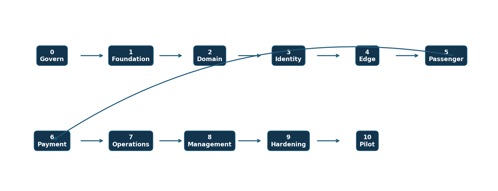
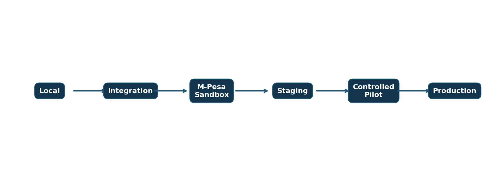

> Controlled source: [10_Implementation Plan and Build Sequence (IPBS)_HotPesa Pay Detailed Final.docx](../controlled-documents/10_Implementation%20Plan%20and%20Build%20Sequence%20(IPBS)_HotPesa%20Pay%20Detailed%20Final.docx)

> The DOCX source is authoritative. This Markdown copy preserves its controlled status and does not confer approval.

DOCUMENT 10

Implementation Plan and Build Sequence

HotPesa Pay

Detailed Final

A controlled, phase-gated plan for converting the approved requirements, architecture, data, experience, security and operational specifications into a browser-testable pilot and, after separate authorization, a production-ready Kenyan payment service.

| Control | Value |
| --- | --- |
| Project | HotPesa Pay |
| Document | Implementation Plan and Build Sequence |
| Version | 1.0 |
| Status | Detailed final draft for review and approval |
| Lifecycle position | Final pre-code baseline and controlled implementation guide |
| Classification | Confidential - project planning |
| Prepared | 19 September 2026 |

Governing constraint: No live M-Pesa traffic, production credentials, real passenger data or release activity is authorized by this document alone.

 

# Document Control

| Field | Controlled value |
| --- | --- |
| Document owner | Product Owner, supported by Business Analysis and Engineering |
| Approval authority | Product Steering Committee or designated sponsor |
| Reviewers | Founder; PSV and SACCO representatives; Engineering; Security; Privacy; Finance; Operations; Legal and Compliance; Quality Assurance |
| Authoritative inputs | Approved or review-ready Documents 01 through 09, the requirements traceability report and accepted ADRs |
| Change control | Material scope, architecture, security, privacy, cost or release changes require impact assessment, baseline update and an ADR where applicable. |
| Review cycle | At every phase exit, release candidate and material change |

## Status and interpretation

This plan is the implementation control baseline for HotPesa Pay. Confirmed requirements are mandatory. Estimates and numeric targets remain planning baselines until approved by the accountable owner. “Complete” means the stated evidence exists and the exit authority has accepted it; coding activity alone does not complete a phase.

## Version history

| Version | Date | Status | Summary |
| --- | --- | --- | --- |
| 0.1 | 18 September 2026 | Baseline | Initial phase map, evidence model and readiness gate. |
| 1.0 | 19 September 2026 | Detailed final draft | Expanded work breakdown, sequencing, governance, CI/CD, data migration, testing, operations, pilot and acceptance controls. |

## Executive decision requested

Approve this document as the implementation baseline, authorize Phase 0 closure/revalidation and Phase 1 repository work, assign named owners and capacity, and require a separate go/no-go decision before M-Pesa sandbox, pilot or production progression.

## Table of contents

| Section | Title |
| --- | --- |
| 1 | Purpose Scope and Authority |
| 2 | Delivery Strategy and Principles |
| 3 | Governance Roles and Decision Rights |
| 4 | Planning Assumptions Dependencies and Constraints |
| 5 | Master Build Sequence |
| 6 | Phase 0 Governance and Validation |
| 7 | Phase 1 Repository and Quality Foundation |
| 8 | Phase 2 Domain and Data Foundation |
| 9 | Phase 3 Identity Device and Audit |
| 10 | Phase 4 Trip Edge Foundation |
| 11 | Phase 5 Passenger Fare Experience |
| 12 | Phase 6 M-Pesa Payment and Reconciliation |
| 13 | Phase 7 Conductor Operations |
| 14 | Phase 8 Owner SACCO and Finance Web |
| 15 | Phase 9 Hardening and Operational Readiness |
| 16 | Phase 10 Pilot and Release |
| 17 | Cross-cutting Workstreams |
| 18 | Environment and CI CD Strategy |
| 19 | Testing and Quality Assurance |
| 20 | Data Migration and Configuration |
| 21 | Release Deployment Rollback and Recovery |
| 22 | Requirements Allocation and Traceability |
| 23 | Schedule Resources and Capacity |
| 24 | Risk Issue Dependency and Change Control |
| 25 | Definition of Ready and Definition of Done |
| 26 | Acceptance Exit Gates and Evidence |
| 27 | Documentation and Handover |
| 28 | Open Decisions |
| 29 | Approval and Sign Off |
| 30 | Final Readiness Checklist |

 

# 1 Purpose Scope and Authority

This IPBS defines the order, dependencies, outputs, verification evidence and stop conditions for building HotPesa Pay. Its purpose is to prevent uncontrolled feature expansion, expose external dependencies early, keep payment evidence authoritative, and provide a repeatable path from the existing Mock M-Pesa demonstration to a controlled Kenyan pilot.

## 1.1 In scope

Governance, repository, environment and CI/CD foundations.

Core domain, data, identity, authorization, device and audit foundations.

Android host and local passenger portal behavior required by the approved MVP architecture.

Fare quotation, M-Pesa initiation, trusted callback/status evidence, reconciliation and receipts.

Conductor, owner, SACCO, finance and administration workflows allocated to MVP.

Security, privacy, accessibility, resilience, observability, backup, recovery, deployment, training and pilot evidence.

## 1.2 Out of scope unless change-controlled

Stored-value wallet or custody of passenger funds.

Seat reservation, loyalty, insurance, financing, advertising and cross-border payments.

Advanced AI, dynamic pricing and smart-city integrations.

Card processing and PCI DSS scope.

Production rollout before legal, provider, security, privacy and operational gates close.

## 1.3 Authority hierarchy

| Question | Authority | Implementation effect |
| --- | --- | --- |
| Why and business outcome | BRD and approved business case | Controls investment and success measures. |
| What product and MVP | PRD | Controls scope and release priorities. |
| Required behavior | FRS and USUC | Controls acceptance behavior and edge cases. |
| Technical realization | TRD and ADRs | Controls architecture, boundaries and technology. |
| Data and interfaces | DMAC | Controls schemas, states, APIs and compatibility. |
| Experience and flows | AFIA and UIUX | Controls navigation, content, accessibility and states. |
| Cross-cutting controls | SPNFR | Controls security, privacy, service quality and release gates. |
| Order and evidence | This IPBS | Controls work sequence, ownership and exits. |

# 2 Delivery Strategy and Principles

Use an incremental, pilot-first strategy. Every phase starts from approved requirements, implements the smallest coherent capability, verifies it at the appropriate layer, records evidence, updates controlled documents and stops at an explicit gate.

| Principle | Required behavior |
| --- | --- |
| Evidence before expansion | No downstream phase starts on assertion alone; required tests, documents and approvals must exist. |
| Payment truth is server-side | An initiated STK push, client message, hotspot state or HTTP response never proves payment. |
| Security and privacy by design | Threat, authorization, minimization, redaction and recovery controls are built in each phase. |
| Offline and failure are normal states | Loss of connectivity, restart, duplicate callbacks and delayed evidence are designed and tested. |
| Thin vertical slices | Deliver usable end-to-end capabilities before broadening modules. |
| Contract first | API, event and data contracts precede dependent clients and integrations. |
| No speculative roadmap code | Deferred features remain outside MVP until change control approves them. |
| Reversible delivery | Use migrations, flags, rollback and operational runbooks for material change. |

## 2.1 Existing Phase 0 evidence

The repository currently contains a browser-testable vertical slice using synthetic data and an internal Mock M-Pesa adapter. Its lint, typecheck, unit/integration, build and Playwright evidence may support foundation acceptance after it is committed, reviewed, run in CI and revalidated with PostgreSQL/Redis durability. It is not evidence of Daraja readiness, production authentication, legal compliance or release approval.

# 3 Governance Roles and Decision Rights

| Role | Accountability | Phase-gate authority |
| --- | --- | --- |
| Sponsor / Steering Committee | Funding, priority, risk appetite and release authorization. | Approve baseline, pilot and production go/no-go. |
| Product Owner | Scope, backlog, acceptance and stakeholder alignment. | Accept product outcomes and deferrals. |
| Delivery Lead | Plan, dependencies, capacity, cadence and evidence. | Recommend entry/exit; escalate blockers. |
| Architecture Lead | Architecture integrity, ADRs and technical debt. | Accept technical design and exceptions. |
| Security and Privacy Leads | Threats, controls, DPIA, risk and privacy obligations. | Approve security/privacy gates or record residual risk. |
| Engineering Leads | Implementation quality, reviews and operability. | Approve technical completion. |
| QA Lead | Test strategy, independence and release evidence. | Approve test completion and defect disposition. |
| Operations / Support | Monitoring, incidents, reconciliation and runbooks. | Approve operational readiness. |
| Finance / Reconciliation | Settlement evidence and financial controls. | Approve reconciliation behavior. |
| Legal / Compliance / DPO | Kenyan legal role, notices, contracts and regulatory applicability. | Close or condition compliance decisions. |
| Pilot Operator | Device, route and field validation. | Accept controlled operational trial. |

## 3.1 Decision cadence

| Forum | Cadence | Purpose | Output |
| --- | --- | --- | --- |
| Delivery stand-up | Daily during build | Blockers, coordination and evidence progress. | Updated board and owner actions. |
| Backlog refinement | Weekly | Clarify acceptance, dependencies and sizing. | Ready backlog. |
| Architecture and security review | Weekly or on material change | Review contracts, ADRs, threats and exceptions. | Decision or action record. |
| Phase gate | End of each phase | Review evidence and residual risk. | Go, conditional go, hold or stop. |
| Steering review | Monthly and pilot/release gates | Scope, budget, benefit, risk and release. | Recorded sponsor decision. |

# 4 Planning Assumptions Dependencies and Constraints

| Type | Item | Planning treatment |
| --- | --- | --- |
| Assumption | MVP is non-custodial and account-light for passengers. | Reassess if wallet, balances or passenger accounts enter scope. |
| Assumption | M-Pesa is the only MVP payment rail. | Card and PCI scope excluded. |
| Assumption | Pilot uses a bounded operator, route, fleet and approved device matrix. | Capacity, support and rollback sized for the pilot. |
| Dependency | Daraja credentials, sandbox, callback reachability and provider terms. | Mock implementation proceeds; external gate blocks sandbox/production. |
| Dependency | Named pilot operator and representative field access. | Device and usability gates cannot close without it. |
| Dependency | Kenyan legal, DPO and payment-role determination. | Production release remains blocked. |
| Dependency | Production identity and hosting selections. | Phase 9 approval blocked until recorded. |
| Constraint | No production secrets, real passenger data or live money in developer environments. | Automated scans and environment separation enforced. |
| Constraint | Target phones must host stable hotspot/local service behavior. | Early device spike and field tests required. |
| Constraint | Intermittent mobile network and power are expected. | Local durability, recovery and operational procedures required. |

## 4.1 Estimation policy

The schedule uses relative weeks and phase ranges rather than fixed completion dates. Estimates must be re-baselined after team capacity, device matrix, provider onboarding dates and pilot scope are approved. External approval or procurement waiting time is tracked separately from engineering effort.

# 5 Master Build Sequence

The build order follows technical and risk dependencies. Payment and field operations are deliberately placed after repository, contract, domain, authorization and edge foundations, while security, privacy, testing and documentation run through every phase.

Figure 1  Controlled HotPesa Pay build sequence

| Phase | Name | Primary scope | Exit gate |
| --- | --- | --- | --- |
| 0 | Governance and validation | Approve MVP, ADR baseline, target devices, legal/payment decisions and owners. | Approved baseline; unresolved decisions owned. |
| 1 | Repository and quality foundation | Monorepo, environments, CI, secrets, lint, tests, scans and controls. | Reproducible protected build and deployment path. |
| 2 | Domain and data foundation | Tenant, operator, fleet, route, stage, fare, trip and payment schema/contracts. | Migration, constraint and tenant-isolation tests pass. |
| 3 | Identity device and audit | Workforce identity, roles/policies, MFA, device enrollment and immutable audit. | Negative authorization and revocation pass. |
| 4 | Trip edge foundation | Android host, local store, assignment sync, trip session and portal reachability. | Approved devices sustain representative field session. |
| 5 | Passenger fare experience | Local portal, journey context, stage selection, quote and recovery. | Usability, accessibility and fare-rule tests pass. |
| 6 | M-Pesa payment and reconciliation | Intent, adapter, callbacks, evidence, idempotency, status, receipt and reconciliation. | Sandbox fault, timeout, duplicate and conflict tests pass. |
| 7 | Conductor operations | Live payment board, exception handling, trip closure and sync. | End-to-end trip simulation passes. |
| 8 | Owner SACCO and finance web | Configuration, fleet, fare, reports, reconciliation and support workspace. | Role-scoped UAT and report reconciliation pass. |
| 9 | Hardening and operational readiness | Performance, security, privacy, monitoring, backup, recovery and runbooks. | No unaccepted critical/high risk; drills pass. |
| 10 | Pilot and release | Training, controlled rollout, support, measurement, rollback and review. | Sponsor records go/no-go and next-scope decision. |

## 5.1 Dependency rule

A phase may overlap with the preceding phase only where its inputs are stable, the overlap cannot bypass an exit gate, and the Delivery Lead plus accountable technical authority record the decision. Live-provider, production-data and release activities may never start through schedule overlap.

 

# 6 Phase 0 Governance and Validation

Baseline authority and readiness before feature expansion

| Control area | Detailed plan |
| --- | --- |
| Objectives | Approve MVP and exclusions; resolve or assign ADRs; name owners; confirm pilot operator, device matrix and success measures. |
| Build activities | Reconcile Documents 01-10; issue master traceability baseline; register assumptions/decisions; validate existing Phase 0 repository evidence; create prioritized backlog. |
| Verification | Document consistency review; scope-to-requirement coverage; decision-owner review; repository and test-discovery check. |
| Deliverables | Approved scope statement, requirement baseline, ADR register, risk/decision/dependency logs, initial roadmap and evidence index. |
| Entry | Documents 01-09 available; sponsor and review roles identified. |
| Exit | No unowned blocking decision; MVP and deferred scope approved; Phase 1 backlog ready. |
| Stop conditions | Unknown payment role, no sponsor, missing authoritative scope or material contradiction between specifications. |

## Phase.1 Required phase evidence

Evidence must include the exact build identifier, environment, test dataset classification, automated/manual result, reviewer, date, unresolved defects, residual risk and approval decision. Screenshots alone are not sufficient where logs, test reports, signed decisions or reconciliation records are expected.

 

# 7 Phase 1 Repository and Quality Foundation

Create a reproducible and controlled engineering system

| Control area | Detailed plan |
| --- | --- |
| Objectives | Make every workspace buildable, testable, scannable and releasable through the same commands. |
| Build activities | pnpm TypeScript monorepo; apps/services/packages boundaries; environment schema; secret handling; local Compose; lint/typecheck/unit/build; test discovery; branch protection; dependency and secret scans; artifact retention. |
| Verification | Frozen install; all projects discovered; lint, typecheck, tests and builds pass; negative discovery test fails correctly; Compose validates; no secret match. |
| Deliverables | Repository conventions, CI workflow, local runbook, environment template, ownership rules and foundation traceability. |
| Entry | Phase 0 approval and architecture baseline. |
| Exit | Clean clone reproduces pipeline; protected main path established; CI evidence accessible. |
| Stop conditions | Uncommitted baseline, unresolved package ownership, exposed credentials or non-repeatable build. |

## Phase.1 Required phase evidence

Evidence must include the exact build identifier, environment, test dataset classification, automated/manual result, reviewer, date, unresolved defects, residual risk and approval decision. Screenshots alone are not sufficient where logs, test reports, signed decisions or reconciliation records are expected.

 

# 8 Phase 2 Domain and Data Foundation

Establish enforceable business truth and persistence

| Control area | Detailed plan |
| --- | --- |
| Objectives | Model tenancy, organizations, users, devices, fleet, routes, stages, fares, trips, payment attempts, provider events and audit records. |
| Build activities | Schema and migrations; invariants and unique keys; money and time conventions; tenancy filters; repositories; seed/reference data; OpenAPI/event schemas; retention metadata. |
| Verification | Forward/rollback migration; constraint, tenancy and concurrency tests; schema/API compatibility; restore of representative data. |
| Deliverables | Versioned data model, migration set, API contract, test fixtures and data dictionary. |
| Entry | Repository gate passed; DMAC/ADR baseline accepted. |
| Exit | Schema supports allocated requirements; destructive migration risks controlled; tenant isolation verified. |
| Stop conditions | Ambiguous payment state, fare authority, tenant boundary or identifier ownership. |

## Phase.1 Required phase evidence

Evidence must include the exact build identifier, environment, test dataset classification, automated/manual result, reviewer, date, unresolved defects, residual risk and approval decision. Screenshots alone are not sufficient where logs, test reports, signed decisions or reconciliation records are expected.

 

# 9 Phase 3 Identity Device and Audit

Secure workforce access and accountable actions

| Control area | Detailed plan |
| --- | --- |
| Objectives | Provide managed authentication, application-owned authorization, privileged MFA, device enrollment/revocation and tamper-evident audit. |
| Build activities | Identity adapter; workforce roles; RBAC plus resource/context policy; session lifecycle; device binding; audit taxonomy; redaction; admin access workflow. |
| Verification | Negative permission matrix; cross-tenant denial; session expiry; revoked device; privileged MFA; log redaction and audit completeness. |
| Deliverables | Identity integration, policy library, device registry, audit service, access procedures and test evidence. |
| Entry | Domain/resource identifiers stable. |
| Exit | No client-side-only authorization; privileged and cross-tenant abuse tests pass. |
| Stop conditions | Identity vendor or workforce ownership unresolved before production-like deployment. |

## Phase.1 Required phase evidence

Evidence must include the exact build identifier, environment, test dataset classification, automated/manual result, reviewer, date, unresolved defects, residual risk and approval decision. Screenshots alone are not sufficient where logs, test reports, signed decisions or reconciliation records are expected.

 

# 10 Phase 4 Trip Edge Foundation

Prove the in-vehicle technical model early

| Control area | Detailed plan |
| --- | --- |
| Objectives | Run the approved Android host/local portal architecture reliably on target devices under realistic power and network conditions. |
| Build activities | Host lifecycle; local database; encrypted configuration; trip assignment sync; trip session; hotspot/local reachability; clock/restart handling; health screen; recovery. |
| Verification | Approved device matrix; reconnect/restart; battery/thermal observation; multiple passenger connections; local persistence; stale assignment and revocation tests. |
| Deliverables | Installable test build, device test report, local protocol contract, support checklist and recovery procedure. |
| Entry | Identity/device and trip contracts available. |
| Exit | Representative trip session remains usable within approved thresholds; known limitations accepted. |
| Stop conditions | Platform restrictions make secure/reliable hosting infeasible or device support responsibility is undefined. |

## Phase.1 Required phase evidence

Evidence must include the exact build identifier, environment, test dataset classification, automated/manual result, reviewer, date, unresolved defects, residual risk and approval decision. Screenshots alone are not sufficient where logs, test reports, signed decisions or reconciliation records are expected.

 

# 11 Phase 5 Passenger Fare Experience

Deliver a trustworthy low-friction passenger journey

| Control area | Detailed plan |
| --- | --- |
| Objectives | Show route/operator/vehicle context, capture destination/stage, obtain an authoritative fare quote and recover safely from interruption. |
| Build activities | Local PWA shell; language-ready content; fare quote API; seven payment-state presentation; validation; accessibility; reconnect/session recovery; privacy notice. |
| Verification | Fare rules and boundary cases; WCAG 2.2 AA checks; 390px layout; keyboard/focus; reduced motion; slow-network and restart recovery; usability sessions. |
| Deliverables | Passenger vertical slice, component/state catalogue, accessibility evidence and usability findings. |
| Entry | Edge session and fare contracts stable. |
| Exit | Passenger can identify journey, obtain correct quote and understand every non-paid/paid state without ambiguity. |
| Stop conditions | Fare source is not authoritative or payment language could falsely signal success. |

## Phase.1 Required phase evidence

Evidence must include the exact build identifier, environment, test dataset classification, automated/manual result, reviewer, date, unresolved defects, residual risk and approval decision. Screenshots alone are not sufficient where logs, test reports, signed decisions or reconciliation records are expected.

 

# 12 Phase 6 M-Pesa Payment and Reconciliation

Implement payment orchestration with authoritative evidence

| Control area | Detailed plan |
| --- | --- |
| Objectives | Create idempotent payment intent, provider request, trusted callback/status processing, reconciliation, receipt and exception review. |
| Build activities | Mock-to-Daraja adapter boundary; credential vault integration; callback authentication/validation; payment state machine; evidence deduplication; status query; expiry; conflict review; reconciliation workspace; receipt. |
| Verification | Contract fixtures; sandbox happy/failure/timeout; delayed, missing, duplicate and conflicting callback; replay; changed idempotency request; restart durability; redaction; provider outage. |
| Deliverables | Payment service, provider adapter, callback endpoint, reconciliation jobs, receipt contract, dashboards, alerts and runbook. |
| Entry | Provider contract approved; security/privacy controls; durable database and queue; sandbox access. |
| Exit | Exactly one settlement effect per evidence identity; only trusted evidence confirms payment; finance and security accept fault results. |
| Stop conditions | Unverified callback mechanism, secrets in code/logs, ambiguous provider result mapping or inability to reconcile. |

## Phase.1 Required phase evidence

Evidence must include the exact build identifier, environment, test dataset classification, automated/manual result, reviewer, date, unresolved defects, residual risk and approval decision. Screenshots alone are not sufficient where logs, test reports, signed decisions or reconciliation records are expected.

 

# 13 Phase 7 Conductor Operations

Turn trusted payment state into safe trip operations

| Control area | Detailed plan |
| --- | --- |
| Objectives | Give authorized staff a live, recoverable view of payment outcomes and controlled exceptions. |
| Build activities | Trip board; filter/search; state changes from server evidence; manual-review workflow; offline cache; synchronization; trip close; shift summary; support escalation. |
| Verification | Concurrent updates; device restart; delayed evidence; wrong-trip attempt; revoked user/device; offline/online merge; close with pending/review-required cases. |
| Deliverables | Conductor interface, exception procedures, shift/trip records and end-to-end simulation evidence. |
| Entry | Payment state and audit contracts stable. |
| Exit | Trip can operate and close without treating untrusted client state as payment truth. |
| Stop conditions | Operators can override confirmation without controlled workflow or audit. |

## Phase.1 Required phase evidence

Evidence must include the exact build identifier, environment, test dataset classification, automated/manual result, reviewer, date, unresolved defects, residual risk and approval decision. Screenshots alone are not sufficient where logs, test reports, signed decisions or reconciliation records are expected.

 

# 14 Phase 8 Owner SACCO and Finance Web

Provide governed configuration and accountable oversight

| Control area | Detailed plan |
| --- | --- |
| Objectives | Enable role-scoped fleet, route, stage, fare, trip, reporting, reconciliation and support administration. |
| Build activities | Configuration workflows; approval/versioning for fares; fleet/route management; payment and exception reports; exports; reconciliation queues; support search; audit views. |
| Verification | Role/tenant matrix; four-eyes controls where approved; report-to-ledger reconciliation; export redaction; large-query performance; accessibility and UAT. |
| Deliverables | Management web applications, reports, operational dashboards, user guides and UAT evidence. |
| Entry | Core domain and payment operations stable. |
| Exit | Authorized users complete assigned tasks with accurate totals and no cross-tenant exposure. |
| Stop conditions | Financial totals cannot be reconciled or sensitive exports lack policy/ownership. |

## Phase.1 Required phase evidence

Evidence must include the exact build identifier, environment, test dataset classification, automated/manual result, reviewer, date, unresolved defects, residual risk and approval decision. Screenshots alone are not sufficient where logs, test reports, signed decisions or reconciliation records are expected.

 

# 15 Phase 9 Hardening and Operational Readiness

Prove the service can be operated safely

| Control area | Detailed plan |
| --- | --- |
| Objectives | Close security, privacy, performance, resilience, recovery, observability and support requirements. |
| Build activities | Threat-model refresh; SAST/SCA/secret/container scans; penetration remediation; performance/capacity test; dashboards/alerts; backup/restore; DR; incident, reconciliation, access and privacy runbooks; training material. |
| Verification | Independent penetration test; no unaccepted critical/high finding; load and callback burst; RPO/RTO exercise; incident tabletop; access review; privacy/DPIA approval; accessibility regression. |
| Deliverables | Release evidence pack, risk acceptance, runbooks, on-call/support model, restore report and operational acceptance. |
| Entry | Feature-complete release candidate and production-like staging. |
| Exit | All mandatory SPNFR gates pass or formally accepted residual risk is recorded by authority. |
| Stop conditions | Open critical/high risk, failed restore, absent alert ownership, incomplete DPIA/legal gate or unrehearsed rollback. |

## Phase.1 Required phase evidence

Evidence must include the exact build identifier, environment, test dataset classification, automated/manual result, reviewer, date, unresolved defects, residual risk and approval decision. Screenshots alone are not sufficient where logs, test reports, signed decisions or reconciliation records are expected.

 

# 16 Phase 10 Pilot and Release

Validate real operations within a deliberately bounded rollout

| Control area | Detailed plan |
| --- | --- |
| Objectives | Train users, execute controlled pilot, measure outcomes, support incidents and decide whether to scale, revise or stop. |
| Build activities | Pilot tenant/configuration; participant briefing and privacy notice; controlled transaction limits; support rota; daily reconciliation; KPI collection; rollback rehearsal; retrospective. |
| Verification | Entry checklist; smoke and synthetic monitoring; daily settlement/reconciliation; incident/complaint response; usability and adoption measures; post-pilot security/privacy review. |
| Deliverables | Pilot report, KPI evidence, incident/issue log, lessons, backlog and sponsor decision. |
| Entry | Legal/provider/production authorization; Phase 9 pass; trained users; rollback and support ready. |
| Exit | Sponsor accepts evidence and records go, conditional go, revise or stop. |
| Stop conditions | Safety/security/privacy incident, reconciliation mismatch above tolerance, provider/legal instruction, uncontrolled support load or breached stop threshold. |

## Phase.1 Required phase evidence

Evidence must include the exact build identifier, environment, test dataset classification, automated/manual result, reviewer, date, unresolved defects, residual risk and approval decision. Screenshots alone are not sufficient where logs, test reports, signed decisions or reconciliation records are expected.

 

# 17 Cross-cutting Workstreams

| Workstream | Responsibilities throughout all phases | Evidence owner |
| --- | --- | --- |
| Product and analysis | Refine acceptance, control scope, maintain traceability and measure outcomes. | Product Owner / BA |
| Architecture | Maintain boundaries, contracts, ADRs, performance and technical debt. | Architecture Lead |
| Backend and integration | Domain services, authorization, validation, payment orchestration, queues and APIs. | Backend Lead |
| Android and edge | Host lifecycle, local persistence, hotspot behavior, recovery and device health. | Mobile Lead |
| Passenger and web | Accessible user flows, state semantics, admin/reporting and responsive behavior. | Frontend Lead |
| Data | Schemas, migrations, integrity, retention, reporting and restore. | Data Lead |
| Security and privacy | Threats, controls, testing, DPIA, redaction, incidents and risk. | Security / Privacy Leads |
| QA | Strategy, environments, automation, regression, defects and release evidence. | QA Lead |
| DevOps/SRE | CI/CD, infrastructure, secrets, monitoring, backup, deployment and rollback. | Platform / SRE Lead |
| Operations and finance | Reconciliation, support, runbooks, settlement review and pilot operations. | Operations / Finance |

## 17.1 Work-package template

| Field | Required content |
| --- | --- |
| Requirement IDs | Every story/task maps to one or more approved IDs. |
| Outcome | Observable user, operational or control result. |
| Dependencies | Contracts, decisions, data, environments and external parties. |
| Acceptance | Given/when/then or measurable acceptance condition. |
| Verification | Unit, contract, integration, E2E, security, performance or manual evidence. |
| Observability | Logs, metrics, traces, audit and alert behavior. |
| Data/privacy | Classification, minimization, retention, access and test-data treatment. |
| Release/rollback | Flag, migration, compatibility, deployment and recovery action. |
| Owner/reviewer | Named accountable implementer and independent reviewer. |
| Evidence link | Immutable location for results and decision. |

# 18 Environment and CI CD Strategy

Figure 2  Controlled promotion path

| Environment | Purpose | Data and access | Promotion rule |
| --- | --- | --- | --- |
| Local | Fast development and isolated tests. | Synthetic only; local secrets; Mock M-Pesa. | Commit only after local quality gate. |
| Integration | Shared contract and service integration. | Synthetic deterministic fixtures; restricted team access. | CI build and integration gate. |
| M-Pesa sandbox | Provider contract and fault validation. | Synthetic provider-approved numbers; managed sandbox secrets. | Security/provider checklist and sandbox evidence. |
| Staging | Production-like release candidate verification. | Synthetic or approved anonymized data; production-equivalent controls. | Full release candidate gate. |
| Controlled pilot | Bounded real-world validation after authorization. | Minimum required personal/payment data; named operational access. | Daily review; stop thresholds active. |
| Production | Approved service operation. | Live data under approved governance. | Formal go/no-go, change record and rollback ready. |

## 18.1 Continuous integration gate

Validate workspace and test discovery.

Install from the frozen lockfile.

Run formatting/lint, typecheck and unit tests.

Run contract, database and integration tests with isolated services.

Build every deployable and package.

Run SAST, dependency, secret, licence and container scans.

Generate signed/versioned artifacts, SBOM and provenance where supported.

Publish test/security reports and block merge on mandatory failure.

## 18.2 Continuous delivery controls

Immutable artifacts are promoted; environments do not rebuild source independently.

Database migrations execute through an approved, observable job with compatibility checks.

Secrets come from managed stores and are never embedded in artifacts.

Production deployment requires separation of duties, change record and approved window.

Feature flags default safely and have owner, expiry and removal task.

Rollback or forward-fix decision criteria are documented before deployment.

## 18.3 Branch and change policy

Use short-lived branches, mandatory review, passing protected checks and conventional change records. Direct production changes, unreviewed migration edits and disabling mandatory security controls are prohibited. Emergency changes require incident linkage, minimum independent review, post-change validation and retrospective.

# 19 Testing and Quality Assurance

| Level | Primary scope | Minimum evidence |
| --- | --- | --- |
| Static | Formatting, lint, types, policy and IaC validation. | Zero blocking error; report retained. |
| Unit | Fare rules, state transitions, policy, matching and redaction. | Deterministic pass and coverage trend. |
| Database | Constraints, migrations, isolation, uniqueness and restart durability. | Forward/rollback and concurrency results. |
| Contract | Clients/services/provider fixtures against versioned schemas. | Compatibility report; no unapproved breaking change. |
| Integration | API, queue, database, cache, provider and storage behavior. | Isolated repeatable environment result. |
| End to end | Passenger to payment to operations to reporting. | Critical journey suite against live test services. |
| Resilience | Network loss, restart, delay, duplicates, conflict, expiry and replacement. | Recovery and invariant evidence. |
| Security/privacy | SAST/SCA, secrets, authorization, API/mobile test, penetration and privacy controls. | Findings disposition and approval. |
| Performance | API, callbacks, reports, device portal, capacity and endurance. | Target, workload, percentile and bottleneck report. |
| Accessibility/usability | WCAG, keyboard, screen reader, focus, language and field study. | Defect log and acceptance. |
| UAT/pilot | Role-based business and operational scenarios. | Signed acceptance and open-item disposition. |

## 19.1 Critical regression journeys

Trusted confirmation, provider-declared failure, missing callback followed by trusted status check, duplicate callback with one state effect, conflicting/late evidence to review-required.

Passenger reconnect/reload without false success, fare change/stale quote rejection and safe retry with same idempotency identity.

Cross-tenant denial, revoked workforce session/device, privileged MFA and redacted audit inspection.

Trip close with pending/review-required cases, report-to-payment reconciliation and database restart persistence.

## 19.2 Defect severity and release policy

| Severity | Meaning | Release treatment |
| --- | --- | --- |
| Critical | Fund loss/misattribution, confirmation without trusted evidence, severe exposure or unrecoverable outage. | Immediate stop; no release. |
| High | Material security/privacy, reconciliation, authorization, data-loss or critical-journey failure. | No release unless accountable authorities explicitly accept exceptional residual risk. |
| Medium | Degraded non-critical behavior with controlled workaround. | Owner, target release and accepted impact required. |
| Low | Minor usability/cosmetic or low-impact defect. | May defer with backlog ownership. |

# 20 Data Migration and Configuration

| Stage | Required activity | Evidence |
| --- | --- | --- |
| Design | Classify change; identify owner, compatibility, volume, privacy and rollback risk. | Reviewed migration plan. |
| Prepare | Backup/restore point; dry run; index/capacity analysis; data-quality checks. | Dry-run timings and validation queries. |
| Deploy | Expand-compatible schema first; controlled job; monitoring; no destructive change before consumers migrate. | Migration logs and health metrics. |
| Validate | Counts, constraints, totals, tenancy, payment invariants and application smoke test. | Signed validation report. |
| Contract | Remove deprecated structures only after usage evidence and retention/rollback window. | ADR/change approval and cleanup evidence. |

## 20.1 Configuration governance

Routes, stages, fares, operators, provider endpoints, feature flags, limits and retention settings are versioned configuration, not informal code constants. Material changes require authorization, effective dates, validation, audit and rollback. Production configuration must be reviewed separately from code.

# 21 Release Deployment Rollback and Recovery

## 21.1 Release sequence

Freeze candidate scope and generate the evidence index.

Confirm environment, secrets, provider, data, migration, monitoring and support readiness.

Run full staging regression, performance, security and restore checks.

Conduct go/no-go with named authorities and unresolved-risk disposition.

Deploy immutable artifacts and compatible migrations using a controlled strategy.

Run smoke tests and synthetic payment checks without asserting success from client-side initiation.

Observe heightened telemetry and reconcile early transactions.

Close the change only after the observation window; otherwise rollback or execute approved forward fix.

## 21.2 Rollback triggers

| Trigger | Immediate action | Recovery proof |
| --- | --- | --- |
| False confirmation or payment mismatch | Stop affected flow, preserve evidence, notify incident and finance owners. | Invariant restored and reconciled. |
| Cross-tenant or unauthorized access | Disable route/feature, revoke sessions/keys and activate incident plan. | Authorization and exposure review complete. |
| Migration/data corruption | Stop writers if required; restore or forward repair under runbook. | Counts, constraints and application validation pass. |
| Provider instability | Open circuit/disable initiation, preserve status/reconciliation processing. | Provider health and backlog recovery verified. |
| Performance or resource exhaustion | Scale/rollback/limit safely; protect payment evidence path. | SLO and saturation return to accepted range. |

## 21.3 Recovery order

| Priority | Capability | Reason |
| --- | --- | --- |
| 1 | Identity, authorization and evidence integrity | Prevents unsafe access and state mutation. |
| 2 | Passenger status and receipt reads | Reduces duplicate payment and support demand. |
| 3 | Payment initiation, callbacks and reconciliation | Restores core service without losing evidence. |
| 4 | Workforce operations and trip board | Restores controlled field operations. |
| 5 | Reporting, analytics and exports | Non-critical workload follows transaction recovery. |

# 22 Requirements Allocation and Traceability

| Phase | Primary requirement families | Representative evidence |
| --- | --- | --- |
| 0 | BR and PR scope; master decisions and ADRs. | Approved baseline and decision register. |
| 1 | Repository/control requirements; implementation governance. | CI, build, scan and discovery reports. |
| 2 | FR-TEN, FR-FARE, foundational DMAC contracts. | Migration, constraint, isolation and contract tests. |
| 3 | FR-AUTH, FR-AUDIT; SEC-AUTH/AUTHZ/DEV/AUD. | IAM policy, negative tests, revocation and audit evidence. |
| 4 | FR-TRIP, FR-PORTAL-001, FR-OFF, FR-SYNC. | Device, local persistence and field reliability evidence. |
| 5 | FR-PORTAL-002/003, fare and UIUX requirements. | Fare, journey, accessibility and usability tests. |
| 6 | FR-PAY, FR-RCPT, SEC-PAY, NFR reliability. | Provider, state-machine, durability and fault evidence. |
| 7 | FR-BOARD, FR-TRIP-003 and exception/sync requirements. | End-to-end trip and recovery simulation. |
| 8 | FR-REPORT, FR-SUP, configuration and management requirements. | Role UAT, report reconciliation and export controls. |
| 9 | All SPNFR and operational controls. | Security, privacy, performance, restore and incident pack. |
| 10 | All MVP acceptance criteria and pilot KPIs. | Pilot report and sponsor decision. |

## 22.1 Traceability record

| Field | Rule |
| --- | --- |
| Requirement ID | Stable identifier from authoritative specification. |
| Implementation control | Epic/story/task, code module or configuration item. |
| Verification | Test case, review, drill or inspection with result. |
| Evidence | Immutable report/log/record and build/environment identity. |
| Owner | Named accountable role/person. |
| Status | Not started, in progress, verified, accepted, deferred or rejected. |
| Release | First release/pilot containing the accepted requirement. |
| Exception | Approved waiver, residual risk, expiry and compensating control. |

The Master Requirements Traceability Matrix is the authoritative evidence index. A feature is not accepted if implementation exists but its requirement, verification and approval chain is incomplete.

# 23 Schedule Resources and Capacity

## 23.1 Indicative relative schedule

| Phase | Indicative duration | Parallel work permitted | Primary critical dependency |
| --- | --- | --- | --- |
| 0 | 1-2 weeks | Legal/provider discovery; backlog preparation. | Decision owners and authoritative documents. |
| 1 | 1-2 weeks | Environment and CI work. | Repository access and architecture baseline. |
| 2 | 2-3 weeks | Contract and fixture work. | Domain decisions. |
| 3 | 2-3 weeks | Edge spike can begin after device contract. | Identity and authorization pattern. |
| 4 | 3-5 weeks | Passenger prototype and provider onboarding. | Target devices and platform feasibility. |
| 5 | 2-4 weeks | Payment mock and operational design. | Fare and edge session stability. |
| 6 | 4-6 weeks plus provider lead time | Conductor UI against stable state contract. | Daraja sandbox and security controls. |
| 7 | 2-4 weeks | Management web foundation. | Payment/trip event stability. |
| 8 | 3-5 weeks | Hardening begins continuously. | Reporting and policy requirements. |
| 9 | 3-5 weeks | Training and pilot preparation. | Feature-complete staging candidate. |
| 10 | 2-4 weeks controlled pilot | Next-release discovery only. | External approval and operational readiness. |

These ranges are planning estimates, not commitments. Provider onboarding, procurement, legal review, device access and pilot scheduling are tracked separately and can extend elapsed time.

## 23.2 Minimum role capacity

| Capability | Minimum ownership expectation |
| --- | --- |
| Product/business analysis | Dedicated Product Owner and BA coverage for decisions and acceptance. |
| Architecture/technical leadership | Named authority across backend, mobile/edge, web, data and platform. |
| Engineering | Capacity for backend/integration, Android/edge, passenger/web and management web. |
| Quality engineering | Automation and exploratory/field testing embedded from Phase 1. |
| Security/privacy | Named reviewers from Phase 0; active testing and DPIA support before release. |
| Platform/SRE | CI/CD, environments, observability, backup, deployment and incident readiness. |
| Operations/finance/support | Reconciliation, field procedures, training and pilot support. |
| Legal/compliance/DPO | Decision availability at defined gates, not only at release. |

## 23.3 Capacity rule

Do not plan every person at full utilization. Reserve capacity for defects, reviews, environment work, support, documentation and risk reduction. The Delivery Lead publishes the actual team-based forecast after staffing and external dates are known.

# 24 Risk Issue Dependency and Change Control

| Risk | Early indicator | Response | Owner |
| --- | --- | --- | --- |
| Hotspot/device limitations discovered late | Unstable portal, thermal/battery or OS restrictions. | Phase 4 spike on approved device matrix; stop and revisit architecture if thresholds fail. | Mobile/Architecture |
| Daraja onboarding delay | Credentials, callback or approval date slips. | Maintain contract-complete mock; track external milestone; do not fake sandbox evidence. | Product/Integration |
| False payment confirmation | Client state or initiation treated as paid. | Central state machine; trusted evidence only; regression and reconciliation. | Backend/Security |
| Reconciliation gaps | Unmatched, duplicate or conflicting records. | Evidence identity, status repair, review queue and daily pilot checks. | Finance/Backend |
| Scope expansion | Roadmap features enter active sprint. | Allocation matrix, deferred register and change authority. | Product |
| Weak field usability | Passenger/staff failure in representative context. | Early field studies and accessibility/usability gates. | UX/Operations |
| Cross-tenant exposure | Authorization defects or report leakage. | Server-side resource policy and negative tests. | Security/Engineering |
| Security deferred | Findings accumulate near release. | Per-phase controls/scans and explicit risk trend. | Security |
| Single-device dependency | Loss, power failure or revocation stops trip. | Backup/replacement and recovery procedure. | Operations |
| Insufficient support | Unowned alerts/incidents during pilot. | Named rota, escalation, runbooks and stop thresholds. | Operations |

## 24.1 Change process

Submit change with reason, affected requirement and urgency.

Assess value, scope, architecture, data, security, privacy, legal, cost, schedule, test and operational impact.

Decide through delegated authority; use ADR for architectural decisions.

Update authoritative specifications, traceability, backlog, tests, risks and release plan.

Communicate the approved baseline and prevent work on rejected/unapproved scope.

## 24.2 Escalation thresholds

Any risk to payment correctness, tenant isolation, personal data, legal authority or recovery is escalated immediately.

A blocked critical-path dependency exceeding the agreed tolerance is escalated to Steering.

Repeated phase-gate failure triggers re-planning rather than silent schedule compression.

# 25 Definition of Ready and Definition of Done

| Definition of Ready | Definition of Done |
| --- | --- |
| Requirement and user/operational outcome are clear. | Requirement IDs map to accepted implementation and evidence. |
| Acceptance and failure conditions are testable. | Code/configuration reviewed; mandatory pipeline passes. |
| Dependencies, decisions and data classification are known. | Unit, contract, integration and relevant E2E/security tests pass. |
| API/data/UI contract impact is assessed. | API/data/UI documents updated with no unapproved break. |
| Security, privacy and authorization impact is identified. | Authorization, audit, redaction and observability verified. |
| Design/accessibility content is available where required. | Accessibility and state coverage verified where applicable. |
| Environment/test data are available. | Deployment, migration and rollback considerations recorded/tested. |
| Owner, reviewer and evidence location are assigned. | Known limitations/risks documented; no prohibited open defect. |

## 25.1 Not done conditions

Work is not done when it passes only on a developer workstation; relies on undocumented manual steps; lacks negative/failure tests; exposes sensitive data; has an unreviewed migration; bypasses authorization; changes a contract without versioning; or cannot be traced to a requirement and release decision.

# 26 Acceptance Exit Gates and Evidence

| Gate | Mandatory decision questions | Decision |
| --- | --- | --- |
| Specification baseline | Are scope, requirements, architecture, data, UX and controls consistent and approved? | Go / Conditional / Hold / Stop |
| Foundation | Can a clean environment reproduce build, tests, scans and artifact creation? | Go / Conditional / Hold / Stop |
| Domain and access | Are invariants, tenancy, identity, authorization, device and audit controls proven? | Go / Conditional / Hold / Stop |
| Field architecture | Does the target device/hotspot design work safely under representative conditions? | Go / Rework / Stop |
| Payment | Can trusted evidence, duplicates, failures, timeouts, conflicts and restart durability be proven? | Go / Rework / Stop |
| Feature complete | Do all MVP journeys and management controls meet acceptance? | Go / Rework / Defer |
| Operational readiness | Do security/privacy/performance/recovery/incident/support gates pass? | Pilot / Hold / Stop |
| Pilot exit | Do KPI, reconciliation, incident, usability and support results justify progression? | Scale / Revise / Stop |
| Production release | Are all external approvals, risks and operational controls accepted? | Release / Hold / Stop |

## 26.1 Evidence index requirements

Build and source identity; environment and configuration version.

Requirement and test identifiers; execution time; result and reviewer.

Defect and exception disposition; residual-risk owner and expiry.

Migration, deployment, rollback, restore and reconciliation records where applicable.

Named approval decision with conditions and follow-up actions.

# 27 Documentation and Handover

| Artifact | Update trigger | Acceptance owner |
| --- | --- | --- |
| BRD/PRD/FRS/USUC | Approved scope or behavior change. | Product Owner / BA |
| TRD and ADR log | Material architecture or technology decision. | Architecture Lead |
| DMAC/OpenAPI/event schemas | Data/interface change. | Data/API Owners |
| AFIA/UIUX | Flow, content, accessibility or state change. | Product/UX |
| SPNFR/threat model/DPIA | Control, risk, data or vendor change. | Security/Privacy |
| IPBS/roadmap/backlog | Sequence, capacity, dependency or gate change. | Delivery Lead |
| Runbooks | Operational, provider, incident, restore or deployment change. | Operations/SRE |
| User/admin guidance | Accepted workflow or support change. | Product/Support |
| Release notes/evidence index | Every release candidate and pilot. | QA/Release Manager |

## 27.1 Handover package

The handover package includes architecture and dependency inventory, build/deploy instructions, environment ownership, secrets and access procedures, data dictionary, APIs/events, monitoring/alerts, backups/restores, payment reconciliation, incident response, support escalation, known limitations, approved risks, licences and training records.

# 28 Open Decisions

| ID | Decision required | Owner | Due gate | Status |
| --- | --- | --- | --- | --- |
| OD-IPBS-001 | Approve MVP scope, exclusions and requirement baseline. | Sponsor/Product | Before Phase 1 | Open |
| OD-IPBS-002 | Confirm pilot operator, route/fleet and device matrix. | Product/Operations | Before Phase 4 | Open |
| OD-IPBS-003 | Confirm workforce identity provider and account lifecycle owner. | Security/Engineering | Before Phase 3 production integration | Open |
| OD-IPBS-004 | Approve HotPesa payment role, Daraja arrangement and settlement responsibilities. | Legal/Finance/Product | Before Phase 6 sandbox exit | Open |
| OD-IPBS-005 | Approve controller/processor roles, DPIA outcome, notices and retention schedule. | DPO/Legal/Product | Before pilot | Open |
| OD-IPBS-006 | Select production hosting/region and confirm transfer/subprocessor controls. | Architecture/Privacy | Before Phase 9 | Open |
| OD-IPBS-007 | Approve quantitative SLOs, capacity model, RPO/RTO and support hours. | Sponsor/Engineering/Ops | Before pilot | Open |
| OD-IPBS-008 | Approve pilot limits, stop thresholds, KPI targets and go/no-go authority. | Sponsor/Product/Ops | Before Phase 10 | Open |
| OD-IPBS-009 | Confirm staffing, budget, procurement and external milestone dates. | Sponsor/Delivery | Before schedule baseline | Open |
| OD-IPBS-010 | Decide whether the current Phase 0 repository evidence is accepted, reworked or superseded. | Architecture/QA/Product | Before Phase 1 closure | Open |

## 28.1 Decision discipline

An open decision must have an owner, due gate, options, recommendation, impact and recorded outcome. If its due gate arrives unresolved, the affected work stops unless the authorized risk owner approves a time-bounded, reversible exception.

# 29 Approval and Sign Off

Approval adopts this IPBS as the controlled implementation baseline. It authorizes only the phases explicitly released by the decision below and does not authorize live M-Pesa, production credentials, real passenger data, a public pilot or production release unless those decisions are separately recorded.

| Role | Name | Decision | Signature | Date |
| --- | --- | --- | --- | --- |
| Sponsor / Steering Chair |  | Approve / Conditional / Reject |  |  |
| Product Owner |  | Approve / Conditional / Reject |  |  |
| Delivery Lead |  | Approve / Conditional / Reject |  |  |
| Architecture Authority |  | Approve / Conditional / Reject |  |  |
| Security Authority |  | Approve / Conditional / Reject |  |  |
| Privacy / DPO Authority |  | Approve / Conditional / Reject |  |  |
| Legal / Compliance Authority |  | Approve / Conditional / Reject |  |  |
| Finance / Operations Authority |  | Approve / Conditional / Reject |  |  |
| Quality Assurance Authority |  | Approve / Conditional / Reject |  |  |
| Pilot Operator Representative |  | Approve / Conditional / Reject |  |  |

## 29.1 Approval conditions

| Condition | Status |
| --- | --- |
| Documents 01-10 and master traceability baseline reconciled. | Pending |
| MVP scope, exclusions and accepted ADRs approved. | Pending |
| Named team, capacity and external dependencies confirmed. | Pending |
| Phase 0 repository evidence committed, pushed and validated in CI. | Pending |
| PostgreSQL/Redis durability and restart idempotency verified. | Pending |
| Pilot operator/device matrix and provider onboarding plan confirmed. | Pending |
| Legal, privacy, security and release authorities identified. | Pending |

# 30 Final Readiness Checklist

| Readiness item | Status |
| --- | --- |
| Purpose, authority, hierarchy and delivery principles defined. | Complete |
| Governance roles, decision cadence and escalation defined. | Complete |
| Assumptions, dependencies, constraints and estimation policy defined. | Complete |
| Phases 0-10 include objectives, activities, verification, deliverables, entry, exit and stop conditions. | Complete |
| Cross-cutting workstreams and work-package template defined. | Complete |
| Environment, CI/CD, branch and promotion controls defined. | Complete |
| Test levels, critical regression, severity and release policy defined. | Complete |
| Migration, configuration, deployment, rollback and recovery controls defined. | Complete |
| Requirements allocation and traceability record defined. | Complete |
| Indicative schedule, capacity model and risk/change process defined. | Complete |
| Definitions of Ready/Done, gates, evidence and handover defined. | Complete |
| Named owners, staffing, pilot, external dates and quantitative targets approved. | Pending |
| Phase 0 repository/CI/database durability evidence formally accepted. | Pending |
| Live provider, pilot and production authorizations granted. | Not authorized |

## 30.1 Completion statement

This document is a detailed final draft suitable for professional implementation planning and approval. It provides a controlled sequence from requirement baseline through pilot evidence, embeds security and privacy throughout delivery, and prevents live payment or production progression without explicit gates. After the open decisions and approval conditions are closed, it becomes the operational build contract and the planning source for the master backlog, release calendar and requirements traceability matrix.
