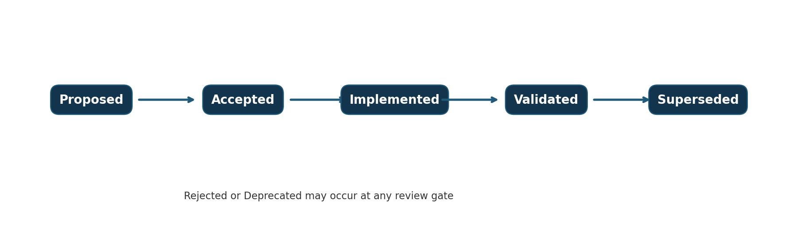

> Controlled source: [11_Architecture Decision Record and Decision Log (ADR)_HotPesa Pay Detailed Final.docx](../controlled-documents/11_Architecture%20Decision%20Record%20and%20Decision%20Log%20(ADR)_HotPesa%20Pay%20Detailed%20Final.docx)

> The DOCX source is authoritative. This Markdown copy preserves its controlled status and does not confer approval.

DOCUMENT 11

Architecture Decision Record and Decision Log

HotPesa Pay

Detailed Final

A controlled record of material HotPesa Pay architecture decisions, their context, alternatives, rationale, consequences, validation and approval gates.

| Control | Value |
| --- | --- |
| Project | HotPesa Pay |
| Document | Architecture Decision Record and Decision Log |
| Version | 1.0 |
| Status | Detailed final draft for architecture review and approval |
| Owner | Product Owner and Architecture Lead |
| Classification | Confidential - architecture and project planning |
| Prepared | 19 September 2026 |

Interpretation: “Accepted” indicates an evidenced implementation baseline, not a live-production authorization. “Recommended” and “Decision required” remain open until the named authority records approval.

 

# Document Control

| Field | Controlled value |
| --- | --- |
| Document owner | Product Owner, supported by Architecture and Engineering |
| Reviewers | Founder; PSV/SACCO representatives; Engineering; Security; Privacy; Finance; Operations; Legal/Compliance; Quality Assurance |
| Approval authority | Architecture Review Board and Product Steering Committee or delegated authorities |
| Authoritative inputs | Documents 01-10, master requirements traceability baseline, repository evidence and implementation discoveries |
| Change control | Material stack, trust-boundary, data, integration, deployment, security/privacy or operational changes require impact analysis and an ADR. |
| Review cycle | At proposal, implementation, validation, material incident/change and planned architecture review |

## Status and interpretation

This record prevents proposals from becoming de facto decisions through implementation alone. Decisions already evidenced by the Phase 0 repository are identified as implementation baselines but remain subject to governance, durability, security, privacy, provider and production gates. Legal, regulatory, provider-commercial and production approvals are not created by an ADR.

## Executive decision requested

Approve the ADR governance model, confirm the accepted Phase 0 baseline decisions, assign owners and due gates to every open decision, and authorize implementation only within the boundaries and validation conditions recorded here.

## Version history

| Version | Date | Status | Summary |
| --- | --- | --- | --- |
| 0.1 | 18 September 2026 | Baseline | Twelve proposed decisions and governance template. |
| 1.0 | 19 September 2026 | Detailed final draft | Expanded register, implementation-evidenced statuses, eighteen full ADRs, impacts, validation, open decisions and approval gates. |

## Table of contents

| Section | Title |
| --- | --- |
| 1 | Purpose Scope and Authority |
| 2 | ADR Governance and Lifecycle |
| 3 | Naming Numbering and Status Rules |
| 4 | Decision Rights and Review Process |
| 5 | Master Decision Register |
| 6 | Decision Dependency Map |
| 7-24 | Full ADR Records ADR 001 through ADR 018 |
| 25 | Cross Decision Consequence Summary |
| 26 | Priority Decision Workshops |
| 27 | Change Impact and Supersession Control |
| 28 | Open Decision and Validation Register |
| 29 | Review History and Evidence |
| 30 | Approval and Sign Off |
| 31 | Final ADR Readiness Checklist |

# 1 Purpose Scope and Authority

This document records the architecture choices that shape HotPesa Pay and the reasons those choices were made. It is both a decision log and a set of full ADRs. It governs technical realization but does not replace business, product, legal, privacy, security, financial or operational approval.

## 1.1 In scope

System topology and trust boundaries.

Vehicle-edge, passenger, cloud and provider responsibilities.

Backend, database, queue, repository, frontend, identity and deployment patterns.

Payment truth, idempotency, fare integrity, tenancy, privacy minimization and test-provider boundaries.

Decision ownership, validation, consequences, supersession and affected artifacts.

## 1.2 Authority hierarchy

| Decision type | Primary authority | ADR role |
| --- | --- | --- |
| Business outcome and funding | BRD/business case and sponsor | ADR records technical consequences only. |
| Product scope and priority | PRD and Product Owner | ADR cannot add roadmap scope. |
| Functional behavior | FRS/USUC | ADR chooses realization without weakening acceptance. |
| Architecture and technology | TRD and Architecture Review Board | ADR is the authoritative decision history. |
| Data and interfaces | DMAC and data/API owners | ADR controls material model/contract choices. |
| Security/privacy/NFR | SPNFR and risk authorities | ADR may strengthen; exceptions need explicit risk approval. |
| Implementation order | IPBS and Delivery Lead | ADR creates tasks, dependencies and gates. |

 

# 2 ADR Governance and Lifecycle

Create an ADR before committing to a material, difficult-to-reverse or cross-cutting choice. Small local implementation details remain in code review or design notes unless they change a contract, trust boundary, operational responsibility, risk posture or approved requirement.

Figure 1  ADR lifecycle and review states

| Status | Meaning | Permitted action |
| --- | --- | --- |
| Proposed | Option documented but not approved. | Spike, analysis and review only; no irreversible commitment. |
| Recommended for approval | Preferred option with sufficient rationale; authority decision pending. | Reversible preparatory work within recorded limits. |
| Decision required | Material choice cannot be safely inferred. | Stop affected gate until decision or approved exception. |
| Accepted | Authorized architecture baseline. | Implement within boundaries and conditions. |
| Implemented | Accepted decision exists in a traceable build. | Validate in stated environments. |
| Validated | Required tests/reviews demonstrate intended outcome. | Use as release evidence subject to other gates. |
| Rejected | Reviewed option not selected. | Retain record and rationale; do not implement. |
| Deprecated | Still present but discouraged and planned for removal. | Track migration and removal. |
| Superseded | Replaced by a later ADR. | Keep record and link successor. |

## 2.1 Mandatory ADR triggers

New or changed trust boundary, provider integration or payment authority.

New datastore, queue, runtime, framework, hosting model or deployment unit.

Breaking API/event/data change or material migration strategy.

New personal-data category, processor, region or retention model.

Change to tenancy, identity, authorization, encryption, recovery or availability architecture.

Material exception to approved TRD, DMAC, SPNFR or IPBS.

# 3 Naming Numbering and Status Rules

| Rule | Standard |
| --- | --- |
| Identifier | ADR-NNN, zero-padded and never reused. |
| Title | Specific decision statement beginning with an action verb where practical. |
| Filename | ADR-NNN-short-kebab-title.md for repository records; this master document remains the register. |
| Date | ISO 8601 decision and review dates. |
| Owner | One accountable owner plus named approvers/reviewers. |
| Status | Use only controlled lifecycle states defined in Section 2. |
| Scope | State phase/environment and exclusions. |
| Supersession | Old ADR remains immutable except status/link/review metadata. |
| Evidence | Link requirement, build, test, benchmark, spike, review and approval records. |
| Review date | Set when assumption, vendor, scale, regulation or operating context may change. |

## 3.1 Record quality rule

An ADR must state one decision clearly enough that an implementer can comply and a reviewer can detect violation. It must explain credible alternatives and consequences, not merely restate the selected technology.

# 4 Decision Rights and Review Process

| Role | Decision responsibility |
| --- | --- |
| Product Owner | Confirms scope, outcomes, passenger/operator impact and deferrals. |
| Architecture Lead / Review Board | Owns ADR quality, compatibility, boundaries and technical approval. |
| Security and Privacy Authorities | Approve threat, data, identity, provider, hosting and residual-risk impacts. |
| Data/API Owners | Approve model, migration, contract, idempotency and compatibility effects. |
| Engineering Leads | Confirm implementability, cost, operability and migration plan. |
| QA Lead | Confirms measurable validation and evidence independence. |
| Operations/Finance | Approve support, reconciliation, monitoring, recovery and settlement consequences. |
| Legal/Compliance/DPO | Decide legal applicability, controller/processor, provider role and transfer/retention matters. |
| Sponsor/Steering | Decides material cost, schedule, risk appetite and release consequences. |

## 4.1 Decision process

Identify the trigger and open the ADR before irreversible implementation.

Describe context, constraints, alternatives and affected requirements.

Perform spike, benchmark, threat/privacy analysis or provider/legal review proportionate to risk.

Record recommendation, consequences, migration and validation plan.

Obtain approvals from accountable authorities.

Update the register, specifications, traceability, backlog, tests and runbooks.

Implement and validate; change status without rewriting historical rationale.

Review on trigger date, incident, scale change or superseding proposal.

# 5 Master Decision Register

| ID | Decision | Status | Scope | Owner | Gate |
| --- | --- | --- | --- | --- | --- |
| ADR-001 | Use a hybrid vehicle edge and cloud architecture | Recommended for approval | Target MVP architecture | Architecture Lead | Approve before Phase 4 |
| ADR-002 | Use an Android first conductor host | Decision required | Target edge platform | Mobile and Architecture Leads | Decide before Phase 4 |
| ADR-003 | Provide a no install passenger web experience | Recommended for approval | Passenger interaction | Product and Frontend Leads | Approve before Phase 5 |
| ADR-004 | Keep M Pesa credentials and callbacks in cloud services | Accepted architecture baseline | Payment trust boundary | Security and Integration Leads | Accepted pattern; provider details before Phase 6 exit |
| ADR-005 | Treat trusted provider evidence as the sole payment truth | Accepted and implemented in Phase 0 | Payment state authority | Finance, Security and Backend Leads | Accepted; revalidate with PostgreSQL and Daraja sandbox |
| ADR-006 | Use a modular monolith for the initial backend | Accepted implementation baseline | Backend structure | Architecture and Backend Leads | Accepted for MVP |
| ADR-007 | Use PostgreSQL as the authoritative operational database | Accepted implementation baseline | Data persistence | Data and Architecture Leads | Accepted; production service/region pending |
| ADR-008 | Use encrypted local persistence and an outbox on the Android host | Recommended for approval | Edge durability | Mobile, Data and Security Leads | Approve before Phase 4 build |
| ADR-009 | Version fare schedules with controlled approval | Recommended for approval | Fare integrity | Product, Finance and Data Leads | Approve before Phase 2 exit |
| ADR-010 | Use a shared multi tenant platform with strict tenant isolation | Recommended for approval | Commercial and authorization model | Architecture, Security and Product Leads | Approve before Phase 2 exit |
| ADR-011 | Use queue backed asynchronous workers for callbacks reconciliation and reports | Recommended for approval | Asynchronous processing | Backend and Platform Leads | Approve before Phase 6 |
| ADR-012 | Minimize passenger identity in the MVP | Recommended for approval | Privacy and onboarding | Product and Privacy Leads | Approve before Phase 5 |
| ADR-013 | Use a pnpm TypeScript monorepo with bounded applications and packages | Accepted and implemented in Phase 0 | Repository architecture | Architecture and Platform Leads | Accepted for current phase |
| ADR-014 | Use React TypeScript and Vite for web and PWA surfaces | Accepted implementation baseline | Frontend technology | Frontend and Architecture Leads | Accepted for MVP |
| ADR-015 | Version HTTP and event contracts and require idempotency keys | Accepted implementation baseline | Integration contracts | API and Data Leads | Accepted for MVP |
| ADR-016 | Use an internal Mock M Pesa adapter for Phase 0 only | Accepted with strict scope | Development and test provider | Integration and QA Leads | Accepted for Phase 0; prohibited in production |
| ADR-017 | Use managed workforce authentication with application owned authorization | Decision required | Identity architecture | Security, Architecture and Operations | Choose before production-like Phase 3 |
| ADR-018 | Deploy containerized services to a managed cloud platform | Decision required | Production hosting and deployment | Architecture, Platform, Security and Privacy | Decide before Phase 9 |

## 5.1 Register interpretation

Accepted implementation-baseline entries reflect the current Phase 0 design and evidence. They become fully validated only when their stated tests and environment gates pass. Recommended and decision-required entries cannot be treated as approved through code, schedule pressure or vendor availability.

# 6 Decision Dependency Map

| Upstream decision | Dependent decisions or capabilities | Dependency rule |
| --- | --- | --- |
| ADR-005 Payment truth | ADR-004, ADR-011, ADR-015, ADR-016; passenger/conductor state semantics. | No dependent component may invent a confirmation source. |
| ADR-001 Hybrid architecture | ADR-002, ADR-003, ADR-008; edge sync and field operations. | Approve/prove edge boundary before payment-dependent field build. |
| ADR-007 PostgreSQL | ADR-009, ADR-010, ADR-011, ADR-015; durability and reporting. | Schema/invariants precede dependent clients/workers. |
| ADR-010 Multi-tenancy | ADR-017 identity; all repositories, reports and exports. | Tenant policy must exist before multi-operator data. |
| ADR-013 Monorepo | ADR-006, ADR-014, ADR-015, CI/CD. | Boundary/tooling controls apply to all packages. |
| ADR-017 Identity | Conductor, admin, finance and support production access. | Vendor choice can wait; authorization model cannot. |
| ADR-018 Hosting | Production IAM, network, data region, backup, recovery and observability. | No production gate until vendor/region and controls are approved. |

 

# 7 ADR-001 Use a hybrid vehicle edge and cloud architecture

| Field | Controlled value |
| --- | --- |
| Status | Recommended for approval |
| Scope | Target MVP architecture |
| Accountable owner | Architecture Lead |
| Required gate | Approve before Phase 4 |
| Decision date | To be recorded on approval |
| Review trigger | Material requirement, provider, platform, risk, scale, incident or regulatory change |

## Context

HotPesa must support passengers connected to a vehicle-hosted experience while protecting payment secrets, preserving authoritative evidence and operating through intermittent mobile connectivity.

## Decision

Use a vehicle-edge host for trip context, local passenger access and resilient field behavior. Keep payment credentials, callbacks, authoritative payment state, cross-tenant controls, central reporting and reconciliation in cloud services. Synchronize through versioned, idempotent contracts.

## Alternatives considered

Edge-only architecture; cloud-only passenger flow; dedicated networking appliance with no application edge.

## Rationale

The hybrid pattern best balances in-vehicle reachability and resilience with secure provider integration, central control and auditable payment truth.

 

## Consequences

| Positive consequences | Negative consequences and trade offs |
| --- | --- |
| Local trip experience can continue during weak coverage; cloud retains sensitive trust functions; supports incremental pilot. |
| Adds synchronization, conflict, deployment and device-support complexity; requires explicit stale-state behavior. |

## Security privacy and operational impact

| Area | Impact and control |
| --- | --- |
| Security and privacy | Treat vehicle, local passenger, public internet and cloud as separate trust zones; no provider secret at the edge; signed/encrypted communication and revocable device identity. |
| Operations | Requires device health, update, replacement, clock, storage, support and reconciliation procedures. |
| Implementation and migration | Prove contract boundaries, local persistence and recovery before Daraja integration. |

## Affected artifacts and validation

| Affected artifacts | Required validation |
| --- | --- |
| TRD, DMAC, AFIA, UIUX, SPNFR, IPBS; edge app, API, worker, audit and monitoring. |
| Target-device spike, connectivity tests, security review, restart/offline tests and pilot measurement. |

Scope control: this ADR applies only within the stated scope; material weakening or expansion requires a new ADR, impact review and traceability update.

 

# 8 ADR-002 Use an Android first conductor host

| Field | Controlled value |
| --- | --- |
| Status | Decision required |
| Scope | Target edge platform |
| Accountable owner | Mobile and Architecture Leads |
| Required gate | Decide before Phase 4 |
| Decision date | To be recorded on approval |
| Review trigger | Material requirement, provider, platform, risk, scale, incident or regulatory change |

## Context

The host must expose the approved local experience, maintain trip state and operate on affordable devices common in the Kenyan PSV context. Platform restrictions and manufacturer variation can affect hotspot and background behavior.

## Decision

Adopt Android as the first supported conductor host, subject to a published device and OS matrix. Do not promise equivalent iOS hosting. Use controlled enrollment, health checks, revocation and application updates.

## Alternatives considered

Cross-platform host; passenger-facing native app; dedicated router/embedded appliance; cloud-only flow.

## Rationale

Android provides the most practical access to local networking, storage and device management for the proposed pilot, but this must be proven on actual devices.

## Consequences

| Positive consequences | Negative consequences and trade offs |
| --- | --- |
| Focused engineering and support scope; better access to required host capabilities. |
| Vendor/OS fragmentation, thermal/battery limits and background restrictions may invalidate assumptions. |

## Security privacy and operational impact

| Area | Impact and control |
| --- | --- |
| Security and privacy | Managed secrets, device-bound identity, encrypted local data, least privilege, secure update and remote revocation. |
| Operations | Device procurement, charging, replacement, enrollment, inventory and OS-support policy are required. |
| Implementation and migration | Run a platform spike before building payment-dependent field workflows. |

## Affected artifacts and validation

| Affected artifacts | Required validation |
| --- | --- |
| TRD, UIUX, SPNFR, IPBS; Android host and device registry. |
| Approved device matrix tests and representative trip endurance test. |

Scope control: this ADR applies only within the stated scope; material weakening or expansion requires a new ADR, impact review and traceability update.

 

# 9 ADR-003 Provide a no install passenger web experience

| Field | Controlled value |
| --- | --- |
| Status | Recommended for approval |
| Scope | Passenger interaction |
| Accountable owner | Product and Frontend Leads |
| Required gate | Approve before Phase 5 |
| Decision date | To be recorded on approval |
| Review trigger | Material requirement, provider, platform, risk, scale, incident or regulatory change |

## Context

Passengers should pay without creating an account or installing an application. The experience may be opened through QR, local address or assisted discovery while connected to the vehicle network.

## Decision

Use a responsive PWA/web portal with minimal data entry and explicit seven-state payment language. Passenger identity remains account-light for MVP. Captive-portal behavior is convenience only and cannot be the sole entry method.

## Alternatives considered

Mandatory native passenger app; USSD-only flow; conductor-entered passenger payment; public cloud-only page.

## Rationale

A web experience minimizes onboarding friction, supports broad devices and aligns with privacy minimization.

## Consequences

| Positive consequences | Negative consequences and trade offs |
| --- | --- |
| Fast access, no installation, accessible/responsive delivery and independent web release cadence. |
| Browser, captive portal, local TLS and address discovery vary; offline installability does not replace server evidence. |

## Security privacy and operational impact

| Area | Impact and control |
| --- | --- |
| Security and privacy | No secrets or confirmation authority in the browser; input validation, CSP, secure headers, minimized storage and privacy notice. |
| Operations | Requires tested QR/address fallback, language-ready content and passenger support guidance. |
| Implementation and migration | Reuse shared contracts and design tokens; do not add a passenger account system in MVP. |

## Affected artifacts and validation

| Affected artifacts | Required validation |
| --- | --- |
| PRD, FRS, USUC, AFIA, UIUX, SPNFR; passenger PWA and local host. |
| Browser/device matrix, WCAG 2.2 AA, 390px layout, field usability and reconnect tests. |

Scope control: this ADR applies only within the stated scope; material weakening or expansion requires a new ADR, impact review and traceability update.

 

# 10 ADR-004 Keep M Pesa credentials and callbacks in cloud services

| Field | Controlled value |
| --- | --- |
| Status | Accepted architecture baseline |
| Scope | Payment trust boundary |
| Accountable owner | Security and Integration Leads |
| Required gate | Accepted pattern; provider details before Phase 6 exit |
| Decision date | To be recorded on approval |
| Review trigger | Material requirement, provider, platform, risk, scale, incident or regulatory change |

## Context

Provider credentials, callback authentication and reconciliation are high-value controls. Vehicle devices may be lost, compromised or intermittently connected and cannot safely expose public callback endpoints.

## Decision

Store provider credentials only in managed cloud secret storage. Initiate provider requests through a dedicated server-side adapter. Receive, authenticate, validate, persist and deduplicate callbacks/status evidence in cloud services.

## Alternatives considered

Credentials and callback logic on the conductor device; client-to-provider integration; manual SMS confirmation.

## Rationale

Cloud custody reduces secret exposure, provides reachable endpoints and centralizes audit, rate limiting, idempotency and reconciliation.

## Consequences

| Positive consequences | Negative consequences and trade offs |
| --- | --- |
| Stronger security and operability; consistent provider controls; easier rotation and incident response. |
| Payment initiation needs internet; provider or cloud outage produces pending states requiring reconciliation. |

## Security privacy and operational impact

| Area | Impact and control |
| --- | --- |
| Security and privacy | Least-privilege secret access, rotation, callback authenticity, replay protection, redaction and audit. |
| Operations | Requires provider monitoring, status repair, incident runbook and credential ownership. |
| Implementation and migration | Phase 0 uses an internal Mock adapter only; Daraja implementation remains gated. |

## Affected artifacts and validation

| Affected artifacts | Required validation |
| --- | --- |
| TRD, DMAC, SPNFR, IPBS; API, provider adapter, secret store and callback endpoint. |
| Daraja sandbox contract/fault suite and independent security review. |

Scope control: this ADR applies only within the stated scope; material weakening or expansion requires a new ADR, impact review and traceability update.

 

# 11 ADR-005 Treat trusted provider evidence as the sole payment truth

| Field | Controlled value |
| --- | --- |
| Status | Accepted and implemented in Phase 0 |
| Scope | Payment state authority |
| Accountable owner | Finance, Security and Backend Leads |
| Required gate | Accepted; revalidate with PostgreSQL and Daraja sandbox |
| Decision date | To be recorded on approval |
| Review trigger | Material requirement, provider, platform, risk, scale, incident or regulatory change |

## Context

An STK prompt, client response, SMS, screenshot, hotspot session or locally initiated request does not prove that a payment settled. Duplicate, delayed, missing and conflicting evidence are expected.

## Decision

Only authenticated server-side provider callback or trusted status evidence may transition an attempt to confirmed or failed. Persist evidence before mutation, deduplicate by stable evidence identity and route late/conflicting terminal evidence to review-required.

## Alternatives considered

Accept handset SMS or screenshot; conductor manual confirmation; trust initiation response; client-supplied success.

## Rationale

This preserves financial correctness, fraud resistance, auditability and deterministic reconciliation.

## Consequences

| Positive consequences | Negative consequences and trade offs |
| --- | --- |
| Prevents false confirmation and double effect; supports restart/replay and clear audit. |
| Passengers may remain pending; operations need status checks, expiry and review workflows. |

## Security privacy and operational impact

| Area | Impact and control |
| --- | --- |
| Security and privacy | Authenticated evidence, idempotency, immutable audit, least-privilege manual review and full redaction. |
| Operations | Requires monitoring of pending age, duplicates, invalid callbacks, reconciliation and incident escalation. |
| Implementation and migration | Central transition function and contract tests are mandatory for every payment state change. |

## Affected artifacts and validation

| Affected artifacts | Required validation |
| --- | --- |
| FRS, USUC, DMAC, AFIA, UIUX, SPNFR, IPBS; payment state machine and admin review. |
| Happy, failure, delayed, duplicate, missing, conflicting, replay and restart-durability tests. |

Scope control: this ADR applies only within the stated scope; material weakening or expansion requires a new ADR, impact review and traceability update.

 

# 12 ADR-006 Use a modular monolith for the initial backend

| Field | Controlled value |
| --- | --- |
| Status | Accepted implementation baseline |
| Scope | Backend structure |
| Accountable owner | Architecture and Backend Leads |
| Required gate | Accepted for MVP |
| Decision date | To be recorded on approval |
| Review trigger | Material requirement, provider, platform, risk, scale, incident or regulatory change |

## Context

The pilot requires clear business boundaries but does not yet justify distributed-service deployment, cross-service transactions or a large platform team.

## Decision

Build one deployable TypeScript API and associated worker processes organized into enforceable modules for identity/tenancy, fleet/route/fare, trip, payment, reconciliation, audit and reporting. Communicate internally through explicit interfaces/events.

## Alternatives considered

Independent microservices from inception; serverless-only functions; unstructured single application.

## Rationale

A modular monolith reduces operational cost and delivery risk while keeping later extraction possible where evidence supports it.

## Consequences

| Positive consequences | Negative consequences and trade offs |
| --- | --- |
| Simpler deployment, transactions, testing, observability and local development. |
| Boundary erosion can create a “big ball of mud”; scaling remains mostly shared until modules are extracted. |

## Security privacy and operational impact

| Area | Impact and control |
| --- | --- |
| Security and privacy | Module-owned authorization and data access; no bypass of central controls; dependency and secret scans. |
| Operations | One core deployment increases blast radius; health, graceful shutdown, worker isolation and recovery are required. |
| Implementation and migration | Use dependency direction rules, module owners, repository interfaces and ADR-backed exceptions. |

## Affected artifacts and validation

| Affected artifacts | Required validation |
| --- | --- |
| TRD, SPNFR, IPBS; API, workers and packages. |
| Architecture tests, module dependency checks, load tests and operational review. |

Scope control: this ADR applies only within the stated scope; material weakening or expansion requires a new ADR, impact review and traceability update.

 

# 13 ADR-007 Use PostgreSQL as the authoritative operational database

| Field | Controlled value |
| --- | --- |
| Status | Accepted implementation baseline |
| Scope | Data persistence |
| Accountable owner | Data and Architecture Leads |
| Required gate | Accepted; production service/region pending |
| Decision date | To be recorded on approval |
| Review trigger | Material requirement, provider, platform, risk, scale, incident or regulatory change |

## Context

HotPesa needs transactional integrity, unique/idempotency constraints, auditable history, tenant scoping, reconciliation queries and reliable backup/restore.

## Decision

Use PostgreSQL as the system of record for operational/domain data. Enforce money, identifiers, transitions and idempotency through reviewed application logic plus database constraints. Use migrations and tested backups/restores.

## Alternatives considered

Document database; distributed ledger; edge database as global authority; provider reports as only datastore.

## Rationale

PostgreSQL offers mature ACID transactions, constraints, indexing, reporting and operational tooling with appropriate team familiarity.

## Consequences

| Positive consequences | Negative consequences and trade offs |
| --- | --- |
| Strong consistency and constraints; broad ecosystem; clear persistence and recovery model. |
| Schema evolution, query tuning and scaling require discipline; single-region design needs recovery planning. |

## Security privacy and operational impact

| Area | Impact and control |
| --- | --- |
| Security and privacy | Private network, encryption, least privilege, audit, masked test data and controlled exports. |
| Operations | Managed service preferred for production; backups, PITR, capacity and connection management required. |
| Implementation and migration | Repository boundaries and forward/backward compatible migrations are mandatory. |

## Affected artifacts and validation

| Affected artifacts | Required validation |
| --- | --- |
| DMAC, SPNFR, IPBS; API repositories, migrations, reporting and backups. |
| Migration rollback, concurrency/idempotency, tenant-isolation and restore tests. |

Scope control: this ADR applies only within the stated scope; material weakening or expansion requires a new ADR, impact review and traceability update.

 

# 14 ADR-008 Use encrypted local persistence and an outbox on the Android host

| Field | Controlled value |
| --- | --- |
| Status | Recommended for approval |
| Scope | Edge durability |
| Accountable owner | Mobile, Data and Security Leads |
| Required gate | Approve before Phase 4 build |
| Decision date | To be recorded on approval |
| Review trigger | Material requirement, provider, platform, risk, scale, incident or regulatory change |

## Context

The vehicle host must survive application restart and temporary loss of cloud connectivity without losing assigned trip state or creating uncontrolled repeated mutations.

## Decision

Use Room/SQLite or equivalent approved Android persistence for minimal trip/session/cache data and an ordered idempotent outbox. Encrypt sensitive local data, version schemas, bound retention and reconcile with server authority.

## Alternatives considered

Memory-only state; custom flat files; full cloud database replica; local store as global authority.

## Rationale

Structured local storage and an outbox provide predictable restart/offline behavior without making the vehicle authoritative for payment settlement.

## Consequences

| Positive consequences | Negative consequences and trade offs |
| --- | --- |
| Improved resilience, deterministic replay and diagnosable synchronization. |
| Local schema migration, conflict, storage growth and device compromise must be managed. |

## Security privacy and operational impact

| Area | Impact and control |
| --- | --- |
| Security and privacy | Minimal fields, encryption, key protection, logout/revocation cleanup and no M-Pesa PIN/provider credential. |
| Operations | Needs queue visibility, retry limits, poison-item handling, storage monitoring and recovery procedure. |
| Implementation and migration | Define event identities and server conflict rules in DMAC before implementation. |

## Affected artifacts and validation

| Affected artifacts | Required validation |
| --- | --- |
| TRD, DMAC, SPNFR, IPBS; Android storage and sync. |
| Restart, offline/online, duplicate replay, schema upgrade, revocation and storage-pressure tests. |

Scope control: this ADR applies only within the stated scope; material weakening or expansion requires a new ADR, impact review and traceability update.

# 15 ADR-009 Version fare schedules with controlled approval

| Field | Controlled value |
| --- | --- |
| Status | Recommended for approval |
| Scope | Fare integrity |
| Accountable owner | Product, Finance and Data Leads |
| Required gate | Approve before Phase 2 exit |
| Decision date | To be recorded on approval |
| Review trigger | Material requirement, provider, platform, risk, scale, incident or regulatory change |

## Context

Passengers need price certainty and finance/operations need proof of the applicable fare at the time of quote/payment. A mutable current-fare row cannot reconstruct history reliably.

## Decision

Store immutable/versioned fare schedules with scope, effective period, status, approver and audit. Bind every quote/payment attempt to a fare version and quoted amount. Reject stale or incompatible quotes under explicit rules.

## Alternatives considered

Overwrite current fare; conductor enters arbitrary price; calculate from an external source without snapshot.

## Rationale

Versioning supports audit, disputes, reporting and controlled change while preventing silent repricing.

 

## Consequences

| Positive consequences | Negative consequences and trade offs |
| --- | --- |
| Historical reproducibility, clear approval and deterministic reconciliation. |
| Additional authoring, effective-date and overlap validation workflows. |

## Security privacy and operational impact

| Area | Impact and control |
| --- | --- |
| Security and privacy | Authorized fare management, four-eyes approval where adopted, audit and tenant scope. |
| Operations | Requires publication/rollback procedure and monitoring for overlaps or missing coverage. |
| Implementation and migration | Add constraints for effective ranges and quote binding before passenger workflow. |

## Affected artifacts and validation

| Affected artifacts | Required validation |
| --- | --- |
| BRD, PRD, FRS, DMAC, UIUX, SPNFR, IPBS; fare admin, quote and reports. |
| Boundary/effective-time, overlap, stale-quote, approval and reconciliation tests. |

Scope control: this ADR applies only within the stated scope; material weakening or expansion requires a new ADR, impact review and traceability update.

 

# 16 ADR-010 Use a shared multi tenant platform with strict tenant isolation

| Field | Controlled value |
| --- | --- |
| Status | Recommended for approval |
| Scope | Commercial and authorization model |
| Accountable owner | Architecture, Security and Product Leads |
| Required gate | Approve before Phase 2 exit |
| Decision date | To be recorded on approval |
| Review trigger | Material requirement, provider, platform, risk, scale, incident or regulatory change |

## Context

HotPesa targets multiple PSV owners, SACCOs or bus companies. Separate deployments improve isolation but multiply operating cost and upgrade effort.

## Decision

Use a shared platform with explicit tenant identifiers, server-side resource policies, tenant-scoped queries, quotas and audit. Keep an architectural option for dedicated deployments if commercial/regulatory needs justify them.

## Alternatives considered

Deployment per tenant; globally shared records without tenant policy; tenant-selected database schema.

## Rationale

A shared platform supports centralized operations and commercial scale if isolation is treated as a first-class invariant.

## Consequences

| Positive consequences | Negative consequences and trade offs |
| --- | --- |
| Efficient upgrades and infrastructure use; cross-tenant analytics can be governed centrally. |
| Authorization defects create severe exposure; noisy-neighbor and data-residency expectations must be managed. |

## Security privacy and operational impact

| Area | Impact and control |
| --- | --- |
| Security and privacy | Deny by default, resource/context policy, negative cross-tenant tests, export controls and monitored privileged access. |
| Operations | Tenant onboarding/offboarding, quotas, support access and data export/deletion procedures required. |
| Implementation and migration | Tenant ID is mandatory in relevant entities/contracts; repository methods cannot omit scope. |

## Affected artifacts and validation

| Affected artifacts | Required validation |
| --- | --- |
| BRD, PRD, FRS, DMAC, SPNFR, IPBS; all APIs, reports and operations. |
| Cross-tenant negative suite, load isolation, audit and privacy review. |

Scope control: this ADR applies only within the stated scope; material weakening or expansion requires a new ADR, impact review and traceability update.

 

# 17 ADR-011 Use queue backed asynchronous workers for callbacks reconciliation and reports

| Field | Controlled value |
| --- | --- |
| Status | Recommended for approval |
| Scope | Asynchronous processing |
| Accountable owner | Backend and Platform Leads |
| Required gate | Approve before Phase 6 |
| Decision date | To be recorded on approval |
| Review trigger | Material requirement, provider, platform, risk, scale, incident or regulatory change |

## Context

Provider callbacks can burst or be retried; status checks and reports may be slow. Synchronous request handling alone can amplify failure and timeouts.

## Decision

Persist inbound evidence before acknowledgment, then process idempotently through durable queue-backed workers. Use bounded retries, dead-letter/review handling, backpressure and observable lag. Keep simple critical state changes transactional where appropriate.

## Alternatives considered

All synchronous processing; database polling only; unmanaged in-memory queue; immediate microservices split.

## Rationale

Durable asynchronous work absorbs bursts and provider lag while keeping web/API latency bounded.

## Consequences

| Positive consequences | Negative consequences and trade offs |
| --- | --- |
| Resilience, controlled retry, workload isolation and operational visibility. |
| Eventual consistency and duplicate delivery require careful idempotency; introduces Redis/queue operations. |

## Security privacy and operational impact

| Area | Impact and control |
| --- | --- |
| Security and privacy | Authenticated producers, minimal payloads, encrypted transport, no secrets/raw sensitive provider payloads in queue. |
| Operations | Queue health, lag, retry, poison events, worker restart and capacity must be monitored. |
| Implementation and migration | Adopt Redis-backed queue only after persistence semantics and operational ownership are verified. |

## Affected artifacts and validation

| Affected artifacts | Required validation |
| --- | --- |
| TRD, DMAC, SPNFR, IPBS; callbacks, reconciliation, notifications and reports. |
| Redelivery, worker/API restart, backlog recovery, poison event and load tests. |

Scope control: this ADR applies only within the stated scope; material weakening or expansion requires a new ADR, impact review and traceability update.

 

# 18 ADR-012 Minimize passenger identity in the MVP

| Field | Controlled value |
| --- | --- |
| Status | Recommended for approval |
| Scope | Privacy and onboarding |
| Accountable owner | Product and Privacy Leads |
| Required gate | Approve before Phase 5 |
| Decision date | To be recorded on approval |
| Review trigger | Material requirement, provider, platform, risk, scale, incident or regulatory change |

## Context

The payment flow needs a phone number for the provider interaction but does not require a full HotPesa passenger profile, photograph or identity document for the current MVP.

## Decision

Provide an account-light passenger flow. Collect only data required for quote/payment/support, display a concise notice, mask/tokenize phone identifiers where possible and apply approved retention. Do not store an M-Pesa PIN.

## Alternatives considered

Mandatory account/profile; anonymous cash-only flow; collect identity for future loyalty/analytics.

## Rationale

Data minimization reduces onboarding friction, exclusion, breach impact and privacy obligations unrelated to MVP value.

## Consequences

| Positive consequences | Negative consequences and trade offs |
| --- | --- |
| Faster experience and smaller personal-data footprint. |
| Reduced personalization, self-service history and loyalty capability; rights workflows still required. |

## Security privacy and operational impact

| Area | Impact and control |
| --- | --- |
| Security and privacy | Purpose limitation, minimization, masking, access, retention, rights and processor controls. |
| Operations | Support and reconciliation must work with limited identity and protected lookup mechanisms. |
| Implementation and migration | Avoid future-use fields until a change updates PRD, privacy analysis and consent/lawful-basis decision. |

## Affected artifacts and validation

| Affected artifacts | Required validation |
| --- | --- |
| BRD, PRD, FRS, DMAC, AFIA, UIUX, SPNFR, IPBS. |
| Privacy/DPIA review, log scan, field inventory and usability test. |

Scope control: this ADR applies only within the stated scope; material weakening or expansion requires a new ADR, impact review and traceability update.

 

# 19 ADR-013 Use a pnpm TypeScript monorepo with bounded applications and packages

| Field | Controlled value |
| --- | --- |
| Status | Accepted and implemented in Phase 0 |
| Scope | Repository architecture |
| Accountable owner | Architecture and Platform Leads |
| Required gate | Accepted for current phase |
| Decision date | To be recorded on approval |
| Review trigger | Material requirement, provider, platform, risk, scale, incident or regulatory change |

## Context

HotPesa has several web/service packages that share contracts, configuration and design tokens. Independent repositories would increase drift at the pilot stage.

## Decision

Use one pnpm workspace for deployable applications/services and reusable packages. Each project has source, lint, typecheck, test and build commands; empty discovery fails; dependency direction is controlled.

## Alternatives considered

Multiple repositories; npm/yarn workspaces; unstructured single package.

## Rationale

The monorepo supports atomic contract changes, consistent tooling and efficient CI for the current team and product maturity.

## Consequences

| Positive consequences | Negative consequences and trade offs |
| --- | --- |
| Shared standards, simpler refactoring and one traceable build. |
| CI duration and accidental coupling can grow; permissions are repository-wide. |

## Security privacy and operational impact

| Area | Impact and control |
| --- | --- |
| Security and privacy | Secret scans, dependency/licence audit, protected branches and least-privilege CI tokens. |
| Operations | Requires ownership rules, affected-project optimization and artifact naming. |
| Implementation and migration | Preserve six-project quality gates and explicit package public APIs. |

## Affected artifacts and validation

| Affected artifacts | Required validation |
| --- | --- |
| TRD, SPNFR, IPBS; repository and CI. |
| Frozen install, discovery, lint, typecheck, tests, builds, audit and negative discovery test. |

Scope control: this ADR applies only within the stated scope; material weakening or expansion requires a new ADR, impact review and traceability update.

 

# 20 ADR-014 Use React TypeScript and Vite for web and PWA surfaces

| Field | Controlled value |
| --- | --- |
| Status | Accepted implementation baseline |
| Scope | Frontend technology |
| Accountable owner | Frontend and Architecture Leads |
| Required gate | Accepted for MVP |
| Decision date | To be recorded on approval |
| Review trigger | Material requirement, provider, platform, risk, scale, incident or regulatory change |

## Context

Passenger and administration surfaces require responsive, accessible interfaces and shared contracts with the TypeScript ecosystem. The MVP does not currently require server-side rendering for public SEO.

## Decision

Use React with TypeScript and Vite for passenger and administration web/PWA surfaces. Keep routing, state and dependencies minimal, use shared design tokens and preserve progressive enhancement where feasible.

## Alternatives considered

Next.js/SSR; Angular; Vue; server-rendered templates; native-only passenger app.

## Rationale

This choice matches existing Phase 0 code, team capability and rapid testable delivery while avoiding unnecessary SSR complexity.

## Consequences

| Positive consequences | Negative consequences and trade offs |
| --- | --- |
| Fast builds, strong typing, component reuse and broad testing ecosystem. |
| Client bundle/performance and state complexity must be controlled; SEO-heavy public content may later need reassessment. |

## Security privacy and operational impact

| Area | Impact and control |
| --- | --- |
| Security and privacy | CSP, dependency controls, no secrets, secure API/session patterns and XSS/CSRF review. |
| Operations | Static artifact deployment, browser support and accessibility regression required. |
| Implementation and migration | Use shared contracts/tokens and avoid speculative framework layers. |

## Affected artifacts and validation

| Affected artifacts | Required validation |
| --- | --- |
| TRD, UIUX, SPNFR, IPBS; passenger and admin web. |
| Unit/component, Playwright, accessibility, responsive and performance tests. |

Scope control: this ADR applies only within the stated scope; material weakening or expansion requires a new ADR, impact review and traceability update.

 

# 21 ADR-015 Version HTTP and event contracts and require idempotency keys

| Field | Controlled value |
| --- | --- |
| Status | Accepted implementation baseline |
| Scope | Integration contracts |
| Accountable owner | API and Data Leads |
| Required gate | Accepted for MVP |
| Decision date | To be recorded on approval |
| Review trigger | Material requirement, provider, platform, risk, scale, incident or regulatory change |

## Context

Passenger, admin, host, worker and provider integrations evolve independently and payment requests can be retried due to network uncertainty.

## Decision

Version public/internal HTTP and event contracts; validate requests/responses; publish schemas; reject incompatible changes. Require client idempotency for payment initiation and stable evidence identity for provider events.

## Alternatives considered

Unversioned endpoints; best-effort documentation; client-generated payment status; duplicate suppression by timing only.

## Rationale

Explicit contracts and idempotency make retries safe, support independent testing and preserve financial invariants.

## Consequences

| Positive consequences | Negative consequences and trade offs |
| --- | --- |
| Predictable integration, automated compatibility and safer rollout. |
| Schema governance and deprecation effort; poorly chosen keys can create conflicts. |

## Security privacy and operational impact

| Area | Impact and control |
| --- | --- |
| Security and privacy | Schema validation, rate limits, authenticated access, replay protection and safe error responses. |
| Operations | Contract registry/doc ownership, deprecation windows and consumer inventory required. |
| Implementation and migration | OpenAPI/event schemas are build artifacts and tests; changed request under reused key is rejected. |

## Affected artifacts and validation

| Affected artifacts | Required validation |
| --- | --- |
| DMAC, SPNFR, IPBS; all clients, API and provider adapter. |
| Contract tests, backward compatibility and idempotency/replay tests. |

Scope control: this ADR applies only within the stated scope; material weakening or expansion requires a new ADR, impact review and traceability update.

 

# 22 ADR-016 Use an internal Mock M Pesa adapter for Phase 0 only

| Field | Controlled value |
| --- | --- |
| Status | Accepted with strict scope |
| Scope | Development and test provider |
| Accountable owner | Integration and QA Leads |
| Required gate | Accepted for Phase 0; prohibited in production |
| Decision date | To be recorded on approval |
| Review trigger | Material requirement, provider, platform, risk, scale, incident or regulatory change |

## Context

Early vertical-slice testing requires deterministic confirmed, failed, delayed, duplicate and missing-callback behavior without credentials, money movement or provider dependency.

## Decision

Use an internal deterministic Mock M-Pesa adapter only in local/test Phase 0 environments. Make production selection fail closed. Daraja requires a separate adapter, security/provider review and sandbox gate.

## Alternatives considered

Call live Daraja during early development; stub payment success in the client; no provider abstraction.

## Rationale

A contract-faithful mock enables repeatable fault testing and protects credentials while the provider arrangement is unresolved.

## Consequences

| Positive consequences | Negative consequences and trade offs |
| --- | --- |
| Fast deterministic tests and safe browser demonstration. |
| Mock success is not provider evidence; divergence from Daraja is a risk. |

## Security privacy and operational impact

| Area | Impact and control |
| --- | --- |
| Security and privacy | No live secrets or real numbers; clear environment labeling; fail-closed provider selection. |
| Operations | Runbooks and UI must label synthetic behavior; CI prevents production configuration with mock. |
| Implementation and migration | Keep a narrow provider interface justified by the planned Daraja adapter; no speculative provider framework. |

## Affected artifacts and validation

| Affected artifacts | Required validation |
| --- | --- |
| TRD, DMAC, UIUX, SPNFR, IPBS; provider adapter and test fixtures. |
| Contract comparison with official Daraja documentation and sandbox suite. |

Scope control: this ADR applies only within the stated scope; material weakening or expansion requires a new ADR, impact review and traceability update.

 

# 23 ADR-017 Use managed workforce authentication with application owned authorization

| Field | Controlled value |
| --- | --- |
| Status | Decision required |
| Scope | Identity architecture |
| Accountable owner | Security, Architecture and Operations |
| Required gate | Choose before production-like Phase 3 |
| Decision date | To be recorded on approval |
| Review trigger | Material requirement, provider, platform, risk, scale, incident or regulatory change |

## Context

Credential security, MFA, recovery and workforce lifecycle are specialized concerns, while HotPesa tenant/resource authorization depends on business context.

## Decision

Select a managed identity provider for workforce authentication/session primitives. Keep roles, tenant membership, resource/context policies and business authorization inside HotPesa. Passenger MVP remains account-light.

## Alternatives considered

Build credentials/session system; outsource all authorization to provider groups; shared admin password.

## Rationale

This separates commodity identity security from domain-specific access control and supports MFA/revocation without surrendering policy clarity.

## Consequences

| Positive consequences | Negative consequences and trade offs |
| --- | --- |
| Reduced credential risk and mature lifecycle features. |
| Vendor dependency, cost, configuration risk and identity-to-domain synchronization. |

## Security privacy and operational impact

| Area | Impact and control |
| --- | --- |
| Security and privacy | MFA for privileged roles, short sessions, secure federation, audited provisioning/deprovisioning and deny-by-default application policies. |
| Operations | Requires HR/operations ownership, access reviews, break-glass and vendor incident procedures. |
| Implementation and migration | Run vendor evaluation and integration spike; keep an identity adapter boundary. |

## Affected artifacts and validation

| Affected artifacts | Required validation |
| --- | --- |
| TRD, DMAC, SPNFR, IPBS; admin/conductor identity and authorization. |
| Vendor security/privacy review, MFA/session tests, provisioning/revocation and negative permission suite. |

Scope control: this ADR applies only within the stated scope; material weakening or expansion requires a new ADR, impact review and traceability update.

 

# 24 ADR-018 Deploy containerized services to a managed cloud platform

| Field | Controlled value |
| --- | --- |
| Status | Decision required |
| Scope | Production hosting and deployment |
| Accountable owner | Architecture, Platform, Security and Privacy |
| Required gate | Decide before Phase 9 |
| Decision date | To be recorded on approval |
| Review trigger | Material requirement, provider, platform, risk, scale, incident or regulatory change |

## Context

The system needs repeatable deployment, private managed data services, TLS, scaling, observability, backup and a Kenyan privacy/transfer assessment without a large infrastructure team.

## Decision

Package API/workers as OCI containers and deploy to a managed cloud/PaaS with private PostgreSQL/Redis, managed secrets, infrastructure as code, immutable promotion and automated rollback. Select provider/region through a scored decision.

## Alternatives considered

Virtual machines managed manually; Kubernetes from inception; serverless-only; on-premises hosting.

## Rationale

Managed container hosting provides portability and operational control with less complexity than early Kubernetes.

## Consequences

| Positive consequences | Negative consequences and trade offs |
| --- | --- |
| Consistent artifacts, simpler scaling and managed operational services. |
| Provider/region lock-in, egress/cost and platform limits; final privacy/availability properties depend on vendor. |

## Security privacy and operational impact

| Area | Impact and control |
| --- | --- |
| Security and privacy | Private networks, least-privilege IAM, encryption, WAF/rate limits, image scans, secret store and audited deployment. |
| Operations | Requires ownership, budgets, observability, backups, DR and support agreement. |
| Implementation and migration | Keep deployment descriptors portable; do not hard-code provider-specific business logic. |

## Affected artifacts and validation

| Affected artifacts | Required validation |
| --- | --- |
| TRD, SPNFR, IPBS; CI/CD, infrastructure, API, workers and data services. |
| Provider scorecard, threat/privacy review, load/restore/failover and cost tests. |

Scope control: this ADR applies only within the stated scope; material weakening or expansion requires a new ADR, impact review and traceability update.

 

# 25 Cross Decision Consequence Summary

| Concern | Decisions | Combined consequence |
| --- | --- | --- |
| Field resilience | ADR-001, 002, 003, 008 | Local experience improves, but device, synchronization, discovery and stale-state support become first-class obligations. |
| Payment correctness | ADR-004, 005, 011, 015, 016 | Cloud evidence and idempotency protect financial truth; pending/review workflows and queue operations are mandatory. |
| Data integrity | ADR-007, 009, 010, 015 | Strong constraints and history support audit; migrations, tenant policy and compatibility require continuous discipline. |
| Delivery simplicity | ADR-006, 013, 014, 018 | Monorepo/modular monolith/managed platform reduce early overhead; boundary and vendor discipline prevent later lock-in. |
| Privacy and access | ADR-010, 012, 017, 018 | Minimization and application-owned authorization reduce exposure; vendor/region/controller decisions remain gates. |
| Testing and assurance | All ADRs | Every decision has a test/review condition and must map to implementation evidence before validation. |

## 25.1 Architecture invariants

Only trusted server-side provider evidence confirms or fails a payment.

No M-Pesa PIN or production provider secret is requested, stored or logged by passenger/edge clients.

Every mutating retry is idempotent and every provider evidence item is deduplicated before state effect.

Tenant and resource authorization is server-side and deny-by-default.

PostgreSQL remains authoritative for operational truth; edge/cache/queue state cannot silently override it.

Personal data is minimized, masked in logs and retained only under approved policy.

A phase gate cannot be bypassed by implementation progress alone.

# 26 Priority Decision Workshops

| Workshop | Decisions and outputs | Required participants | Gate |
| --- | --- | --- | --- |
| Edge connectivity | Hotspot/local API, address discovery, QR/captive portal, TLS, supported device/OS matrix, endurance and replacement. | Android, Architecture, Security, UX, Field Operations | Before Phase 4 |
| Payment and Daraja | Daraja product, merchant relationship, callback authenticity, credentials, status query, reconciliation, refunds/reversals and settlement roles. | Product, Finance, Legal, Provider Partner, Security, Integration | Before Phase 6 exit |
| Identity and tenancy | Identity vendor, account lifecycle, MFA, tenant membership, device enrollment, support/break-glass. | Security, Architecture, Operations, DPO | Before production-like Phase 3 |
| Cloud and recovery | Provider/region, container platform, private data services, backups, RPO/RTO, monitoring, cost and DR. | Architecture, Platform, Security, Privacy, Finance | Before Phase 9 |
| Privacy and retention | Field inventory, lawful basis, notices, retention, rights, processors/transfers and DPIA. | Product, DPO/Legal, Support, Engineering | Before pilot |
| Pilot and operations | Operator, route/fleet, devices, limits, KPIs, support rota, stop thresholds and go/no-go. | Sponsor, Product, Operations, Finance, Security, QA | Before Phase 10 |

## 26.1 Workshop evidence

Each workshop produces the decision record, options considered, recommendation, named approvers, conditions, dissent, due actions, updated ADR status and links to affected requirements, risks, backlog and tests.

# 27 Change Impact and Supersession Control

| Impact question | Required response when yes |
| --- | --- |
| Does the change alter a BR, PR, FR, SEC, PRIV or NFR requirement? | Update the governing specification and traceability; obtain scope/risk approval. |
| Does it change public/local API, event or persisted data? | Version contract, assess consumers, migration, compatibility and rollback. |
| Does it change payment truth, reconciliation or audit evidence? | Finance/security review and full invariant/fault regression. |
| Does it create a new personal-data field, recipient, processor or region? | Privacy assessment, RoPA/DPIA/notice/contract update as applicable. |
| Does it change tenant, identity or authorization boundaries? | Threat model, negative permission suite and access procedure update. |
| Does it change availability, recovery, cost or ownership? | SLO, capacity, recovery, support and budget decision. |
| Does it require field-device rollout? | Device matrix, staged deployment, rollback and support plan. |
| Does it replace an existing ADR? | Create successor ADR; mark predecessor superseded; preserve history and migration. |

## 27.1 Supersession rule

Never delete or silently rewrite a historical decision. Correct factual errors transparently, append review history and create a new ADR for a changed choice. The successor names the predecessor, migration path, compatibility window and removal criteria.

## 27.2 Emergency exception

An emergency may justify a temporary deviation only when an authorized incident/risk owner records scope, rationale, compensating controls, expiry, validation and rollback. The permanent architecture decision follows normal review after stabilization.

# 28 Open Decision and Validation Register

| ID | Decision or validation required | Owner | Due gate | Status |
| --- | --- | --- | --- | --- |
| OD-ADR-001 | Approve hybrid edge/cloud target after device spike. | Architecture/Product | Before Phase 4 | Open |
| OD-ADR-002 | Select supported Android devices/OS and lifecycle policy. | Mobile/Operations | Before Phase 4 | Open |
| OD-ADR-003 | Approve local discovery/TLS/captive portal strategy. | Architecture/Security/UX | Before Phase 4 | Open |
| OD-ADR-004 | Approve fare versioning and approval authority. | Product/Finance | Before Phase 2 exit | Open |
| OD-ADR-005 | Approve shared multi-tenant model and isolation controls. | Sponsor/Security | Before Phase 2 exit | Open |
| OD-ADR-006 | Approve queue technology/operations and persistence semantics. | Architecture/Platform | Before Phase 6 | Open |
| OD-ADR-007 | Confirm passenger data inventory, lawful basis, retention and DPIA. | Privacy/Legal/Product | Before pilot | Open |
| OD-ADR-008 | Select managed workforce identity provider and lifecycle owner. | Security/Operations | Before production-like Phase 3 | Open |
| OD-ADR-009 | Confirm Daraja product, merchant/settlement role, callback and credential controls. | Legal/Finance/Integration | Before Phase 6 exit | Open |
| OD-ADR-010 | Select hosting provider/region and approve transfer/subprocessor assessment. | Architecture/Privacy | Before Phase 9 | Open |
| VAL-ADR-001 | Re-run PostgreSQL/Redis durability, restart idempotency and restore evidence. | QA/Data/Platform | Before Phase 1 closure | Pending |
| VAL-ADR-002 | Commit/push Phase 0 baseline and obtain passing hosted CI evidence. | Engineering/QA | Before Phase 1 closure | Pending |
| VAL-ADR-003 | Compare Mock adapter contract with official Daraja sandbox behavior. | Integration/QA | Before Phase 6 exit | Pending |

## 28.1 Stop rule

If an open item reaches its due gate, the affected work stops unless the named authority approves a time-bounded, reversible exception. No exception may authorize false payment confirmation, exposed secrets, cross-tenant access or unapproved live processing.

# 29 Review History and Evidence

| Date | ADR or scope | Review type | Outcome | Evidence or action |
| --- | --- | --- | --- | --- |
| 18 September 2026 | ADR-001 to ADR-012 | Initial baseline | All recorded as Proposed. | Owner and approval review required. |
| 19 September 2026 | Full register | Detailed reconciliation | Phase 0-evidenced decisions separated from target recommendations and unresolved decisions. | Approve register and run open workshops. |
|  |  |  |  |  |
|  |  |  |  |  |
|  |  |  |  |  |

## 29.1 Evidence requirements

Decision status, approvers, date and conditions.

Linked requirement IDs and affected document versions.

Spike, benchmark, threat/privacy/legal/provider review as applicable.

Implementation build/source identity and environment.

Test, migration, restore, field or pilot evidence.

Residual risks, owner, expiry and follow-up review date.

## 29.2 Repository records

After approval, store one immutable Markdown ADR per decision under the controlled repository architecture directory and maintain this Word document as the professional master register. CI should verify unique identifiers, required metadata, valid links and no accepted decision without an owner and date.

# 30 Approval and Sign Off

Approval confirms this register as the architecture decision baseline. It does not by itself authorize live M-Pesa, production credentials, real passenger data, a public pilot or production release. Those actions require the phase and external approvals identified in the IPBS and SPNFR.

| Role | Name | Decision | Signature | Date |
| --- | --- | --- | --- | --- |
| Sponsor / Steering Chair |  | Approve / Conditional / Reject |  |  |
| Product Owner |  | Approve / Conditional / Reject |  |  |
| Architecture Authority |  | Approve / Conditional / Reject |  |  |
| Engineering Lead |  | Approve / Conditional / Reject |  |  |
| Security Authority |  | Approve / Conditional / Reject |  |  |
| Privacy / DPO Authority |  | Approve / Conditional / Reject |  |  |
| Legal / Compliance Authority |  | Approve / Conditional / Reject |  |  |
| Finance / Operations Authority |  | Approve / Conditional / Reject |  |  |
| Quality Assurance Authority |  | Approve / Conditional / Reject |  |  |

## 30.1 Approval conditions

| Condition | Status |
| --- | --- |
| Accepted baseline ADRs have named approvers and decision dates. | Pending |
| Target-MVP recommendations are approved, rejected or assigned a due gate. | Pending |
| Open provider, identity, tenancy, privacy, hosting and edge decisions are owned. | Pending |
| Affected Documents 01-10 and master traceability matrix are synchronized. | Pending |
| Phase 0 code and CI evidence are committed and reviewable. | Pending |
| PostgreSQL/Redis durability, restore and restart evidence passes. | Pending |
| No production activity begins from an unapproved ADR. | Required |

# 31 Final ADR Readiness Checklist

| Readiness item | Status |
| --- | --- |
| Purpose, authority, lifecycle, status and numbering rules defined. | Complete |
| Decision rights, review process and mandatory triggers defined. | Complete |
| Master register includes status, scope, owner and due gate. | Complete |
| Eighteen full ADRs include context, decision, alternatives and rationale. | Complete |
| Positive/negative, security/privacy, operational and implementation consequences recorded. | Complete |
| Affected artifacts and validation methods recorded. | Complete |
| Dependencies, combined consequences and architecture invariants defined. | Complete |
| Priority workshops and change/supersession controls defined. | Complete |
| Open decision and validation register defined. | Complete |
| Review/evidence, approval and sign-off controls defined. | Complete |
| Named approvers and dates entered for accepted decisions. | Pending |
| Target-MVP recommendations formally approved or rejected. | Pending |
| External/legal/provider/privacy/hosting decisions closed. | Pending |
| Production authorization granted. | Not authorized |

## 31.1 Completion statement

This document is a detailed final draft suitable for professional architecture review and decision governance. It preserves historical status, recognizes implementation evidence without overstating approval, defines the target HotPesa architecture and makes every unresolved material choice visible through an owner and gate. It becomes the approved architecture decision baseline when the conditions above are closed and the named authorities sign.
